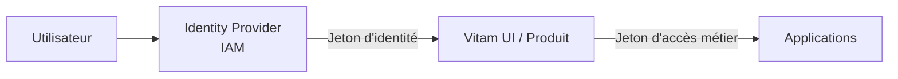
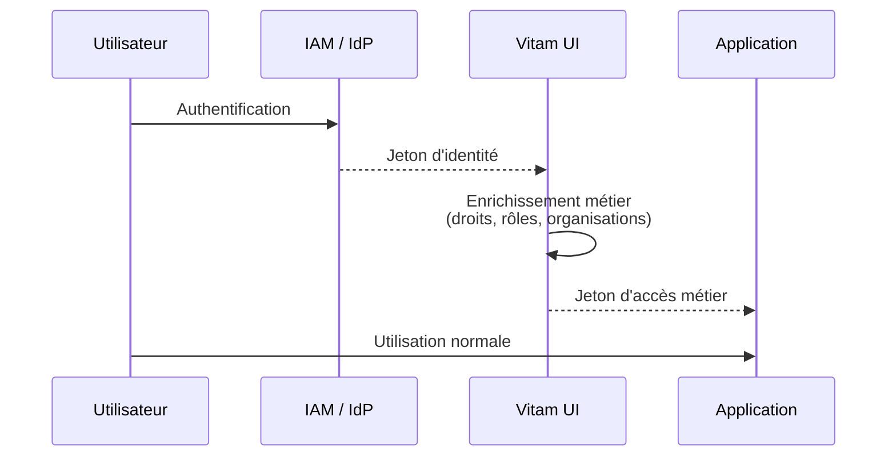
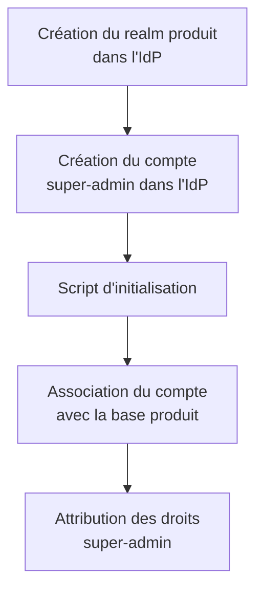
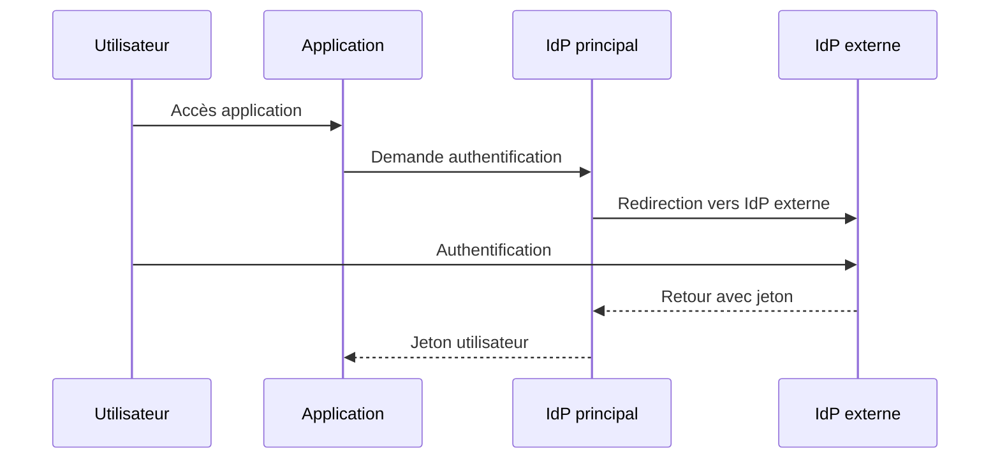
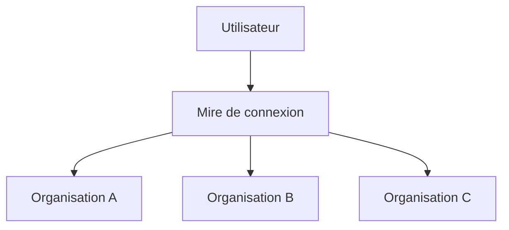
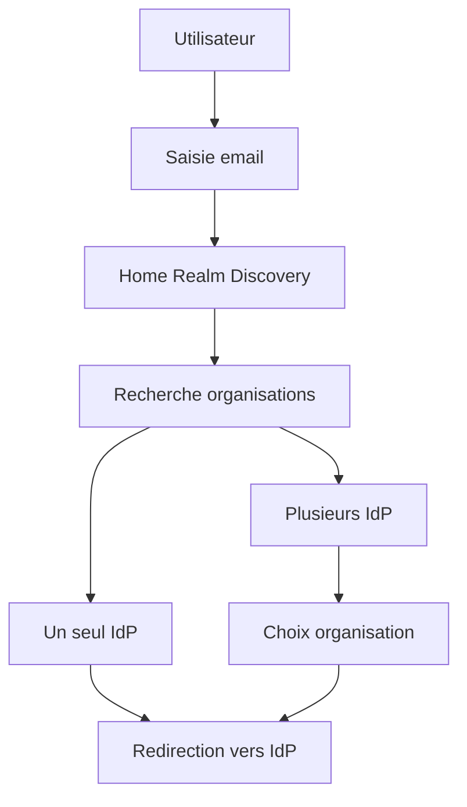

# Synthèse — Évolution de l'architecture CAS / IAM

## 1. Analyse de l'existant

L'analyse des modules CAS et IAM met en évidence un **couplage fort entre les mécanismes d'authentification et les concepts métier**.

Le principal point de blocage identifié concerne l'utilisation de logique métier directement dans les **WebFlows CAS** :

- intégration des notions d'organisation dans les flows d'authentification ;
- sélection d'organisation réalisée pendant le processus de connexion ;
- gestion de la subrogation portée par le mécanisme d'authentification.

Ces éléments relèvent pourtant du domaine métier et devraient être indépendants du système d'identité.

Actuellement :

- le module IAM porte :
    - la base utilisateurs ;
    - les droits ;
    - la gestion des comptes ;
    - la gestion des mots de passe ;
    - la gestion des sessions ;
    - les mécanismes d'authentification ;
    - les notifications liées aux comptes.

- le module CAS agit comme une extension du système IAM afin d'exploiter ces mécanismes d'authentification, mais avec un fort couplage aux règles métier.

---

# 2. Objectif de découplage

L'objectif est de faire évoluer la solution IAM afin qu'elle se comporte uniquement comme un **fournisseur d'identité (Identity Provider / IdP)**.

Le principe cible est de séparer :

- l'identité et l'authentification ;
- la gestion métier et les autorisations applicatives.

Architecture cible :

---

## Responsabilités de l'IdP

L'IdP prend en charge uniquement les aspects liés à l'identité :

- création des utilisateurs ;
- authentification ;
- gestion des mots de passe ;
- OTP / MFA ;
- SMS ou autres facteurs d'authentification ;
- gestion des sessions ;
- émission des jetons d'identité.

Le module IAM ne porte plus de logique métier.

---

## Responsabilités du produit

Le produit récupère le jeton d'authentification fourni après authentification.

À partir de ce jeton, Vitam UI produit un jeton d'accès contenant les informations métier :

- droits applicatifs ;
- rôles ;
- permissions ;
- organisations ;
- autres attributs métier.

Flux cible :

---

# 3. Impacts du changement d'architecture

## Initialisation du compte super-administrateur

Le bootstrap du compte super-admin est réalisé en dehors du processus d'authentification.

Processus proposé :

À partir de ce compte :

- le super-admin peut administrer le produit ;
- il peut créer des organisations ;
- il peut générer les comptes administrateurs associés.

La gestion des organisations reste une responsabilité métier du produit.

---

# 4. Gestion des Identity Providers externes

La gestion des IdP externes constitue le principal point de difficulté.

Le fonctionnement actuel dans CAS semble être basé sur une logique spécifique :

Cette approche est difficile à reproduire avec les standards modernes OIDC et SAML.

---

# 5. Limitation des protocoles OIDC / SAML

Les protocoles OIDC et SAML utilisent un mécanisme de **fédération d'identité (Identity Brokering)** basé sur des redirections.

Le fournisseur externe doit être choisi **avant l'authentification utilisateur**.

Le broker ne récupère donc pas le mot de passe utilisateur et ne peut pas tester plusieurs IdP successivement.

---

# 6. Conséquence fonctionnelle

Deux choix sont possibles.

---

## Option 1 — Sélection explicite de l'IdP

La mire de connexion présente les fournisseurs disponibles :

### Avantages

- architecture standard ;
- maintenance simplifiée ;
- compatible OIDC/SAML ;
- pas de développement spécifique important.

### Inconvénient

Le choix du fournisseur devient visible par l'utilisateur.

---

## Option 2 — Home Realm Discovery (HRD)

Pour conserver une expérience similaire au fonctionnement CAS :

1. l'utilisateur saisit son email ;
2. le système recherche les organisations associées ;
3. l'IdP correspondant est déterminé ;
4. l'utilisateur est redirigé vers le fournisseur adapté.

Architecture :

Avec Keycloak, cette approche nécessiterait probablement :

- un Authenticator SPI personnalisé ;
- un service de découverte d'organisation ;
- une logique de sélection d'IdP.

Architecture cible :

---

# Conclusion

Le passage à une architecture IAM orientée **Identity Provider** permet de supprimer le couplage actuel entre authentification et logique métier.

Les éléments suivants doivent sortir du moteur d'authentification :

- gestion des organisations ;
- sélection des contextes métier ;
- subrogation ;
- gestion des droits applicatifs.

Le principal point nécessitant une adaptation concerne la découverte automatique de l'IdP externe.

Deux choix sont possibles :

1. accepter une sélection explicite de l'IdP par l'utilisateur ;
2. développer une mécanique de **Home Realm Discovery** afin de conserver une expérience similaire au fonctionnement CAS actuel.

La seconde option demande un développement spécifique, mais reste compatible avec une architecture IAM moderne et conserve un meilleur découplage que l'implémentation actuelle dans CAS.
