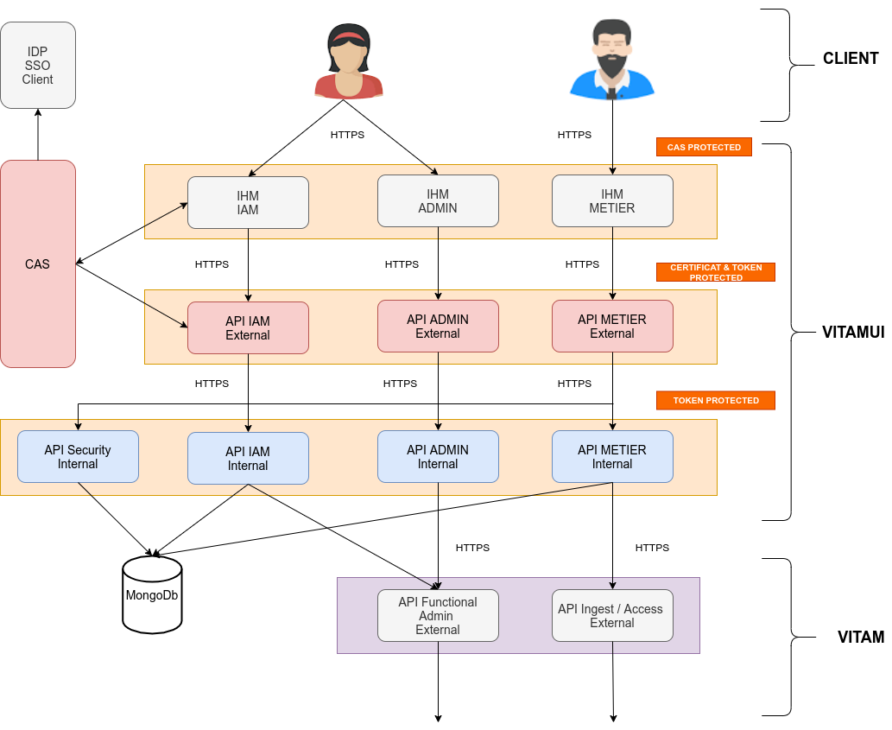

# Architecture 

La solution VITAMUI popose des applications web accessibles depuis un portail. La solution VITAMUI est constitué de différents modules :

* Socle IAM CAS pour la gestion des identités et des accès

* Socle VITAM pour la gestion des archives

* Services d'infrastructure
    * Annuaire de service
    * Gestion des logs centralisée   
    
* Applications web pour les utilisateurs
    * portail 
    * gestion des organisations, utilisateurs, profils, etc.
    * Gestion des référentiels de la solution VITAM
    * Gestion d'entrée, accès et recherche d'archives
    * Consultation des journaux d'opérations d'archives etc.
    
* Services API externes
    * service de gestion des organisations, des utilisateurs, etc.
    * service CAS
    * service de référentiel externe
    * service d'ingest externe
    * service d'archive externe
    
* Services API internes 
    * service des gestion des organisations, des utilisateurs, etc.
    * service de gestion de la sécurité
    * service de référentiel interne
    * service d'ingest interne
    * service d'archive interne

 * Les services API internes communiquent avec les API externes VITAM.
 
 
    Schéma de l’architecture fonctionnelle VITAMUI:

