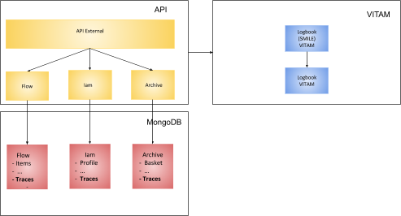

# Journalisation

## Introduction

La journalisation des événements VITAMUI a pour objectifs :

* Conservation de la valeur probante : être en capacité de prouver toute opération effectuée sur toute unité archivistique ou tout objet qui lui est associé.
* La sécurité d’un SAE doit être systémique, c’est-à-dire reposer sur un faisceau d’éléments redondants dont la modification simultanée et cohérente est impossible, ou plus exactement non réalisable en pratique.
* Les journaux constituent un élément central de cette sécurité systémique
Utilisation des journaux vitam NF Z42-013

## Événement
### Vitam
* Un événement = Un événement Primaire (Primary) et ensemble de sous-événements secondaires (Secondary)
    * Primary : événement initial
        * les champs sont contrôlés par VITAM
        * Marque le début de la transaction au sens VITAM 
        * L’heure de l’événement et mise par VITAM (cohérence des journeaux) 
    * Secondary : note un sous événement réalisé suite à l’action principale
        * possède les mêmes champs que l’événement Master mais VITAM ne procède à aucun contrôle
        * l’heure de l’êvénement est à l’appréciation du client
    * Fin de la transaction : le dernier sous événement doit posséder le même champs “eventType” que l’événement Master pour finir la transaction.

### VITAMUI
* Primaire et Secondaire => Un event VITAMUI cf : fr.gouv.vitamui.commons.logbook.domain.event
* Un appel REST => Une ou plusieurs opération métier => ensemble d’events => le premier sera l'evénement primaire (Primary) et les suivants secondaires (Secondary)
* Stocker dans le tenant des éléments de preuves du client

## Application dans VITAMUI

### Modèle

|Propriétés       | valeurs                                           |
|-----------------|:-------------------------------------------------:|
|EventTypeProc    |EXTERNAL_LOGBOOK                                   |
|EventType        | Nom du type d'événement (EXT_VITAMUI_CREATE_USER)    |
|obIdReq          | Nom de la collection Mongo (USERS)      |
|obId             |Identifiant métier de l’objet       |
|evDetData        |Contient les informations importantes (modification avant/après contenu du nouvelle objet) outcome : OK, KO (Pour le master -> OK, pour les sous-events le champ est libre)       |
|evIdAppSession   |applicationIdExt:requestId:applicationName:userIdentifier:superUserIdentifier:customerIdentifier      |
|evIdReq          |X-Request-Id  |

## Création
* L’ensemble des modifications de la base de données se font dans une unique transaction. 
* Centralisation de la création des traces dans chaque module (IamLogbookService, ArchiveLogbookService, FlowLogbookService) (Responsable de la cohérence de la génération d’un event à partir d’un objet métier
* Chaque objet de notre modèle de données possède un converter associé (Capable de convertir un objet en json et qui sera mis dans le evDetData de l’event)

## Sauvegarde 
* Réalisation par les tâches asynchrones (Cf : SendEventToVitamTasks.java et DeleteSynchronizedEventsTasks.java)
* Les événements sont regroupés par rapport à leur X-Request-Id et triés par ordre chronologique croissant.
* Le premier événements du groupe devient le Primary et les autres des sous-events.
* Le premier est recopier a la fin des sous-events afin de fermer la “transaction au sens VITAM”
* Envoit vers vitam (La reponse vitam et la date d'envoi sont toujours stocké) :
    * Succès -> Les events sont conservés X jours et sont marqué au status “SUCCESS”
    * Erreur -> Les events sont marqués au statut “ERROR” et un retry sera effectué dans X heure.
