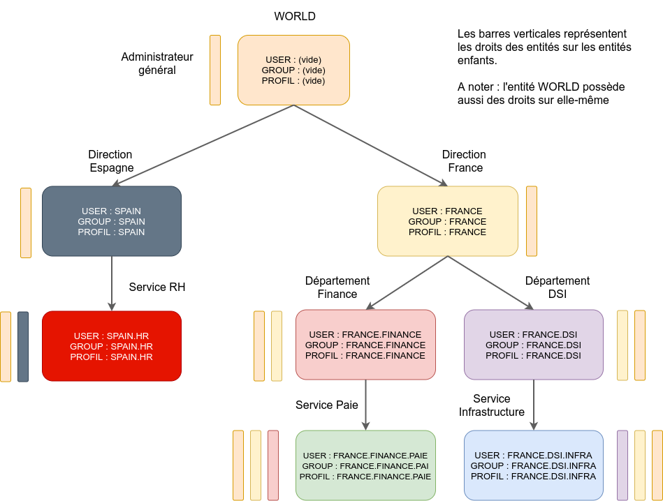

## Profils et rôles 

### Groupe de profils

Un groupe de profils contient (entre autres) les informations suivantes :

* liste de profils 
* niveau 

Un groupe de profils est rattaché à un utilisateur, lui-même rattaché à une organisation. Un groupe de profil peut contenir des profils avec des tenants différents. Pour un tenant donné, un groupe de profil ne peut contenir qu'un seul profil d'une même APP. 

### Profils  

Le profil contient (entre autres) les informations suivantes :

* tenant 
* liste de rôles 
* niveau 
* APP

Un profil contient un seul et unique tenant.  

L'APP permet d'autoriser l'affichage d'une application dans le portail.  Le fait de pouvoir afficher l'application dans le portail ne préjuge pas des droits qui sont nécessaires au bon fonctionnement de l'application.

Un profil est modifiable uniquement par un utilisateur possédant un rôle autorisant la modification de profil et qui possède un niveau supérieur à celui du niveau du profil concerné.  

Un profil ne peut être rattaché qu'à un groupe de profils de même niveau.
 
Dans une instance VITAMUI partagée, il convient de limiter les droits des administrateurs d'une organisation afin qu’ils ne puissent pas réaliser certains actions sur des ressources sensibles. (ie. customer, idp, tenant, etc.). Les profils créés à l’initialisation d’une nouvelle organisation ne doivent donc jamais comporter certains rôles (gestion des organisations, idp, tenants, etc. ) afin d'interdire à l'administrateur d'une organisation d'utiliser ou de créer de nouveaux profils avec ces rôles pour réaliser des opérations multi-tenants. 

Généralement l'adminitrateur de l'instance possède tous les droits (et donc tous les rôles). 

### Rôles 

Le crôle constitue la granularité la plus fine dans le système de gestion des droits. Un rôle donne des droits d’accès à des endpoints (API) correspondants à des services. Un rôle peut être affecté à un ou plusieurs profils. Dans l'implémentation VITAMUI, l’accès à un endpoint est contrôlé par l’annotation @Secured. Il existe des rôles (dénommés sous-rôles) qui donnent accès à des fonctions protégées du service. Ces “sous-rôles” sont généralement contrôlés dans le corps de la méthode par le contexte de sécurité.

    @Secured(ROLE_CREATE_XXX)
    public MyDto create(final @Valid @RequestBody MyDto dto) {
        if ( SecurityContext.hasRole(ROLE_CREATE_XXX_YYY) {
            setProperty(...)
        }
        else {
            return HTTP.403 ;.
        }
    }

Dans l'exemple ci-dessus :

* ROLE_CREATE_XXX est un rôle qui donne accès au service create  
* ROLE_CREATE_XXX_YYY est un sous-rôle, utilisé dans le corps de la méthode, qui donne accès à une fonctionnalité spécifique de la méthode.

### Niveaux

Dans une organisation, la gestion des utilisateurs, des profils et groupe de profils repose sur le principe de la filière unidirectionnelle d'autorité étendue. Elle donne autorité au manageur sur les ressources d'une entité. Plusieurs manageurs peuvent avoir autorité sur une même entité. Un manageur n’a jamais autorité sur l'entité à laquelle il appartient. Il existe cependant un manageur administrateur qui a autorité sur toutes les ressources de toutes les entités.

Schéma de l’arbre de niveaux :  

* Une entité dispose d'un niveau représenté par une chaine de caractère
* Une ressource est un objet (user, group, profile, etc.) appartenant à une entité
* Le manageur est un utilisateur qui a autorité sur des entités et leurs ressources associées

Ex. niveau : "World.France.DSI.Infra"

* World : entité racine - le niveau est vide (ou zéro). Le manageur World a autorité sur toutes les entités de l'arbre (dont lui-même) 
* France : entité enfant de World - La manageur France a autorité sur les entités DSI et Infra
* DSI : entité enfant de France - La manageur DSI a autorité sur l'entité Infra
* Infra : entité enfant de DSI - La manageur Infra n'a autorité sur rien

Un utilisateur : 

* manageur d'une ressource possède un niveau supérieur à celui de la ressource
* peut lister, modifier & supprimer une ressource dont il est le manageur
* peut créer une ressource dans une entité dont il est le manageur
* ne peut pas effectuer une action sur une ressource dont il n'est pas manageur
* ne peut pas effectuer des actions s’il ne dispose pas des rôles associés à ces actions
* ne peut pas affecter à un profil des rôles dont il ne dispose pas (cf. gestion des profils) 
 
Un utilisateur avec un niveau vide (administrateur) : 

* peut uniquement effectuer les actions associées aux rôles qu'il possède
* peut créer un profil ou un groupe de profils de niveau vide (admin) 
* peut modifier ses ressources
* ne peut pas ajouter à un profil un rôle dont il ne dispose pas

Un administrateur d'une organisation possède donc des droits limités aux rôles qui ont été affectés à l'initialisation du système. Il ne peut pas par exemple créer une nouvelle organisation, si ce rôle ne lui pas été donné à l'origine. D'autre part, les droits de l'administrateur restent également limités par les droits associés à ceux du contexte de sécurité de l'application qu'il utilise. 

* un profil ou un groupe de profils ne peuvent être supprimés que s'ils ne sont plus utilisés 
* un profil avec un niveau ne peut être rattaché qu’à un groupe de un même niveau. 

### Matrice des droits

Les tableaux ci-dessous indiquent les droits d'un utilisateur en fonction du niveau de la ressource cible. 

* Matrice des droits d'un utilisateur de niveau N pour réaliser des actions sur un utilisateur de niveau cible N+1, N, N-1 : 

|Niveau cible   | N+1        |   N       |   N-1     |
|---------------|:----------:|:---------:|:---------:|
|Créer          |  Non       |   Non     |   Oui     |
|Modifier       |  Non       |   Non     |   Oui     |
|Lire           |  Non       |   Oui (1) |   Oui     |
|Supprimer      |  Non       |   Non     |   Oui (2) |

Oui(1) : oui mais uniquement s'il s'agit de lui-même  
Oui(2) : en théorie, car il est n'est pas possible de supprimer un utilisateur  

* Matrice des droits d'un utilisateur de niveau N pour réaliser des actions sur un profil de niveau cible N+1, N, N-1 : 

|Niveau cible   | N+1     |   N       |   N-1     |
|---------------|:----------:|:---------:|:---------:|
|Créer          |  Non       |   Non     |   Oui    |
|Modifier       |  Non       |   Non     |   Oui    |
|Lire           |  Non       |   Oui (1) |   Oui    |
|Attribuer      |  Non       |   Non     |   Oui    |
|Supprimer      |  Non       |   Non     |   Oui    |

Oui(1) : oui mais uniquement si le profil est présent dans son groupe de profils  
Lors de la modification du niveau du profil. Il faut vérifier qu’il n’est associé à aucun groupe.
L'utilisateur ne peut affecter à un profil que les rôles et un tenant qu'il possède

* Matrice des droits d'un utilisateur de niveau N pour réaliser des actions sur un groupe de profils de niveau cible N+1, N, N-1 : 

|Niveau cible   | N+1       |   N       |   N-1     |
|---------------|:----------:|:---------:|:---------:|
|Créer          |  Non       |   Non     |   Oui    |
|Modifier       |  Non       |   Non     |   Oui    |
|Lire           |  Non       |   Oui (1) |   Oui    |
|Attribuer      |  Non       |   Non     |   Oui    |
|Supprimer      |  Non       |   Non     |   Oui    |

Oui(1) : oui mais uniquement s'il s'agit de son groupe  
Lors de la modification du niveau d'un groupe. Il faut vérifier qu’il n’a pas de profils

* Matrice des droits d'un administrateur de niveau racine (niveau vide) pour réaliser des actions sur une ressource de niveau cible N+1, N, N-1 : 

|Niveau cible   | N+1     |   N       |   N-1     |
|---------------|:--------:|:---------:|:---------:|
|Créer          |  -       |   Oui     |   Oui    |
|Modifier       |  -       |   Oui     |   Oui    |
|Lire           |  -       |   Oui     |   Oui    |
|Attribuer      |  -       |   Oui     |   Oui    |
|Supprimer      |  -       |   Oui     |   Oui    |

Un administrateur ne peut pas affecter à un profil des rôles qui ne sont pas autorisés dans son organisation. 

### Sécurisation des ressources

#### Vérification générale

Le processus de sécurisation des ressources est systématique et identique quelque soit l’utilisateur appelant la ressource. Ce processus, implémenté dans Spring Security, est essentiel car il permet de s’assurer qu’un utilisateur ne sorte jamais de son tenant. Ce processus de sécurisation est réalisé sur les accès aux ressources des services externals. 

Les étapes du processus de sécurisation sont les suivantes :

1. récupérer l’utilisateur associé au token utilisateur fourni dans le header
2. vérifier que l'organisation de l’utilisateur possède le tenant fourni dans le header
3. vérifier que l’utilisateur possède un profil avec le tenant fourni dans le header
4. trouver le contexte applicatif par rapport au certificat x509 fourni dans la requête 
5. vérifier que le contexte applicatif autorise le tenant fourni dans le header
6. créer un contexte de sécurité utilisateur qui correspond au tenant fourni dans le header et à l’intersection des rôles des profils de l’utilisateur et ceux du contexte applicatif
7. vérifier que les rôles du contexte de sécurité de l’utilisateur autorisent l’utilisateur authentifié à appeler la ressource

Si la ressource n'est pas accessible, une erreur 403 est retournée

#### Vérification des sous-rôles

Cette étape correspond à la vérification des sous-rôles dans le service appelé. Un sous-rôle donne accès à une fonction ou à un périmètre spécifique du service.  

Exemple : Un utilisateur RH a le droit de modifier un autre utilisateur sauf son email (qui est sécurisé). 

* L’utilisateur RH possède donc un rôle UPDATE_USER qui lui donne accès à l’API et au service de mise à jour globale des utilisateurs
* L’utilisateur RH ne possède pas le rôle UPDATE_USER_EMAIL qui permettrait de modifier l’email
 
La vérification du rôle UPDATE_USER_EMAIL est réalisée dans le service de mise à jour de l’utilisateur.

#### Vérification du tenant

En règle générale, le tenant concerné par la requête est vérifié par le processus de vérification générale. Il existe néanmoins des cas où le tenant est fourni en paramètre ou dans le corps de la requête. 

Dans ce cas, les étapes de sécurisation sont les suivantes : 

* vérifier la validité du tenant dans le contexte de sécurité
* Si le tenant n’est pas valide, il faut éventuellement vérifier si l’utilisateur a le droit de réaliser une opération multi-tenant. Cette dernière vérification est implémentée grâce aux rôle et sous-rôles (cf. gestion des customer, des idp, des tenants, des profils, etc).
* Si le tenant n'est pas valide, une erreur 403 est retournée

Cette implémentation permet ainsi de réaliser simplement des opérations multi-tenant en définissant des rôles appropriés. La solution VITAMUI fournit des services multi-tenant pour gérer les organisations, les fournisseurs d'identité, etc. Il est fondamental de limiter autant que possible l'utilisation de rôles muli-tenants. Il est en outre recommandé de borner l'usage des rôles multi-tenant à une zone protégée de l'infrastructure. 

L'ensemble des rôles autorisés dans une organisation sont définis à la création de cette organisation.

