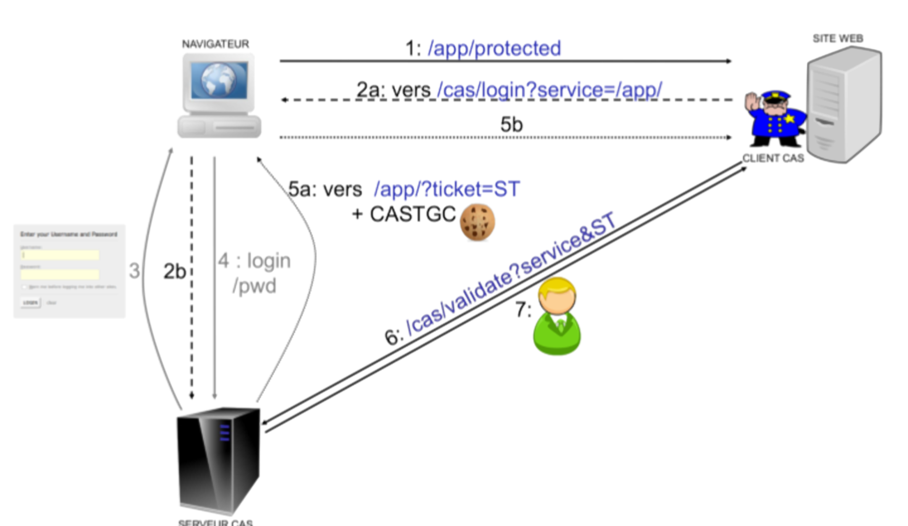

## Service d'authentification

### Authentification des applications externes

A l'initialisation de la connexion HTTPS d'une application cliente à un service API VITAMUI, un processus d'authentification mutuelle entre le client et le serveur basé sur des certificats x509 est mis en oeuvre. Le service VITAMUI contrôle le certificat applicatif x509 transmis par le client pour s'assurer de sa validité. En cas de certificat invalide, expiré ou absent du truststore du service VITAMUI, la connexion échoue.
 
 Il est fortement recommandé d'utiliser des certificats officiels pour toutes les authentifications publiques.

### Authentification des utilisateurs externes

Lorsque la connexion applicative a été réalisée avec succès, la solution VITAMUI récupère dans la base MongoDB le contexte de sécurité applicatif associé au certificat client. Le contexte de sécurité applicatif définit les autorisations d’accès aux différents services (rôles) et le périmètre d'accès (tenant) de l'application. Un même contexte peut être associé à plusieurs certificats. L’utilisateur se voit alors attribuer l’intersection des rôles et tenants du contexte de sécurité applicatif et de ses profils. 

La cinématique est la suivante :  

1. Initialisation de la connexion par l'application cliente   
2. Vérification du certificat client transmis par l'application  
3. Vérification du contexte de sécurité associé au certificat   
4. Récupération des profils (rôles & tenants) de l'utilisateur   
5. Intersection des rôles et tenants entre le conexte de sécurité et les profils  
6. L'utilisateur peut accéder aux ressources autorisées

Il est ainsi possible de limiter les risques d'élévations de privilèges en dissociant les contextes applicatifs de 2 instances d'une même application.

Par exemple, dans une première instance de l'application exposée sur un réseau public et associé à un contexte applicatif possédant des droits limités, un administrateur ne pourra pas accéder à des fonctions d'admnistration. En revanche, une deuxième instance, bénéficiant d'un contexte applicatif adéquat, sur un réseau protégé et accessible à ce même administrateur permettra d'effectuer des opérations à haut privilège. 

### Service d'authentification centralisé CAS 

Dans VITAMUI, l'authentification des utilisateurs est réalisée au moyen du service CAS. CAS est un service d'authentification centralisé (SSO et fédération d’identité), développé depuis 2004 par une communauté open source, et destiné aux applications Web . 

CAS propose les fonctionnalités suivantes :

* un protocole (CAS protocol) ouvert et documenté
* la prise en charge de moteur de stockage variés (LDAP, base de données, X.509, 2-facteur)
* la prise en charge de plusieurs protocoles (CAS, SAML, OAuth, OpenID)
* des bibliothèques de clients pour Java, .Net, PHP, Perl, Apache, uPortal, etc.
* l’intégration native avec uPortal, BlueSocket, TikiWiki, Mule, Liferay, Moodle, etc.
    


Dans la solution VITAMUI, CAS porte uniquement le processus d'authentification (délégué ou non) avec les informations (tickets, cookies, etc.) nécessaires au bon fonctionnement de l'authentification. En revanche, toutes les données des utilisateurs (compte, profils, rôles, etc.) sont stockés dans une base MongoDB gérée par les services VITAMUI. Lors du processus d'authentification, CAS récupère les données des utilisateurs via des services REST dédiés et sécurisés dans VITAMUI. Il est important de noter que les crédentials d'accès à la solution, les données des utilisateurs ou des applications ne sont donc jamais stockés dans CAS.

Ce choix simplifie l'exploitation de la solution car il n'est pas nécessaire de migrer les données lors de la mise à jour de CAS.  



La [documentation de CAS](https://www.apereo.org/projects/cas) est disponible sur internet. CAS est livré sous licence Apache 2.0.

#### Intégration CAS dans VITAMUI

Les principes généraux de l'implémentation de CAS dans VITAMUI sont les suivants :

* l'email de l'utilisateur assure l'indification de l'utilisateur dans le système  

* les applications VITAMUI (ie. Service Provider) raccordées au serveur CAS utilisent le protocole CAS. (Dans VITAMUI, la bibliothèque Spring Security fournit cette fonctionnalité) 

* les applications VITAMUI faisant office de services providers sont déclarées dans CAS 

* la délégation d’authentification du serveur CAS aux IDP des clients se fait en SAML 2.0

* les IDP SAML utilisés sont déclarés dans VITAMUI et sont stockés dans MongoDB

* la fonction de révocation périodique de mot de passe est assurée par CAS

* l’anti force brute est assurée par le serveur CAS (→ throttling)

* la fonction de récupération de mot de passe et le contrôle de robustesse du mot de passe sont assurés par le module password management de CAS

* l’authentification multi-facteur est assurée par SMS (Le fonctionnement du MFA : page de login CAS, étape supplémentaire est portée par le provider du deuxième facteur) est assurée par CAS

* le service CAS dispose d'un certificat client pour être authentifié par VITAMUI 

* dans un environnement web clusterisé, le reverse proxy est configuré pour assurer l'affinité de session nécessaire à la conservation du cookie de session (JSESSIONID) dans l'application WEB

Dans le cas d'un utilisateur n'utilisant pas le SSO :

* le contrôle de robustesse du mot de passe est assuré par le service Identity de VITAMUI

* le chiffrement des mots de passe est assuré par le service Identity de VITAMUI

* le mot de passe est conservé chiffré dans le base MongoDB de VITAMUI


#### Authentification d'un utilisateur non authentifié

Pour un utilisateur, non préalablement authentifiés, l'authentification dans CAS se fait en plusieurs étapes :

1. L'utilisateur tente d'accéder à une page sécurisée et est alors redirigé var CAS   

2. une première page est affichée dans CAS pour saisir l’identifiant (unique) et le mot de passe de l’utilisateur

3. selon le domaine email de l'utilisateur et les règles particulières à la délégation d’authentification, CAS délègue l’authentification ou authentifie lui-même l'utilisateur. 

    * pas de délégation : une seconde page est affichée pour saisir le mot de passe et le serveur CAS vérifie les credentials auprès du service Identity de VITAMUI 
   
    * délégation : l’utilisateur est redirigé pour authentification sur l'IDP de son organisation en SAML v2

4. CAS demande la création d'un token utilisateur via le service Identity de VITAMUI. Ce token assure l'identification de l'utilisateur dans les API external et internal de VITAMUI.

4. le serveur CAS récupère les informations de l'utilisateur via le service Identity/CAS de VITAMUI

5. l'application récupère le profil de l'utilisateur et son token API

6. lors d'un apple à l'API VITAM, le token est transmis dans le header de la requête.


#### Authentification d'un utilisateur préalablement authentifié

Si l'utilisateur est déjà authentifié auprès du CAS, aucune page de login ne s'affiche et l'utilisateur est redirigé vers l'application souhaitée, en étant authentifié dans cette application. Suivant les utilisateurs / applications demandées, une authentification multi-facteurs peut être jouée.

### Délégation d'authentification 

La délégation d'authentification est prise en charge par CAS. Actuellement seul le protocol SAML v2 est supporté.

Les étapes suivantes expliquent comment fonctionne la délégation d'authentification selon le protocole SAML v2 dans le cadre de VITAMUI.

En amont de ce processus, l’ IDP (SSO) doit fournir à VITAMUI l'URL associée à son service d'authentification unique (SSO), ainsi que la clé publique qui lui sera nécessaire pour valider les réponses SAML.

Le schéma ci-dessous illustre les étapes et le mécanisme de connexion d'un utilisateur à une application VITAMUI, via un service d'authentification unique basé sur le protocole SAML. La liste numérotée qui suit le diagramme revient en détail sur chacune des étapes. 

Connexion à VITAMUI via une délégation d'authentification en SAML v2


L'utilisateur tente d'accéder à une application VITAMUI hébergée

1. VITAMUI génère une demande d'authentification SAML, qui est encodée et intégrée dans l'URL associée au service d'authentification unique (SSO) de l’IDP de l'organisation cliente. Le paramètre RelayState, qui contient l'URL encodée de l'application VITAMUI à laquelle tente d'accéder l'utilisateur, est également incorporé dans l'URL d'authentification unique. Il constitue un identificateur opaque qui sera par la suite renvoyé au navigateur de l'utilisateur sans modification ni vérification.

2. VITAMUI envoie une URL de redirection au navigateur de l'utilisateur. Cette URL inclut la demande d'authentification SAML encodée qui doit être envoyée au service d'authentification unique de l'organisation cliente.

3. L’IDP de l'organisation cliente décode la demande SAML et en extrait l'URL du service ACS (Assertion Consumer Service) de VITAMUI et de la destination de l'utilisateur (paramètre RelayState). Il authentifie ensuite l'utilisateur, soit en l'invitant à saisir ses identifiants de connexion, soit en vérifiant ses cookies de session.

4. L’IDP de l'organisation cliente génère une réponse SAML contenant le nom de l'utilisateur authentifié. Conformément aux spécifications SAML 2.0, cette réponse contient les signatures numériques des clés DSA/RSA publiques et privées du de l'organisation cliente.

5. L’IDP de l'organisation cliente encode la réponse SAML et le paramètre RelayState avant de les renvoyer au navigateur de l'utilisateur. Il fournit le mécanisme permettant au navigateur de transmettre ces informations au service ACS de VITAMUI. Par exemple, il peut incorporer la réponse SAML et l'URL de destination dans un formulaire, qui inclut un script JavaScript sur la page qui se charge alors d'envoyer automatiquement le formulaire à VITAMUI.

6. Le service ACS de VITAMUI vérifie la réponse SAML à l'aide de la clé publique du de l'organisation cliente. Si la réponse est validée, l'utilisateur est redirigé vers l'URL de destination.

L'utilisateur est redirigé vers l'URL de destination. Il est désormais connecté à VITAMUI.

### Sécurisation de CAS

En production, le serveur CAS sera composé de plusieurs noeuds. Il est nécessaire d'acyiver la sécurité et de configurer :
* une définition de services (dans MongoDB) propres aux URLs de production
* une configuration Hazelcast adéquate (stockage des sessions SSO).

#### Activation de la sécurité

##### Configuration des propriétés de sécurité

La configuration de CAS se trouve dans le fichier YAML applicatif (en développement : cas-server-application-dev.yml). Elle concerne d’abord les trois propriétés suivantes :
```
cas.tgc.secure : cookie de session SSO en HTTPS
cas.tgc.crypto.enabled : cryptage / signature du cookie SSO
cas.webflow.crypto.enabled : cryptage / signature du webflow
```
En production, il est absolument nécessaire que ces trois propriétés soient à true.

Pour la propriété cas.tgc.crypto.enabled à true, il faut définir la clé de cryptage et de signature via les propriétés suivantes :

```
cas.tgc.crypto.encryption.key : clé de cryptage (ex. Jq-ZSJXTtrQ...)
cas.tgc.crypto.signing.key : clé de signature (ex. Qoc3V8oyK98a2Dr6...)
```

Pour la propriété cas.webflow.crypto.enabled à true, il faut définir la clé de cryptage et de signature via les propriétés suivantes :

```
cas.webflow.crypto.encryption.key : clé de cryptage
cas.webflow.crypto.signing.key : clé de signature
```

Si aucune clé n’est définie, le serveur CAS va les créer lui-même, ce qui ne fonctionnera pas car les clés générées seront différentes sur chaque noeud.

En outre, pour la délégation d’authentification et la gestion du du mot de passe, il existe deux propriétés qui sont déjà à true, mais pour lesquelles aucune clé n’a été définie :

```
cas.authn.pac4j.cookie.crypto.enabled : chiffrement & signature pour
                                        la délégation d’authentification

cas.authn.pm.reset.crypto.enabled : chiffrement & signature pour
                                    la gestion du mot de passe.
```

Pour la délégation d’authentification, il faut définir la clé de cryptage et de signature via les propriétés suivantes :

```
cas.authn.pac4j.cookie.crypto.encryption.key : clé de cryptage
cas.authn.pac4j.cookie.crypto.signing.key : clé de signature
```

Pour la gestion du mot de passe, il faut définir la clé de cryptage et de signature via les propriétés suivantes :

```
cas.authn.pm.reset.crypto.encryption.key : clé de cryptage
cas.authn.pm.reset.crypto.signing.key : clé de signature
```

##### Suppression des accès aux URLs d'auto-administration

Les URLs d’auto-administration du CAS doivent être désactivées. La configuration suivante doit être appliquée :
```
cas.adminPagesSecurity.ip: a
cas.monitor.endpoints.sensitive: true
cas.monitor.endpoints.enabled: false
endpoints.sensitive: true
endpoints.enabled: false
management.security.enabled: false
```

Cette dernière configuration est sans importance du moment que l’URL /status du serveur CAS n’est pas mappée en externe.

#### Définition des services supportés

Il est nécessaire de fournir lors du déploiement de la solution VITAMUI, la liste des services autorisés à interagir avec CAS en tant que Service Provider. Cette liste permet à CAS de s'assuer que le service est connu avant d'effectuer le callback. La liste des services est stockée lors du déploiement dans la base MongoDB de VITAM UI est accessible uniqument par CAS.  

#### Configuration Hazelcast

Par défaut, les noeuds Hazelcast s’auto-découvrent et les tickets sont partitionnés entre tous les noeuds et chaque ticket a un backup. Il est néanmoins possible de configurer dans CAS des propriétés permettant d'affiner le réglage d’Hazelcast :

```
cas.ticket.registry.hazelcast.cluster.members: 123.456.789.000,123.456.789.001
cas.ticket.registry.hazelcast.cluster.instanceName: localhost
cas.ticket.registry.hazelcast.cluster.port: 5701
```

Ci-dessous sont listées des propriétés permettant une gestion avancée d'Hazelcast :  

```
cas.ticket.registry.hazelcast.cluster.tcpipEnabled: true
cas.ticket.registry.hazelcast.cluster.partitionMemberGroupType: 
    HOST_AWARE|CUSTOM|PER_MEMBER|ZONE_AWARE|SPI
cas.ticket.registry.hazelcast.cluster.evictionPolicy: LRU
cas.ticket.registry.hazelcast.cluster.maxNoHeartbeatSeconds: 300
cas.ticket.registry.hazelcast.cluster.loggingType: slf4j
cas.ticket.registry.hazelcast.cluster.portAutoIncrement: true
cas.ticket.registry.hazelcast.cluster.maxHeapSizePercentage: 85
cas.ticket.registry.hazelcast.cluster.backupCount: 1
cas.ticket.registry.hazelcast.cluster.asyncBackupCount: 0
cas.ticket.registry.hazelcast.cluster.maxSizePolicy: USED_HEAP_PERCENTAGE
cas.ticket.registry.hazelcast.cluster.timeout: 5
```

Multicast Discovery : 
```
cas.ticket.registry.hazelcast.cluster.multicastTrustedInterfaces:
cas.ticket.registry.hazelcast.cluster.multicastEnabled: false
cas.ticket.registry.hazelcast.cluster.multicastPort:
cas.ticket.registry.hazelcast.cluster.multicastGroup:
cas.ticket.registry.hazelcast.cluster.multicastTimeout: 2
cas.ticket.registry.hazelcast.cluster.multicastTimeToLive: 32
```

La documentation pour la génération des clés pour le cluster CAS est disponible [ici](https://dacurry-tns.github.io/deploying-apereo-cas/building_server_configure-server-properties.html#configure-ticket-granting-cookie-encryption).

#### Fonctionnalités

Le serveur CAS VITAMUI est construit sur le serveur CAS Open Source v6.1.x via un mécanisme d'overlay Maven.

Les beans Spring sont chargés via les classes `AppConfig` et `WebflowConfig` déclarées par le fichier `src/main/resources/META-INF/spring.factories`.

Les propriétés spécifiques au client IAM sont mappées en Java via le bean `IamClientConfigurationProperties`.

La configuration est située dans le répertoire `src/main/config` et dans les fichiers `src/main/resources/application.properties` et `src/main/resources/bootstrap.properties`.

Une bannière custom est affichée au lancement (`CasEmbeddedContainerUtils`).

Le serveur CAS VITAMUI contient les fonctionnalités suivantes :


##### Utilisation de MongoDB

Les applications autorisées à s'authentifier sur le serveur CAS sont définies dans une base de données MongoDB.

Cela est géré par la dépendance `cas-server-support-mongo-service-registry`.


##### Utilisation d'Hazelcast

Les informations nécessaires durant les sessions SSO sont stockées dans Hazelcast.

Cela est géré par la dépendance `cas-server-support-hazelcast-ticket-registry`.


##### Authentification login/mot de passe

Le `UserAuthenticationHandler` vérifie les credentials de l'utilisateur auprès de l'API IAM et 
le `UserPrincipalResolver` crée le profil utilisateur authentifié à partir des informations récupérées via l'API IAM.

Après avoir saisi son identifiant (classe `DispatcherAction`):
- si l'utilisateur ou son subrogateur est inactif, il est envoyé vers une page dédiée (`casAccountDisabledView`) 
- si aucun fournisseur d'identité n'est trouvé pour l'utilisateur, il est envoyé vers une page dédiée (`casAccountBadConfigurationView`).


##### Délégation d'authentification

L'authentification peut être déléguée à un serveur SAML externe.

Cela est géré par la dépendance `cas-server-support-pac4j-webflow`.

Le flow d'authentification a été modifié (classe `CustomLoginWebflowConfigurer`) pour se dérouler en deux étapes :
- saisie de l'identifiant
- saisie du mot de passe (`src/main/resources/templates/casPwdView.html`) ou redirection vers le serveur SAML externe pour authentification. Cela est géré par l'action `DispatcherAction`.

Cette délégation d'authentification peut être faite de manière transparente si le paramètre `idp` est présent (il est sauvé dans un cookie de session pour mémorisation).
Cela est gérée par la classe `CustomDelegatedClientAuthenticationAction`.


##### Subrogation

Un utilisateur peut subroger un utilisateur authentifié ("il se fait passer pour lui").

Cela est géré par la dépendance `cas-server-support-surrogate-webflow`.

La subrogation est gérée par CAS avec un identifiant contenant à la fois l'identifiant de l'utilisateur et le subrogateur séparé par une virgule.

Pour permettre un affichage séparé des deux informations, elles sont découpées en avance dans les classes `CustomDelegatedClientAuthenticationAction` et `DispatcherAction`.

Pour gérer correctement la subrogation lors d'une délégation d'authentification, le subrogé est sauvegardé en fin d'authentification (`DelegatedSurrogateAuthenticationPostProcessor`).

Le droit de subroger est vérifié auprès de l'API IAM (`IamSurrogateAuthenticationService`).

Le temps de session SSO est allongée dans le cas d'une subrogation générique (`DynamicTicketGrantingTicketFactory`).


##### Interface graphique customisée

L'interface graphique du serveur CAS est adapté au look and feel VITAMUI.

Les pages HTML modifiées sont dans le répertoire `src/main/resources/templates` et les ressources statiques (JS, CSS, images) sont dans le répertoire `src/main/resources/static`.

Les messages customisés sont dans les fichiers `overriden_messages*.properties` (dans `src/main/resources`).

Les bons logos à afficher sont calculés via les actions `CustomInitialFlowSetupAction` (login) et `GeneralTerminateSessionAction` (logout).

Après une authentification réussie, une page "connexion sécurisée" est affichée avant de rediriger sur l'application demandée. Cela est gérée par l'action : `SelectRedirectAction`.


##### Double facteur SMS

Dans certains cas, l'authentification nécessite un second facteur sous forme de token reçu par SMS à re-saisir dans l'IHM.

Cela est géré par la dépendance `cas-server-support-simple-mfa`.

Un webflow spécifique est géré dans `src/main/resources/webflow/mfa-simple/mfa-simple-custom-webflow.xml`
pour gérer le cas où l'utilisateur n'a pas de téléphone (`casSmsMissingPhoneView`, classe `CustomSendTokenAction`),
le cas du code expiré (`casSmsCodeExpiredView`, classe `CheckMfaTokenAction`) et le fait que le token n'a pas de format CAS spécifique ("CASMFA-").


##### Gestion du mot de passe

Le serveur CAS permet également de réinitialiser ou de changer son mot de passe.

Cela est géré par la dépendance `cas-server-support-pm-webflow`.

Le changement de mot de passe est effectué auprès de l'API IAM grâce à la classe `IamPasswordManagementService`.

Les emails envoyés lors de la réinitialisation du mot de passe sont internationalisés grâce aux classes `PmMessageToSend` et `I18NSendPasswordResetInstructionsAction`.
Ils sont aussi différents suivant le type d'évènement : réinitialisation standard ou création de compte. Tout comme le temps d'expiration (classe `PmTransientSessionTicketExpirationPolicyBuilder`).

Une API REST dans CAS permet de déclencher la réinitialisation du mot de passe : `ResetPasswordController`.

La classe `TriggerChangePasswordAction` permet de provoquer le changement de mot de l'utilisateur même s'il est déjà authentifié.

La classe `CustomVerifyPasswordResetRequestAction` gère proprement les demandes de réinit de mot de passe expirées.

La durée de vie des tickets transient est réglée à 1 jour (classe `HazelcastTicketRegistryTicketCatalogConfiguration`) pour gérer les demandes de réinit de mot de passe lors de la création d'un compte.


##### Support serveur OAuth

Le serveur CAS se comporte comme un serveur OAuth pour permettre la cinématique "Resource Owner Password flow".

Cela est géré par la dépendance `cas-server-support-oauth-webflow`.

L'utilisateur est authentifié via ses credentials et des credentials applicatifs et les access tokens OAuth générés sont le token d'authentification VITAM de l'utilisateur (classe `CustomOAuth20DefaultAccessTokenFactory`).


##### Déconnexion

Pour éviter tout problème avec des sessions applicatives persistantes, la déconnexion détruit toutes les sessions applicatives dans le cas où aucune session SSO n'est trouvée (classe `GeneralTerminateSessionAction`).


##### Throttling

Le nombre de requêtes d'authentification accepté par le serveur CAS est limité.

Cela est géré par la dépendance `cas-server-support-throttle`.
