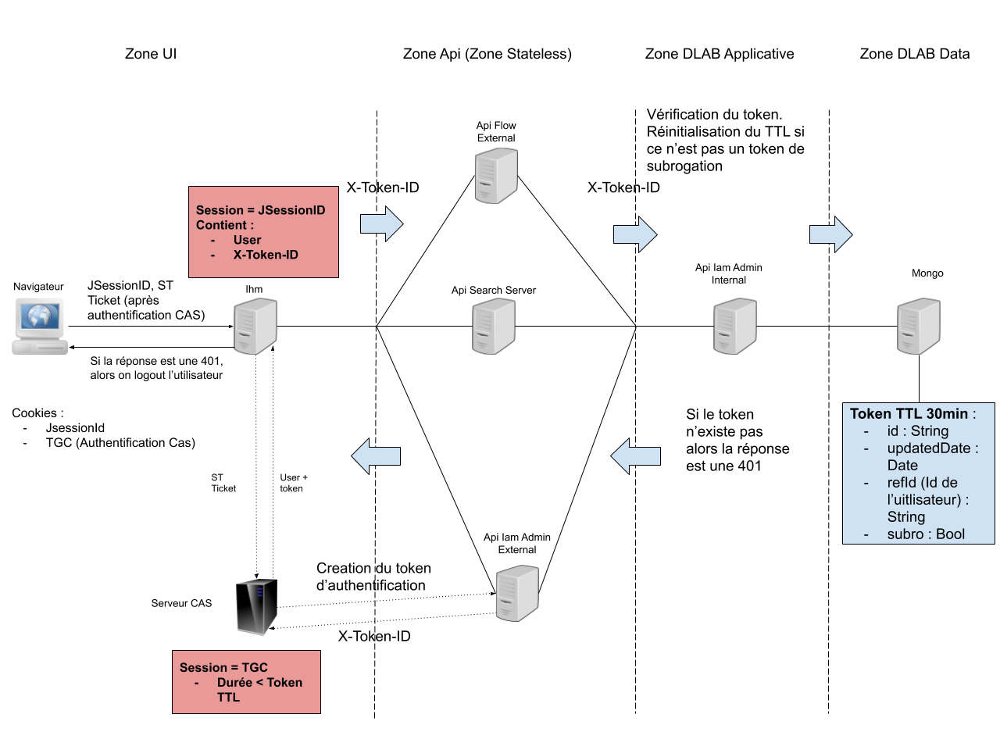

## Sessions applicatives

### Liste des sessions

Il existe 4 sessions définies dans la solution VITAMUI :

* la session applicative Web (cookie JSESSIONID)
* la session des services API (token X-AUTH-TOKEN)
* la session applicative CAS (cookie JSESSIONID / Domaine CAS) 
* la session de l'IDP SAML utilisé pour la délégation d'authentification

### Séquence de création des sessions 

La séquence de création des sessions est liée à l'utisation du protocole CAS et à l'intégration des services API.
Dans le processus de connexion, la création des sessions s'effectue dans l'ordre suivant :

1. création par l'application Web du cookie JSESSIONID
2. création de la session SAML (dans le cas d'une délégation d'authentification)
3. création dans CAS du cookie TGC
4. création par CAS dans l'API VITAMUI du token API 

    
    Schéma des sessions applicatives
    

### Session applicative Web

La session applicative est portée par le cookie JSESSIONID créée dans l'application Web. Le cookie expire à l'issue du délai d'inactivité et sa durée de vie est réinitialisée à chaque utilisation. [A vérifier]

Lorsque la session expire, le cookie est automatiquement recréé par l'application WEB et le client redirigé par un code HTTP 302 vers le service CAS. 

Si la session CAS (cookie TGC) a expiré, l’utilisateur doit se reloguer et les sessions CAS (TGC), services API (Token), et si nécessaire SAML, sont recréées. En revanche, si la session CAS est valide, l'utilisateur n’a pas besoin de se reloguer et est directement redirigé sur l’application Web. Dans ce dernier cas, la session des services est conservée et le token n'est pas recréé.

### Session des services API

La session des services API est porté par un token. Le token permet l'identification des utilisateurs dans les services API (external et internal) de VITAMUI. Le token expire à l'issue du délai d'inactivité et sa durée de vie est réinitialisée à chaque utilisation.

Lors du processus d'authentification, le resolver de CAS extrait l’identité de l'utilisateur (de la réponse SAML en cas de délégation d'authentification) et appelle le service Identity de VITAMUI pour créer un token conservé dans la base mongoDB. 
 
 Le token est fourni aux applications web, mais n'est pas visible dans le navigateur web du client car il est conservé dans la session applicative (JSESSIONID) de l'utilisateur. Dans chaque requête vers les services, le header X-Auth-Token est positionné avec la valeur du token. Avant d'accpter la requête, le service contrôle l'existence du header précédent et vérifie que le token est toujours valide.
 
 Lorsque le token a expiré, les services API génèrent une erreur 401 transmis aux applications web. Lors de la réception d'une erreur 401, l'application web invalide la session applicative (JSESSIONID) concernée, puis effectue une redirection vers le logout CAS (afin de détruire le TGC et la session SAML). L'utilisateur doit obligatoirement se reconnecter pour utiliser à nouveau l'application.
	
### Session CAS

La session CAS est portée par un cookie Ticket-Granting Cookie ou TGC. Le TGC est le cookie de session transmis par le serveur CAS au navigateur du client lors de la phase de login. Ce cookie ne peut être lu ou écrit que par le serveur CAS, sur canal sécurisé (HTTPS). Lors du processus d'authentification, le resolver de CAS extrait l’identité de l'utilisateur (de la réponse SAML en cas de délégation), crée le cookie TGC et un ticket dans l’URL puis stocke ces informations dans le cache HazelCast. 

[A vérifier]
En cas de délégation d'authentification, si la session CAS a expiré (TGC invalide)

* l'utilisateur doit se reconnecter si la session SAML a expiré 
* sinon CAS recrée automatiquement le TGC et le token

Sans délégation d'authentification, l'utilisateur doit se reconnecter systématiquement pour que CAS puisse recréer le TGC et le token. 

### Session des IDP

La session de l’IDP (Identiy Provider) est propre à chaque IDP SAML. Il existe néanmoins un délai maximum dans CAS pour accepter la délégation d'authentification d'un IDP SAML. 

L'utilisateur doit obligatoirement se reconnecter si la session SAML a expiré.

### Expiration et cloture des sessions

Il existe deux politiques d'expiration possibles :

* expiration de session par délai d'inactivité : la session expire si aucune action n'est faite (par l'utilisateur) au bout du délai d'inactivité (session Token)
* expiration de session par délai maximum : la session expire au bout du délai maximum depuis la date de création, quelque soit les actions faites par l'utilisateur (Sessions Applicatives & CAS)

A l’expiration de la session CAS, toutes les sessions applicatives sont supprimées. [Quid du token ?] Les sessions applicatives sont détruites via une redirection dans le navigateur.  [A Préciser le fonctionnement via le navigateur vs certificats]

Le logout d'une application web invalide la session applicative concernée, puis effectue une redirection vers le logout CAS afin de détruire la session CAS (destruction du TGC), la session API (destruction du token) et la session SAML. [à confirmer]

A près un logout ou l'utilisateur doit obligatoirement se reconnecter pour utiliser à nouveau l'application.

### Paramétrages des sessions 

Toutes ces valeurs sont paramétrables dans l’instance de la solution. 

Compte principal :  [à confirmer]

* la session applicative JSESSIONID : 15 minutes (délai d'inactivité) : 
* la session du token : 165 minutes (délai maximum) :
* la session CAS TGC : 170 minutes (délai maximum) :
* délai maximum dans CAS pour accepter la délégation d’authentification : 14 jours (délai maximum)

Dans le cas de la subrogation, on a : [à confirmer]

* la session applicative JSESSIONID : 15 minutes (délai d'inactivité) : 
* la session du token : 165 minutes (délai maximum) :
* la session CAS TGC : 170 minutes (délai maximum) :
* délai maximum dans CAS pour accepter la délégation d’authentification : 14 jours (délai maximum)
