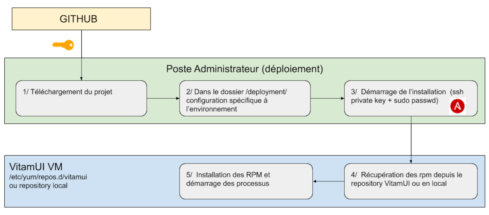

# Gestion du système

## Chaîne de déploiement  

* Les composants de la solution VITAM UI sont installés et configurés par un outil de déploiement automatique (ansible) dans des systèmes d’exploitation cibles (VM, container..). 

* La procédure d’installation et de configuration se fait à travers un ensemble de scripts dont le source code est stocké dans le repository GIT. 

* L’outil de déploiement (yum) utilise exclusivement les dépôts de packages pour installer les softs, afin de se décharger des étapes d’installation des dépendances et la gestion de conflit de fichiers.

    Schéma du processus de déploiement
    

### Packaging

Les packages VITAMUI sont disponibles au format RPM (CentOS).

Chaque package respecte les principes suivants :

* Nom des packages : vitamui<id> du package
* Version du package : Numéro de “release” du projet 
* Les dossiers (ainsi que les droits associés) compris dans les packages respectent les principes dictés dans la section dédiée aux utilisateurs, dossiers et droits.
* Les fichiers de configuration sont gérés par l’outil de déploiement de manière externe aux packages et ne sont pas inclus dans les packages.

Les composants de la solution VITAMUI sont tous disponibles sous forme de packages natif aux distributions supportées (rpm pour CentOS 7). Ceci inclut notamment :

* L’usage des pré-requis (au sens Require ou Depends) nativement inclus dans la distribution concernée
* L’arborescence des répertoires OS de la distribution concernée
* L’usage du système de démarrage systemd.

Les packages ne contiennent pas de pré/post action d’arrêt/démarrage/redémarrage de services. La gestion de démarrage des services et leur démarrage (a minima initial) est de la responsabilité de l’outillage de déploiement.

Les fichiers de configuration ne sont pas gérés dans les packages RPM. Par conséquent, ils n’apparaissent pas dans le résultat de commandes telles que rpm -ql. Les fichiers de configuration sont instanciés par l’outil de déploiement. Pour éviter la génération de fichier .rpmnew ou .rpmsave, il n’est pas utilisé la directive %config.

Les limitations associés au format de packaging choisi sont :

* L’instanciation d’une seule instance d’un même moteur par machine (il n’est ainsi pas possible d’installer 2 moteurs d’exécution sur le même OS) ;
* La redondance de certains contenus dans les packages (ex: les librairies Java sont embarquées dans les packages, et non tirées dans les dépendances de package)

### Dépôts

L’installation de VITAMUI s’appuie sur des dépôts Nexus et dans le Repository RPM; ou tout autre repository mis en oeuvr suite au build.  Il est également possible de déployer VitamUI en générant des dépôts locaux sur les machines cibles.

### Principes de déploiement

Les principes généraux de déploiement sont les suivants :

* Les packages d’installation (rpm) sont identiques pour tous les environnements. Seule leur configuration change.

* La configuration des services est externalisée et gérée par l’outillage de déploiement.

* Le déploiement est décrit intégralement dans un fichier de définition du déploiement. En dehors des pré-requis, le déploiement initial est automatisé en totalité (sauf exception).

* Les services sont configurés par défaut pour permettre leur colocalisation (dans le sens de la colocalisation de deux instances de deux moteurs différents) (ex: dossiers d’installation / de fonctionnement différents, ports d’écoute différents, ...).

* Le déploiement s’effectue à partir d’un point central. Les commandes passées sur chaque serveur à partir de ce point central utilisent le protocole SSH.

Les service de déploiement fourni permet le déploiement de la solution VITAMUI. 

* Gestion des binaires d’installations (version, intégrité)
* Gestion des éléments de configuration spécifiques à chaque plate-forme 
* Pilotage de l’installation des services sur les éléments d’infrastructure (VM/containers) de manière cohérente

Données gérées :

* Configuration technique du système VITAMUI
* Certificats x509 : le moteur de déploiement et de configuration doit posséder la référence des certificats techniques déployés sur la plate-forme (car il doit entre autres assurer la cohérence de ces certificats entre les différentes instances des composants VITAMUI déployés)

## Cloisonnement

TODO 

## Logs techniques  

 La gestion des logs techniques dans VITAMUI est similaire à celle de VITAM. Pour une description complète du fonctionnement des  logs et d'ELK, il est possible de se référer à la documentation VITAM.

* [Doc VITAM : Chaîne de log - rsyslog / ELK ](http://www.programmevitam.fr/ressources/DocCourante/html/exploitation/composants/elasticsearch_log/_toc.html)

## Supervision  

TODO

## Métriques  

TODO

## Sauvegarde

TODO

## PRA

TODO
