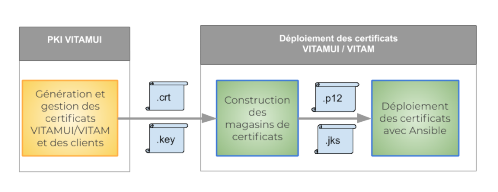

## Certificats et PKI

La PKI permet de gérer de manière robuste les certificats de la solution VITAMUI. Une PKI est une architecture de confiance constituée d’un ensemble de systèmes fournissant des services permettant la gestion des cycles de vie des certificats numériques :

* émission de certificats à des entités préalablement authentifiées
* déploiement des certificats
* révocation des certificats
* établir, publier et respecter des pratiques de certification de confiance pour établir un espace de confiance

### Principes de fonctionnement PKI de VITAMUI

La PKI VITAMUI gère les certificats nécessaires à l'authentification des services VITAMUI et des entités extérieurs. La logique de fonctionnement de la PKI VITAMUI est similaire à celle utilisée par la solution VITAM. 

Les principes de fonctionnement de la PKI sont les suivants :

* Emission des certificats VITAMUI (les dates de création et de fin de validité des CA sont générées dans cette phase).
* Gestion du cycle de vie (révocation) des certificats
* Publication des certificats et des clés (.crt et .key)
* Déploiement :
    * Génération des magasins de certificats VITAMUI (les certificats .crt et .key sont utilisés pour construire un magasin de certificats qui contient des certificats  .p12 et .jks) 
    * Déploiement dans VITAMUI des certificats .p12 et .jks par Ansible


    Schéma de la PKI :
  
    


## Explication avancée du fonctionnement

Le fonctionnement de la PKI de la solution *VitamUI* est basée à celle de Vitam - la logique d'architecture reste identique.

Lien des documentations existantes :
PKI VITAM : <http://www.programmevitam.fr/ressources/DocCourante/html/installation/annexes/10-overview_certificats.html?highlight=pki>

PKI VITAM suite : <https://www.programmevitam.fr/ressources/DocCourante/html/installation/annexes/15-certificates.html#>

La PKI voit ses fichiers répartis à deux emplacements:

- deployment/pki

  A cet emplacement se trouvent les scripts et fichiers de configuration associés à la génération des assets (certificats, clés privées ...)

  Fichier       | Description  |
  ------------ | :----------- |
  pki/ca        |  Répertoire dans lequel sont stockés les CA de chaque zone    |
  pki/config        |  Répertoire dans lequel sont stockées les configurations pour la génération des CA/certificats     |
  pki/config/scripts        |  Répertoire dans lequel sont stockées les scripts de génération de la PKI. |

### Génération des certificats 

  Revenons en détails sur les scripts de génération des différents éléments de la PKI:
  - generate_ca*.sh:
    - Paramètre(s):
      - ERASE [Facultatif]: Booléen indiquant si les CA et fichiers associés existants doivent être supprimés avant génération - Valeur par défaut: **false**
    - Description:
    Permet de générer les certificats d'autorité mentionnées dans le script de génération. Attention, toute autorité existante n'est pas regénérée, l'utilisation du paramètre **ERASE** sera recommandée lors de la première génération de la PKI.

  - generate_certs*.sh
    - Paramètre(s):
      - ENVIRONNEMENT_FILE [Obligatoire]: Chemin vers le fichier d'environnement pour lequel les certificats vont être générés
      - ERASE [Facultatif]: Booléen indiquant si les certificats et fichiers associés existants doivent être supprimés avant génération - Valeur par défaut: **false**
    - Description:
    Permet de générer les certificats (serveur, client) mentionnés dans le script de génération. Attention, tout certificat existant n'est pas regénéré, l'utilisation du paramètre **ERASE** sera recommandée lors de la première génération de la PKI.
    Deux types de fichiers seront modifiés lors de cette exécution:
      - les fichiers de configuration des CA (serial, index.txt ...)
      - les fichiers générés (`deployment/environment/certs`)

  Les scripts suffixés par **_dev** concernent le matériel SSL utilisé pour le lancement de l'application en local sur l'environnement de developpement. L'ensemble des fichiers générés se trouveront dans l'arborescence **dev-deployment** du projet. Chaque application fera référence à ses fichiers respectifs.

- deployment/environment/certs

A cet emplacement figure l'ensemble de la PKI de la solution.
Par défaut, on retrouvera trois zones (une par autorité):

- server: l'ensemble du certificats permettant la communication HTTPS entre les différentes applications de la solution
- client-vitam: certificats utilisés par l'application pour communiquer avec Vitam. Avec le script **generate_certs.sh** fournis par la PKI, un certificat sera généré pour s'interfacer avec Vitam.
- client-external: certificats des clients autorisés à solliciter les API externes

## Cas pratiques

- Instaurer la communication entre la solution VitamUI <-> Vitam

  Quelques rappels:
  - au sein de la solution VitamUI, vous avez:

    - un client Vitam Java (access-external, ingest-external) permettant de réaliser des requêtes aurpès de Vitam. Ce client se base sur un fichier de configuration dans lesquels sont référencés un **keystore** (concenant le certificat utilisé pour chiffrer la requête) et un **trustore** (contenant le(s) CA(s) utilisé(s) pour les échanges avec les applications à l'extérieur de VitamUI)
    - `deployment/environement/certs/client-vitam/ca`: certificat d'autorité intervenant dans la communication VitamUI <-> Vitam.
    /!\ L'ensemble des CA présents dans ce répertoire seront embarqués dans le trustore exploités par le client Vitam Java lors de l'exécution du script *generate_keystores.sh*.

    - `deployment/environement/certs/client-vitam/clients/vitamui`: certificat utilisé pour la communication VitamUI <-> Vitam.
    /!\ Le certificat sera embarqué dans le keystore utilisé par le client Vitam Java lors de l'exécution du script *generate_keystores.sh*.

  - au sein de la solution Vitam, vous avez:

    - au sein du modèle de données, un certificat est associé à un contexte de sécurité (restriction d'actions par tenant à travers des contrats), lui-même associé à un profile de sécurité (permission sur les API externes). Cette association s'effectue dans le fichier `environment/group_vars/all/postinstall_param.yml`

    - la structure de la PKI VitamUI étant identique à celle de Vitam, le comportement est le suivant:

      - tout CA utilisé par un client pour solliciter les API externes et nécessaire à la chaine de vérification de son certificat doit se trouver dans le répertoire `envionment/certs/client-external/ca`
      /!\ L'ensemble des CA présents dans ce répertoire seront embarqués dans le trustore exploités par les API externes lors de l'exécution du script *generate_keystores.sh*.

      - le certificat d'un client accédant aux API externes doit figurer à l'emplacement `envionment/certs/client-external/clients/external`

  De ce fait, vous devez synchroniser vos PKI et vos solutions pour assurer une bonne communication:
  - VitamUI -> Vitam
    - Copier le CA du certificat VitamUI `{vitamui_inventory_dir}/certs/client-vitam/ca/ca-*.crt` dans `{vitam_inventory_dir}/certs/client-external/ca`
    - Copier le certificat VitamUI `{vitamui_inventory_dir}/certs/client-vitam/clients/vitamui/vitamui.crt` dans `{vitam_inventory_dir}/certs/client-external/clients/external`
    - Mise à jour de la PKI Vitam:
      - `./generate_stores.sh`
      - `ansible-playbook ansible-vitam/vitam.yml ${ANSIBLE_OPTS} --tags update_vitam_certificates`
    - Création du contexte VitamUI:
      - Population du fichier postinstall_param.yml:

      ```txt
        vitam_additional_securityprofiles:
        - name: vitamui-security-profile
          identifier: vitamui-security-profile
          hasFullAccess: true
          permissions: "null"
          contexts:
            - name: vitamui-context
              identifier: vitamui-context
              status: ACTIVE
              enable_control: false
              # No control, idc about permissions, VitamUI will do it :)
              permissions: "[ { \"tenant\": 0, \"AccessContracts\": [], \"IngestContracts\": [] }, { \"tenant\": 1, \"AccessContracts\": [], \"IngestContracts\": [] }]"
              certificates: ['external/vitamui.crt']
      ```

      - Exécution du playbook de mise à jour:
        `ansible-playbook ansible-vitam-exploitation/add_contexts.yml`

  - Vitam -> VitamUI
    - Copier le(s) CA(s) de Vitam `{vitam_inventory_dir}/certs/client-vitam/ca` dans `{vitamui_inventory_dir}/certs/client-vitam/ca/`
    - Mise à jour de la PKI VitamUI:
      - `./generate_stores.sh`
      - `ansible-playbook vitamui_apps.yml --tags update_vitamui_certificates`

- Instaurer la communication entre la solution VitamUI <-> *Le monde extérieur*

  TODO (le process n'est pas encore industrialisé)

### PKI de test

VITAMUI propose de générer à partir d’une PKI de tests les autorités de certification root et intermédiaires pour les clients et les serveurs. Cette PKI de test permet de connaître facilement l’ensemble des certificats nécessaires au bon fonctionnement de la solution. Attention, la PKI de test ne doit être utilisée que pour faire des tests, et ne doit surtout pas être utilisée en environnement de production. 

### Liste des certificats utilisés

Le tableau ci-dessous détail l’ensemble du contenu des keystores et truststores par service.

|Composants  |  Keystores  |Truststores|
|------------|-------------|-----------|
|**ui-portal**  |  ui-portal.crt, ui-portal.key  | ca-root.crt, ca-intermediate.crt |
|**ui-identity**  |  ui-identity.crt, ui-identity.key  | ca-root.crt, ca-intermediate.crt |
|**ui-identity-admin**  |  ui-identity-admin.crt, ui-identity-admin.key  | ca-root.crt, ca-intermediate.crt |
|**ui-referential**  |  ui-referential.crt, ui-referential.key  | ca-root.crt, ca-intermediate.crt |
|**ui-ingest**  |  ui-ingest.crt, ui-ingest.key  | ca-root.crt, ca-intermediate.crt |
|**ui-archive-search**  |  ui-archive-search.crt, ui-archive-search.key  | ca-root.crt, ca-intermediate.crt |
|**cas-server**  |  cas-server.crt, cas-server.key  | ca-root.crt, ca-intermediate.crt |
|**iam-external**  |  iam-external.crt, iam-external.key  | ca-root.crt |
|**iam-internal**  |  iam-internal.crt, iam-internal.key  | ca-root.crt |
|**referential-external**  |  referential-external.crt, referential-external.key  | ca-root.crt |
|**referential-internal**  |  referential-internal.crt, referential-internal.key  | ca-root.crt |
|**ingest-external**  |  ingest-external.crt, ingest-external.key  | ca-root.crt |
|**ingest-internal**  |  ingest-internal.crt, ingest-internal.key  | ca-root.crt |
|**archive-search-external**  |  archive-search-external.crt, archive-external.key  | ca-root.crt |
|**archive-search-internal**  |  archive-search-internal.crt, archive-internal.key  | ca-root.crt |
|**security-server**  |  security-server.crt, security-server | ca-root.crt |

La liste des certificats utilisées par VITAM est décrite à cette adresse : http://www.programmevitam.fr/ressources/DocCourante/html/archi/securite/20-certificates.html 

### Procédure d’ajout d’un certificat client externe

Le certificat ou l’autorité de certification doit présent dans les truststores des APIs external VITAMUI. La procédure d'ajout d’un certificat client externe aux truststores des services de VITAMUI est la suivante :

* Déposer le(s) CA(s) du client dans le répertoire deployment/environment/certs/client-external/ca

* Déposer le certificat du client dans le répertoire deployment/environment/certs/client-external/clients/external/

* Régénérer les keystores à l’aide du script deployment/generate_stores.sh

* Exécuter le playbook pour redéployer les keystores sur la solution VITAMUI :  

```console 
ansible-playbook vitamui_apps.yml -i environments/hosts --vault-password-file vault_pass.txt --tags update_vitamui_certificates
```

L’utilisation d’un certificat client sur les environnements VITAMUI nécessite également de vérifier que le certificat soit présent dans la base de données VITAMUI et rattaché à un contexte de sécurité du client.
