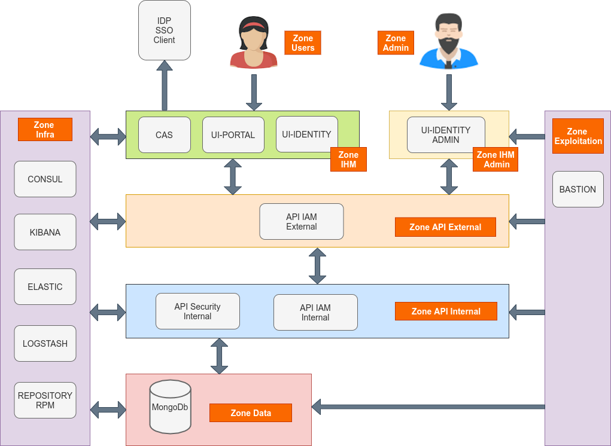

## Services

La solution est bâtie selon une architecture de type micro-services. Ces services communiquent entre eux en HTTPS via des API REST.

* Les services externes exposés publiquement sont sécurisés par la mise en oeuvre d'un protocole M2M nécessitant l'utilisation de certificats X509 client et serveur reconnus mutuellement lors de la connexion. 

* Les services internes, ne sont jamais exposés publiquement. Ils sont accessibles uniquement en HTTPS par les services externes ou par d'autres services internes.
 
* Les accès aux bases de données MongoDb ou aux socles techniques externes (ie. VITAM) se font uniquement via les services internes.

* Les utilisateurs sont authentifiés via CAS et disposent d'un token, validé à chaque appel, qui les identifient durant toute la chaîne de traitement des requêtes.  

### Identification des services

Il est primordial que chaque service de la solution puisse être identifié de manière unique sur le système. A cet effet, les services disposent des différents identifiants suivant :
 
* ID de service (ou service_id) : c’est une chaîne de caractères qui nomme de manière unique un service. Cette chaîne de caractère doit respecter l’expression régulière suivante : [a-z][a-z-]*. Chaque cluster de service possède un ID unique de service.

* ID d’instance (ou instance_id) : c’est l’ID d’un service instancié dans un environnement ; ainsi, pour un même service, il peut exister plusieurs instances de manière concurrente dans un environnement donné. Cet ID a la forme suivante : <service_id>-<instance_number>, avec <instance_number> respectant l’expression régulière suivante : [0-9]{2}. Chaque instance dans ce cluster possède un id d’instance (instance_id).

* ID de package (ou package_id) : il est de la forme vitamui<service_id>. C’est le nom du package à déployer.

### Communications inter-services

Les services VITAMUI suivent les principes suivants lors d’un appel entre deux composants :

1. Le composant amont effectue un appel (de type DNS) à l’annuaire de service en indiquant le service_id du service qu’il souhaite appeler

2. L’annuaire de service lui retourne une liste ordonnée d’instance_id. C’est de la responsabilité de l’annuaire de service de trier cette liste dans l’ordre préférentiel d’appel (en fonction de l’état des différents services, et avec un algorithme d’équilibrage dont il a la charge)

3. Le composant amont appelle la première instance présente dans la liste. En cas d’échec de cet appel, il recommence depuis le point 1. La communication vers une instance cible de type Service API utilise nécessairement le protocole sécurisé HTTPS. 

Ces principes ont pour but de garantir les trois points suivants :
* Les clients des services doivent être agnostiques de la topologie de déploiement, et notamment du nombre d’instances de chaque service dans chaque cluster. La connaissance de cette topologie est déléguée à l’annuaire de service.

* Le choix de l’instance cible d’un appel doit être décorrélé de l’appel effectif afin d’optimiser les performances et la résilience.

* La garantie de la confidentialité des informations transmises entre les services (hors COTS) 

Dans le cas des COTS, la gestion de l’équilibrage de charge et de la haute disponibilité doit être intégrée de manière native dans le COTS utilisé. D'autre part, la sécurisation de la transmission dépend du COTS. Dans le cas où le chiffrement des données transmises n'est pas assuré, il est alors recommandé d'isoler le COTS dans une zone réseau spécifique.

### Cloisonnement des services  

Le cloisonnement applicatif permet de séparer les services de manière physique (subnet/port) et ainsi  limiter la portée d’une attaque en cas d’intrusion dans une des zones. Ce cloisonnement applique le principe de défense en profondeur préconisé par l’ANSI.

Chaque zone héberge des clusters de services. Un cluster doit être présent en entier dans une zone, et ne peut par conséquent pas être réparti dans deux zones différentes. Chaque noeud d’un cluster applicatif doit être installé sur un hôte (OS) distinct (la colocalisation de deux instances d’un même service n’étant pas supporté). La mise en oeuvre d’une infrastructure virtualisée impose de placer deux noeuds d’un même cluster applicatif sur deux serveurs physiques différents.

Un exemple de découpage en zones applicative est fourni ci-dessous. Ce découpage repose sur une logique assez classique adapté à une infrastructure de type VmWare ESX. Pour une architecture reposant sur  une technologie de type Docker, il serait envisageable de découper plus finement les zones jusqu'à envisager une zone pour chaque cluster de service.

Dans cet exemple, il est prévu pour respecter les contraintes de flux inter-zones suivants :

* les utilisateurs de la zone USERS communiquent avec les services de la zone IHM
* les administrateurs de la zone ADMIN communiquent avec les services de la zone IHM ADMIN
* les services de la zone IHM et IHM-ADMIN communiquent avec les services de la zone API-EXTERNAL
* les services de la zone API-EXTERNAL communiquent avec les services de la zone API-INTERNAL
* les services de la zone API-INTERNAL communiquent avec les services de la zone DATA
* les services de toutes les zones communiquent avec les services déployés dans la zone INFRA 
* les exploitants techniques accédent aux services de la zone EXPLOITATION puis intervenir dans toutes les zones

Tous les serveurs cibles doivent avoir accès aux dépôts de binaires contenant les paquets des logiciels VITAMUI et des composants externes requis pour l’installation. Les autres éléments d’installation (playbook ansible, ...) doivent être disponibles sur la machine ansible orchestrant le déploiement de la solution dans la zone INFRA.

    Schéma de zoning :
  
  

