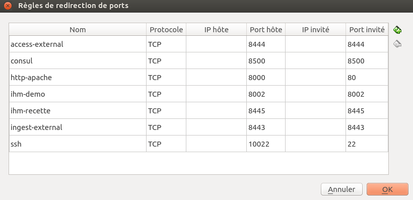

# VitamUI

## I - Connect Vitamui with remote Vitam environment

To connect Vitamui with a deployed Vitam environment, we follow these steps :

### 1. Prepare TSL/SSL configurations:

In the case of TSL/SSL mutual authentication, we need to prepare the trust-store of the remote environment and the keystore
of our environment trusted by the remote environment, to do that, we follow these steps :

#### 1.1. Prepare trust-store & key-store for server API access

1. Execute the following command to retrieve server certificate :

```shell script
    openssl s_client -servername ga.env-api.programmevitam.fr -connect ga.env-api.programmevitam.fr:443 </dev/null 2>/dev/null | openssl x509 -text > /tmp/server_cert.crt
```

2. Generate a trust-store with previous extracted cert (example password: customer-password-ts , trust: yes):

```shell script
    keytool -import -file /tmp/server_cert.crt -alias server_cert -keystore our-trust-store.jks
```

3. Download an external public certificate (external_pub.pem && external_key.pem) provided in this
   path: https://webdav.dev.programmevitam.fr/webdav/Certificats_vitam/
4. Generate a keystore, for Vitam context, with this certificate. (example password: customer-password-ks , example in P12 format):

 ```shell script
    openssl pkcs12 -export -in external_pub.pem -inkey external_key.pem -out our-keystore-env-ga.p12
```

### 2. Update settings files:

Update settings files to call Vitam external services: we need to update the settings file for calling external
webservices on Vitam: access-external, ingest-external, and collect-external.

By default, the settings file are named :
access-external-client.conf, ingest-external-client.conf, collect-external-client.conf

Example ingest-external-client.conf :

```
serverHost: ga.env-api.programmevitam.fr                ## the API url of remote Vitam environment
serverPort: 443                                         ## HTTPS default port 
secure: true
sslConfiguration :
 keystore :
  - keyPath: /vitam/conf/our-keystore-env-ga.p12        ## the path of generated keystore before
    keyPassword: customer-password-ks                   ## the password provided on keystore generation
 truststore :
  - keyPath: /vitam/conf/our-trust-store.jks            ##  the path of  generated trust store before
    keyPassword: customer-password-ts                   ## the password provided on trust store generation
hostnameVerification: true
```

## II - Install Vitam locally

There is two ways (for now) for starting [VITAM](https://github.com/ProgrammeVitam/vitam) in an development mode in
order to make
requests to external APIs from VitamUI:

### Launch Vitam services using your IDE and docker for COTS

the first way is launching Vitam locally with IDEs and docker images etc... refer to the directory
named `vitam-conf-dev`
at [Vitam configuration for devs](https://github.com/ProgrammeVitam/vitam), don,t forget to choose the compatible
version of vitam you want to use to follow compatible configurations.

### Launch Vitam services using Vitam Virtual Machine

This is the recommanded way for starting development with VITAMUI with a virtualized VITAM.
each relese of VITAM, a virtual machine is created and published.
to download a specific version (example 2.15.3) of VITAM virtual
machine, [see](https://download.programmevitam.fr/vitam_repository/2.15.3/VM/)

> :warning: **Vitam uses Java 11, since 3.0.x **: Be careful when choosing the VM to download.

### 1 - Steps after downloading the VITAM VM

After downloading the VITAM Virtual Machine, launch it using either [VirtualBox](https://www.virtualbox.org/)
or [VM Ware](https://www.vmware.com)
below the process to launch the VM with VirtualBox

### 1a - Starting checks

#### Import the VM to VirtualBox

dans virtualBox , Fichier > Importer un appareil virtuel

#### Configure network to NAT


#### Vitam port redirections

The redirection of vitam external endpoints ports


#### access the VM

the default shel users:

- demo/demo
- root/packer


#### Vitam main interface

the main interface for all vitam services are accessible with : [localhost:8000](localhost:8000)


#### consul

The consul interface for service discovery is accessible
at [http://localhost:8000/ui/demo/services](http://localhost:8000/ui/demo/services)


### 1b - Get SSL certificate from the store

to make HTTPS request to VITAM Endpoints, you should get the `.crt` and `.key` certificates.
To do so, download the keystore from this
link [localhost:8000/nodes/vitam-env-vm-demo.vitam-env/browse/conf/ihm-demo/](http://localhost:8000/nodes/vitam-env-vm-demo.vitam-env/browse/conf/ihm-demo/)

or execute the command below:
> `bash$ wget localhost:8000/nodes/vitam-env-vm-demo.vitam-env/browse/conf/ihm-demo/keystore_ihm-demo.p12`

or copy the file using SCP command as below:

> `bash$ scp -p 10022 root@localhost:/vitam/conf/ihm-demo/keystore_ihm-demo.p12 .`

the password to use is the 'root' password on the virtual machine.

store it in a working directory, after that, we should extract private kay and certificate from that keystore.

To do so execute the two commands:

- extract the private key:

> `bash$ openssl pkcs12 -in keystore_ihm-demo.p12 -out key.pem -nocerts -nodes`

- extract the public key:

> `bash$ openssl pkcs12 -in keystore_ihm-demo.p12 -out crt.pem -clcerts -nokeys`

### 1b - Try to access the Vitam from local

get your IP adress with `ifconfig` command or with the command `hostname -i`.

- sending HTTPS curl request:

we are going to send an example request to VITAM external endpoint, for example we'll choose VITAM `Ingest External`
API.


Vitam is responding with an `X-Request-Id` as we see in the screen above.

use this request to reproduce it in your local:
> `bash$ curl -XGET -v -k --key ./key.pem --cert ./crt.pem https://@yourIP:8443/ingest-external/v1/status -H 'X-Tenant-Id: 0'`

`--key ./key.pem` and `--cert ./crt.pem`  are the private and the public key extracted at the previous step.

- example of sending an SIP to VITAM
  In this step we are going to send a real SIP to VITAM, see the screen example


use this request to reproduce it in your local:

> `bash$ curl -XPOST -v -k --key ./key.pem --cert ./crt.pem https://@yourIP:8443/ingest-external/v1/ingests -H 'X-Tenant-Id: 0' -H 'X-Action: RESUME' -H 'Accept: application/json' -H 'X-Chunk-Offset:0' -H 'X-Context-Id: DEFAULT_WORKFLOW' -H 'Content-Type: application/octet-stream' -H 'X-Size-Total: size (verify size of sip.zip)' --data-binary @path/to/some/valid/sip.zip`

> :warning: change `@yourIP`, `X-Size-Total` and the `path/to/some/valid/sip.zip` before launching the command

### 1c - Configure VITAMUI to access Vitam APIs

The final Step is to configure VITAMUI modules that interacts with VITAM.
Untill now there is two modules that interacts with VITAM endpoints,
the `IAM` module and the `Ingest` module. specifically the `IAM-Internal` and `Ingest-Internal` modules.

#### Copie VITAM configuration files and necessary certificates to VITAMUI modules

Under the `conf` directory of this two modules, a directory called `vitam-dev` directory for dev purposes as it's name
indicate.
at this level you should copy 4 necessary files:

- `access-external-client.conf` [localhost:8000/nodes/vitam-env-vm-demo.vitam-env/browse/conf/ihm-demo/access-external-client.conf](localhost:8000/nodes/vitam-env-vm-demo.vitam-env/browse/conf/ihm-demo/access-external-client.conf)
- `ingest-external-client.conf` [localhost:8000/nodes/vitam-env-vm-demo.vitam-env/browse/conf/ihm-demo/ingest-external-client.conf](localhost:8000/nodes/vitam-env-vm-demo.vitam-env/browse/conf/ihm-demo/ingest-external-client.conf)
- `keystore_ihm-demo.p12` [localhost:8000/nodes/vitam-env-vm-demo.vitam-env/browse/conf/ihm-demo/keystore_ihm-demo.p12](localhost:8000/nodes/vitam-env-vm-demo.vitam-env/browse/conf/ihm-demo/keystore_ihm-demo.p12)
- `truststore_ihm-demo.jks` [localhost:8000/nodes/vitam-env-vm-demo.vitam-env/browse/conf/ihm-demo/truststore_ihm-demo.jks](localhost:8000/nodes/vitam-env-vm-demo.vitam-env/browse/conf/ihm-demo/truststore_ihm-demo.jks)

copy them to the `vitam-dev` directory of the two modules.

these files are accessible
here : [localhost:8000/nodes/vitam-env-vm-demo.vitam-env/browse/conf/ihm-demo](localhost:8000/nodes/vitam-env-vm-demo.vitam-env/browse/conf/ihm-demo)

### Upgrading PKI (Public Key Infrastructure) in case of Certificates expiration:

In your virtual machine, go to path `/code/deployment/`

#### Modifying the configuration file:

Modify the file `environments/vitam_pf_vars.yml`, comment the line `admin_context_certs`

#### Regenerating the vitam PKI:

To do that, execute the following command lines :

- Generate the CA (Certificate Authorities):
  `bash$ ./pki/scripts/generate_ca.sh true`

- Generate new Certificates
  `bash$ ./pki/scripts/generate_certs.sh environments/hosts.demo true`

- Generate the keystores (truststores, keystores, p12 and jks):
  `bash$ ./generate_stores.sh true`

#### Pushing the new PKI generate:

Push the new PKI generated in the previous step, by executing the following commands, always from `/code/deployment`
location

- `bash$ ansible-playbook ansible-vitam/vitam.yml -i environments/hosts.demo --vault-password-file vault_pass.txt -e confirmation=yes
  --tags update_vitam_certificates --extra-vars=@environments/vitam_pf_vars.yml
  --extra-vars=@environments/environments_vars.yml`

- `bash$ ansible-playbook ansible-vitam-extra/extra.yml -i environments/hosts.demo --vault-password-file vault_pass.txt -e confirmation=yes
  --tags update_vitam_certificates --extra-vars=@environments/vitam_pf_vars.yml
  --extra-vars=@environments/environments_vars.yml`

update_vitam_certificates is an ansible tag the will target the specific locations to update only certificates.

#### Reboot the VM

Restart the VM, and check that all the services are up'running in consul, and check that stores are updated in services
at `/vitam/conf/{vitam-service-name}`
