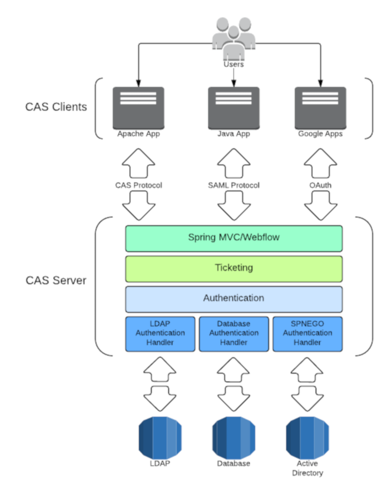
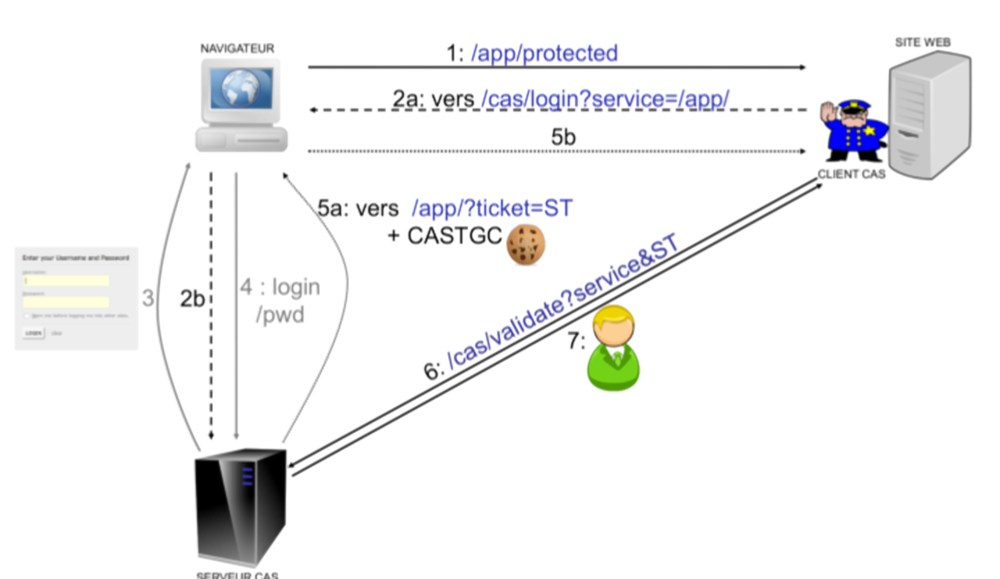
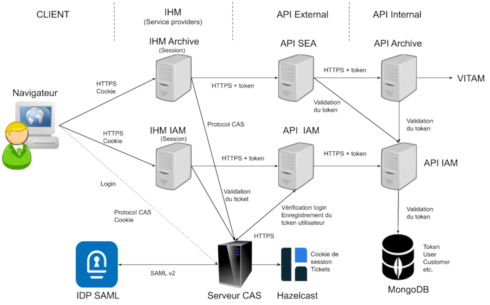
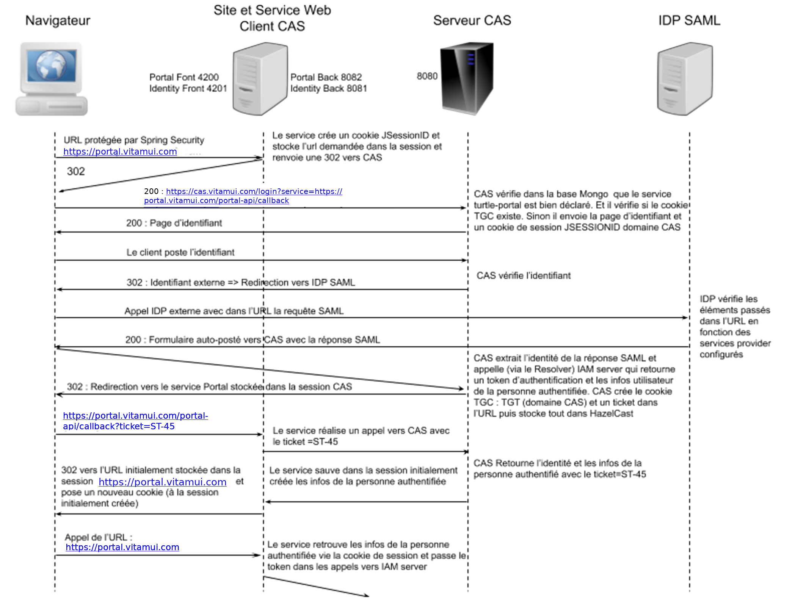
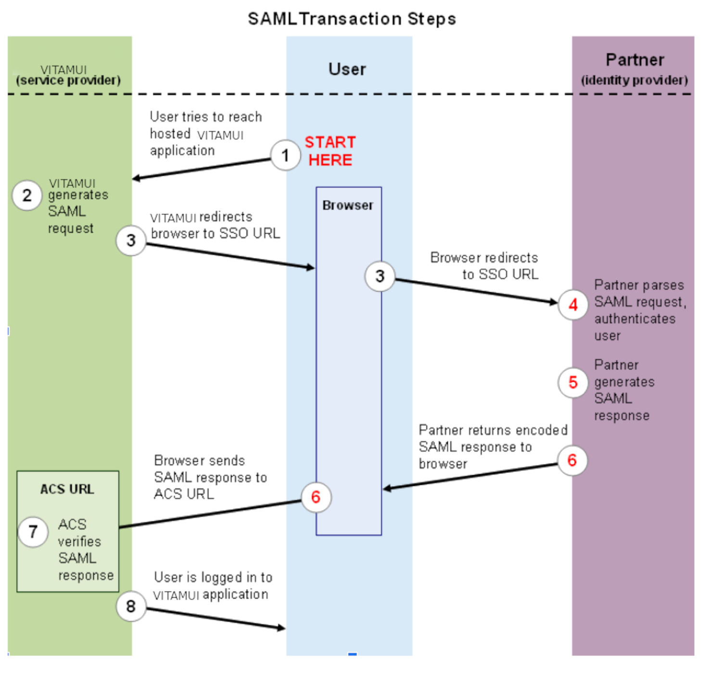
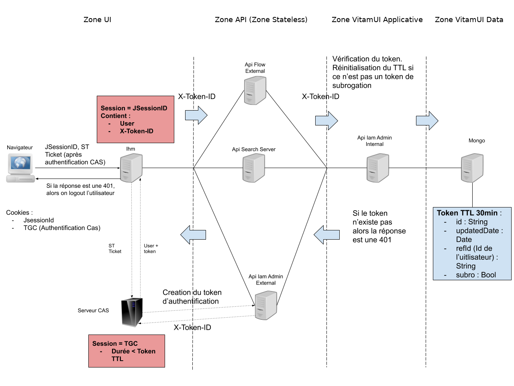
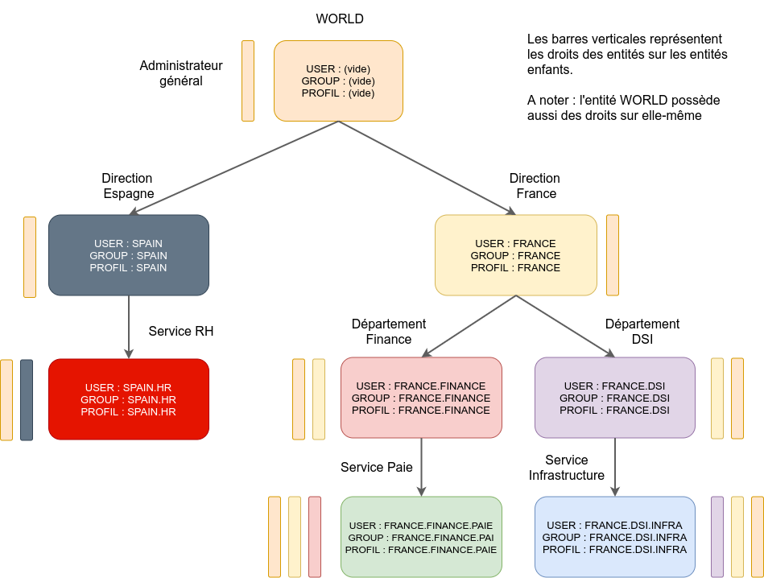
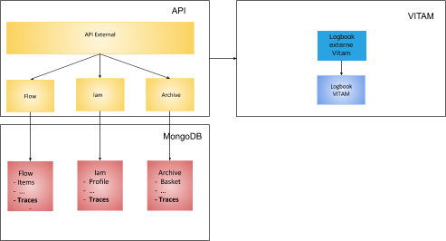
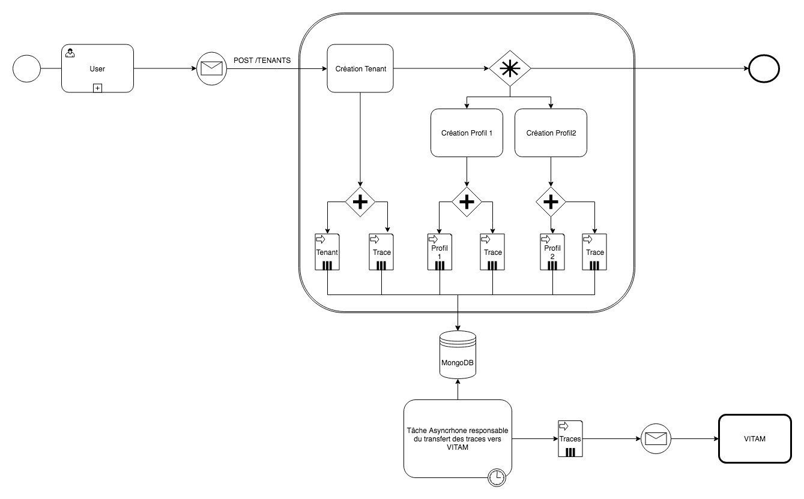
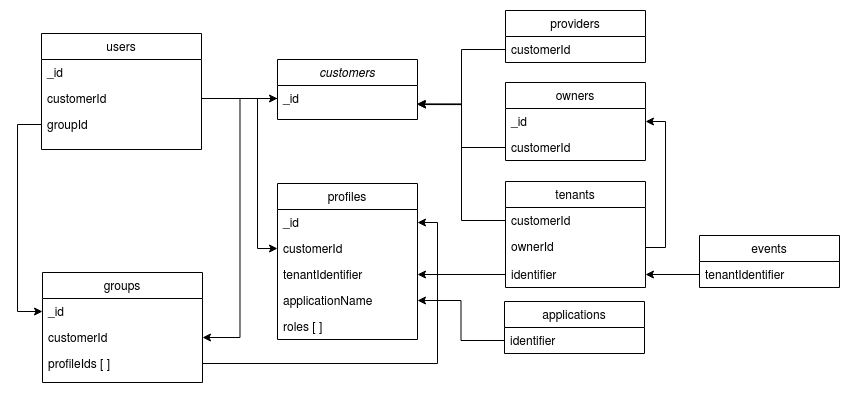

# Architecture

## Applications Web

Les applications Web constituent les IHM de la solution. Elles sont accessibles depuis le portail de la solution.
L'authentification d'un utilisateur dans une application cliente se fait par l'intermédiaire de l'IAM CAS. Une application cliente est constituée de 2 parties.

* Interface utilisateur Front (IHM WEB) qui donne accès aux fonctionnalités via un navigateur
* Interface utilisateur Back (Service BackOffice) qui gère la communication avec CAS et les accès aux API externes

Une double authentification est nécessaire pour qu’un utilisateur puissent accéder aux API externes :

* Le service UI Back de l’application cliente doit posséder un certificat reconnu par la solution
* L’utilisateur de l’application cliente doit être authentifié dans la solution (par CAS) et posséder un token valide

Les applications de base :

* portal : application portail donnant accès aux applications
* identity : application pour gérer les organisations, utilisateurs, profils, etc.

---

## Services externes

Les services externes exposent des API REST publiques accessibles en HTTPS. Ces services constituent une porte d'accès aux services internes et assurent principalement un rôle de sécurisation des ressources internes.

La connexion d'une application cliente à un service externe nécessite le partage de certificats X509 client et serveur dans le cadre d'un processus d'authentification mutuel (Machine To Machine/M2M). Dans la solution VITAMUI, les certificats des clients sont associés à un contexte de sécurité stocké dans une collection MongoDb gérée par le service security_internal. D'autre part, les utilisateurs clients sont identifiés et authentifiés dans les services externes par le token fourni par CAS et transmis dans les headers des requêtes REST en HTTPS.

Le service externe a pour responsabilité de sécuriser les accès en effectuant les différentes étapes de vérifications des droits (générale, tenant, rôles, groupes, etc.) et de déterminer les droits résultants du client à l'origine de la requête, en réalisant l'intersection des droits applicatifs, définis dans le contexte de sécurité, avec les droits issus des profils de l'utilisateur. Le service externe s'assure ensuite que le client possède bien les droits pour accéder à la ressource demandée.

Les services externes s'auto-déclarent au démarrage dans l'annuaire de service Consul.

Les services disposent d'API REST pour suivre leur état et leur activité. Ces API ne sont pas accessibles publiquement.

* API Status pour connaître la disponibilité du service (utilisé par Consul)
* API Health (basée sur SpringBoot) pour suivre l'activité

Les services génèrent les logs techniques dans la solution de log centralisée basée sur ELK.

### Service iam-external

* Description : service externe pour la gestion des organisations, utilisateurs, profils, etc.
* Contraintes
* API swagger

### Service cas-server

* Description : service d’authentification nécessaire et accessible uniquement par l'IAM CAS
* Contraintes
* API swagger

### Service referential-external

* Description : service externe pour la gestion des référentiels de la solution logicielle VITAM.

  Le service de référentiel externe a pour responsabilité la réception, la sécurisation des ressources internes de gestion des référentiels, et la communication sécurisée avec les couches internes.

  Le service de référentiel externe est composé de plusieurs points d'APIs:

    * API des contrats d'accès (/referential/accesscontract)
    * API des contrats d'entrées (/referential/ingestcontract)
    * API des contrats de gestion (/referential/managementcontract)
    * API des services agents (/referential/agency)
    * API des formats (/referential/fileformat)
    * API des ontologies (/referential/ontology)
    * API des profils d'archivages (/referential/profile)
    * API des règles de gestion (/referential/profile)
    * API des profils de sécurité (/referential/security-profile)
    * API des contexts applicatifs (/referential/context)
    * API des opérations permettant le lancement différents audits (cohérence, valeur probante ...).

### Service ingest-external

* Description : service externe pour la gestion des opérations d'entrées d'archives de la solution logicielle VITAM.

  Le service d'ingest externe a pour responsabilité la réception, la sécurisation des ressources internes de versement, et la communication sécurisée avec les couches internes.

  Le service d'ingest externe est composé de plusieurs points d'APIs:

    * API de versement des archives permettant la consommation des flux d'archives (/v1/ingest/upload)
    * API de visualisation des journaux d'opération des opérations d'entrées (API /v1/ingest)
    * API de visualisation détaillé d'un journal d'une opération d'entrées (/v1/ingest/{id})
    * API permettant le téléchargement d'un rapport sous forme ODT d'une opération d'entrée (/v1/ingest/odtreport/{id})
    * API commune est utilisé pour le téléchargement du Manifest et de l'ATR (Archival Transfer Reply) d'une opération d'entrée.
      (Manifest: /logbooks/operations/{id}/download/manifest, ATR: /logbooks/operations/{id}/download/atr)

### Service archive-search-external

* Description : service externe pour la gestion d'accès et la recherche d'archives de la solution logicielle VITAM.

  Le service d'archive externe a pour responsabilité la réception, la sécurisation des ressources internes, et la communication sécurisée avec les couches internes d'accès aux archives.

  Le service d'archive externe est composé de plusieurs points d'APIs:

    * API de recherche des archive par requetes (/archive-search/search)
    * API de recherche des unités archivistiques (/archive-search/archiveunit/{id})
    * API de recherche des arbres de positionnement et plans de classement (/archive-search/filingholdingscheme)
    * API de téléchargement des objets (/archive-search/downloadobjectfromunit/{id})
    * API d'export des résultats sous format csv (/export-csv-search)


### Service de collect externe

* Description : service externe pour la gestion des projets de versements.

  Le service collecte externe est composé de plusieurs points d'APIs:


* GET /collect-api/projects: get projects paginated
* POST /collect-api/projects: Create new collect project
* GET /collect-api/projects/{id}: GET project Details
* PUT /collect-api/projects/{id}: updateProject
* DELETE /collect-api/projects/{id}: DELETE project
* GET /collect-api/projects/{id}/last-transaction: GET last Transaction for project
* GET /collect-api/projects/{id}/transactions:    GET transactions by project paginated
* POST /collect-api/projects/{id}/transactions:    Create Transaction For Project
* GET /collect-api/projects/archive-units/searchcriteriahistory:  GET the search criteria history
* POST /collect-api/projects/archive-units/searchcriteriahistory:  Create search criteria history for collect
* PUT /collect-api/projects/archive-units/searchcriteriahistory/{id}: Update Search criteria history
* DELETE /collect-api/projects/archive-units/searchcriteriahistory/{id}: DELETE Search criteria history
* GET /collect-api/projects/object-groups/downloadobjectfromunit/{id}: Download Archive Unit Object
* POST /collect-api/projects/upload: Upload collect zip file
* GET /collect-api/transactions/{id}: GET transaction by project
* PUT/collect-api/transactions/{id}: updateTransaction
* PUT /collect-api/transactions/{id}/abort: Abort transaction operation
* PUT /collect-api/transactions/{id}/reopen: Reopen transaction operation
* PUT /collect-api/transactions/{id}/send: Send transaction operation
* PUT /collect-api/transactions/{id}/validate:Validate transaction operation
* PUT /collect-api/transactions/{transactionId}/update-units-metadata: Upload on streaming metadata file and update archive units
* POST/collect-api/transactions/archive-units/{transactionId}/export-csv-search: export into csv format archive units by criteria
* POST/collect-api/transactions/archive-units/{transactionId}/search: GET AU collect paginated
* GET /collect-api/transactions/archive-units/archiveunit/{id}: Find the Archive Unit Details

### Service externe de gestion de profils documentaires (Pastis-external)

* Description :  Accéder, Créer, Modifier ou Supprimer les profils d'archivage et les profils d'unité archivistique

Le service Pastis externe est composé de plusieurs points d'APIs:

## Pastis Controller

* POST /pastis-api/pastis/archiveprofile: Download Archive Profile
* POST /pastis-api/pastis/edit: Transform profile
* POST /pastis-api/pastis/getarchiveunitprofile: Download Archive Unit Profile
* GET /pastis-api/pastis/profile: Create new Profile by type PA or PUA
* POST /pastis-api/pastis/profile: Upload Profile Vitamui

## Profile controller

* GET /pastis-api/profile: Get entities paginated
* POST /pastis-api/profile: Create Archival Profile
* PUT /pastis-api/profile/{id}: Update entity
* GET /pastis-api/profile/{identifier}: Get profile by ID
* POST /pastis-api/profile/check: Check ability to create profile
* GET /pastis-api/profile/download/{id}: download profile by id
* POST /pastis-api/profile/import: import profile
* PUT /pastis-api/profile/updateProfileFile/{id}: Importer un fichier xsd ou rng dans un profil

## Archival-profile unit controller

* GET /pastis-api/archival-profile: Get entity
* POST /pastis-api/archival-profile: Create Archival Unit Profile
* PUT /pastis-api/archival-profile/{id}: Update entity
* GET /pastis-api/archival-profile/{identifier}:  Get profile by ID
* POST /pastis-api/archival-profile/check:  Check ability to create ontology
* POST /pastis-api/archival-profile/import: import Archival Unit Profile

---

## Services internes

Les services internes offrent des API REST accessibles en HTTPS uniquement depuis les services externes ou internes. Les API de ces services ne sont donc pas exposées publiquement. Les services internes implémentent les fonctionnalités de base de la solution ainsi que les fonctionnalités métiers. En fonction des besoins, les services internes peuvent être amenés à journaliser des évènements dans le logbook des opérations du socle VITAM.

Les utilisateurs sont identifiés dans les services internes grâce au token transmis dans les headers des requêtes HTTPS.
L'utilisation du protocole HTTPS permet de chiffrer les tokens et les informations sensibles qui sont transportées dans les requêtes. Les services internes peuvent éventuellement vérifier les droits d'accès de l'utilisateur avant d'accéder aux ressources.

Les services internes s'auto-déclarent au démarrage dans l'annuaire de service Consul.

Les services disposent d'API REST pour suivre leur état et leur activité.

* API Status pour connaître la disponibilité du service (utilisé par Consul)
* API Health (basée sur SpringBoot) pour suivre l'activité du service

Les services génèrent les logs techniques dans la solution de log centralisée basée sur ELK.

### Service iam-internal

* Description : service d’administration des clients, des utilisateurs et des profils, portail
* Contraintes
* API swagger
* Modèle de données

### Service security-internal

* Description : service de gestion de la sécurité applicative
* Contraintes
* API swagger
* Modèle de données

### Service referential-internal

* Description : service interne pour la gestion des référentiels de la solution logicielle VITAM.

  Le service de référentiel interne reçoit les requêtes du client référentiel externe, et communique avec VITAM via les clients Admin/Access pour la récupération des données.

  Le service de référentiel interne est composé de plusieurs points d'APIs:

  * API des contrats d'accès (/referential/accesscontract)
  * API des contrats d'entrées (/referential/ingestcontract)
  * API des contrats de gestion (/referential/managementcontract)
  * API des services agents (/referential/agency)
  * API des formats (/referential/fileformat)
  * API des ontologies (/referential/ontology)
  * API des profils d'archivages (/referential/profile)
  * API des règles de gestion (/referential/profile)
  * API des profils de sécurité (/referential/security-profile)
  * API des contexts applicatifs (/referential/context)
  * API des opérations permettant le lancement différents audits (cohérence, valeur probante ...).

  Pour plus d'information: voir la documentation des [référentiels](https://www.programmevitam.fr/pages/documentation/pour_archiviste/)

### Service ingest-internal

* Description : service interne pour la gestion des opérations d'entrées d'archives de la solution logicielle VITAM.

  Le service d'ingest interne a pour responsabilité la réception, et la communication sécurisée avec les couches externes de VITAM.

  Le service d'ingest interne est composé de plusieurs points d'APIs:

  * API de versement des archives permettant la consommation des flux d'archives (/v1/ingest/upload)
  * API de visualisation des journaux d'opération des opérations d'entrées (API /v1/ingest)
  * API de visualisation détaillé d'un journal d'une opération d'entrées (/v1/ingest/{id})
  * API permettant le téléchargement d'un rapport sous forme ODT d'une opération d'entrée (/v1/ingest/odtreport/{id})
  * API commune est utilisé pour le téléchargement du Manifest et de l'ATR (Archival Transfer Reply) d'une opération d'entrée.
      (Manifest: /logbooks/operations/{id}/download/manifest, ATR: /logbooks/operations/{id}/download/atr)

  Ce service est configuré pour qu'il puisse communiquer avec la zone d'accès de la solution logicielle VITAM.

  Pour aller plus loin: [API Ingest](https://www.programmevitam.fr/ressources/DocCourante/raml/externe/ingest.html), [API externes (ingest-external et access-external)](htps://www.programmevitam.fr/ressources/DocCourante/html/archi/archi-applicative/20-services-list.html#api-externes-ingest-external-et-access-external)

### Service archive-search-internal

* Description : service interne pour la gestion d'accès et la recherche d'archives de la solution logicielle VITAM.

  Le service d'archive interne a pour responsabilité la réception, et la communication sécurisée avec les couches externes VITAM.

  Le service d'archive interne est composé de plusieurs points d'APIs:

  * API de recherche des archive par requêtes (/archive-search/search)
  * API de recherche des unités archivistiques (/archive-search/archiveunit/{id})
  * API de recherche des arbres de positionnement et plans de classement (/archive-search/filingholdingscheme)
  * API de téléchargement des objets (/archive-search/downloadobjectfromunit/{id})
  * API d'export des résultats sous format csv (/export-csv-search)


### Service de collect interne


---

## Services d’infrastructure

La solution utilise plusieurs services d'infrastructures :

* l'annuaire de service. basé sur l'outil Consul, il permet de localiser les services actifs dans l'infrastructure
* le service de gestion des logs rsyslog. Il permet de collecter, gérer et de transporter les logs
* l'outil de centralisation et de recherche des logs ELK (Elasticsearch / Logstash / Kibana)

Les services d'infrastructures sont basés et mutualisés avec VITAM. Vous pouvez donc vous référer aux documentations VITAM pour avoir un détail précis du fonctionnement de ces services :

* [Doc VITAM : Chaîne de log - rsyslog / ELK](http://www.programmevitam.fr/ressources/DocCourante/html/exploitation/composants/elasticsearch_log/_toc.html)
* [Doc VITAM : Annuaire de service consul](http://www.programmevitam.fr/ressources/DocCourante/html/exploitation/composants/consul/_toc.html)

---

## Service d'archivage VITAM

Le service d'archivage se base sur le socle logiciel VITAM a pour fonction de gérer l'archivage des documents. Il apporte une forte garantie de sécurité et de disponibilité pour les archives.

Ses principales caractéristiques sont :

* Fonctions d’archivage : versement, recherches, consultation, administration , structurations arborescentes, référentiels…
* Accès aux unités d’archives via un service de requêtage performant
* Garantie de la valeur probante par le respect des normes en vigueur, par la traçabilité des opérations et du cycle de vie des objets et leur journalisation sécurisée
* Sécurité et la robustesse : la gestion applicative du stockage permet une réplication des données, métadonnées, index et journaux sur plusieurs sites et plusieurs offres contrôlées.
  L’architecture interne du stockage assure la capacité de reconstruire le système à partir d’une seule offre, en une fois ou au fil de l’eau
* La possibilité d’une utilisation mutualisée grâce à la gestion multi-tenant des archives
* Offres de stockage multiple
* Capacité à absorber de fortes volumétries de données

La documentation de la solution VITAM est disponible sur le site [programmevitam.fr](http://www.programmevitam.fr/pages/documentation/).

---

## Service d'authentification

### Authentification des applications externes

A l'initialisation de la connexion HTTPS d'une application cliente à un service API VITAMUI, un processus d'authentification mutuelle entre le client et le serveur basé sur des certificats x509 est mis en oeuvre. Le service VITAMUI contrôle le certificat applicatif x509 transmis par le client pour s'assurer de sa validité. En cas de certificat invalide, expiré ou absent du truststore du service VITAMUI, la connexion échoue.

Il est fortement recommandé d'utiliser des certificats officiels pour toutes les authentifications publiques.

### Authentification des utilisateurs externes

Lorsque la connexion applicative a été réalisée avec succès, la solution VITAMUI récupère dans la base MongoDB le contexte de sécurité applicatif associé au certificat client. Le contexte de sécurité applicatif définit les autorisations d’accès aux différents services (rôles) et le périmètre d'accès (tenant) de l'application. Un même contexte peut être associé à plusieurs certificats. L’utilisateur se voit alors attribuer l’intersection des rôles et tenants du contexte de sécurité applicatif et de ses profils.

La cinématique est la suivante :

1. Initialisation de la connexion par l'application cliente
2. Vérification du certificat client transmis par l'application
3. Vérification du contexte de sécurité associé au certificat
4. Récupération des profils (rôles & tenants) de l'utilisateur
5. Intersection des rôles et tenants entre le contexte de sécurité et les profils
6. L'utilisateur peut accéder aux ressources autorisées

Il est ainsi possible de limiter les risques d'élévations de privilèges en dissociant les contextes applicatifs de 2 instances d'une même application.

Par exemple, dans une première instance de l'application exposée sur un réseau public et associé à un contexte applicatif possédant des droits limités, un administrateur ne pourra pas accéder à des fonctions d'administration. En revanche, une deuxième instance, bénéficiant d'un contexte applicatif adéquat, sur un réseau protégé et accessible à ce même administrateur permettra d'effectuer des opérations à haut privilège.

### Service d'authentification centralisé CAS

Dans VITAMUI, l'authentification des utilisateurs est réalisée au moyen du service CAS. CAS est un service d'authentification centralisé (SSO et fédération d’identité), développé depuis 2004 par une communauté open source, et destiné aux applications Web .

CAS propose les fonctionnalités suivantes :

* un protocole (CAS protocol) ouvert et documenté
* la prise en charge de moteur de stockage variés (LDAP, base de données, X.509, 2-facteur)
* la prise en charge de plusieurs protocoles (CAS, SAML, OAuth, OpenID)
* des bibliothèques de clients pour Java, .Net, PHP, Perl, Apache, uPortal, etc.
* l’intégration native avec uPortal, BlueSocket, TikiWiki, Mule, Liferay, Moodle, etc.



Dans la solution VITAMUI, CAS porte uniquement le processus d'authentification (délégué ou non) avec les informations (tickets, cookies, etc.) nécessaires au bon fonctionnement de l'authentification. En revanche, toutes les données des utilisateurs (compte, profils, rôles, etc.) sont stockés dans une base MongoDB gérée par les services VITAMUI. Lors du processus d'authentification, CAS récupère les données des utilisateurs via des services REST dédiés et sécurisés dans VITAMUI. Il est important de noter que les crédentials d'accès à la solution, les données des utilisateurs ou des applications ne sont donc jamais stockés dans CAS.

Ce choix simplifie l'exploitation de la solution car il n'est pas nécessaire de migrer les données lors de la mise à jour de CAS.



La [documentation de CAS](https://www.apereo.org/projects/cas) est disponible sur internet. CAS est livré sous licence Apache 2.0.

### Intégration CAS dans VITAMUI

Les principes généraux de l'implémentation de CAS dans VITAMUI sont les suivants :

* l'email de l'utilisateur assure l'identification de l'utilisateur dans le système
* les applications VITAMUI (ie. Service Provider) raccordées au serveur CAS utilisent le protocole CAS. (Dans VITAMUI, la bibliothèque Spring Security fournit cette fonctionnalité)
* les applications VITAMUI faisant office de services providers sont déclarées dans CAS
* la délégation d’authentification du serveur CAS aux IDP des clients se fait en SAML 2.0
* les IDP SAML utilisés sont déclarés dans VITAMUI et sont stockés dans MongoDB
* la fonction de révocation périodique de mot de passe est assurée par CAS
* l’anti force brute est assurée par le serveur CAS (-> throttling)
* la fonction de récupération de mot de passe et le contrôle de robustesse du mot de passe sont assurés par le module password management de CAS
* l’authentification multi-facteur est assurée par SMS (Le fonctionnement du MFA : page de login CAS, étape supplémentaire est portée par le provider du deuxième facteur) est assurée par CAS
* le service CAS dispose d'un certificat client pour être authentifié par VITAMUI
* dans un environnement web clusterisé, le reverse proxy est configuré pour assurer l'affinité de session nécessaire à la conservation du cookie de session (JSESSIONID) dans l'application WEB

Dans le cas d'un utilisateur n'utilisant pas le SSO :

* le contrôle de robustesse du mot de passe est assuré par le service Identity de VITAMUI
* le chiffrement des mots de passe est assuré par le service Identity de VITAMUI
* le mot de passe est conservé chiffré dans le base MongoDB de VITAMUI



### Authentification d'un utilisateur non authentifié

Pour un utilisateur, non préalablement authentifiés, l'authentification dans CAS se fait en plusieurs étapes :

1. L'utilisateur tente d'accéder à une page sécurisée et est alors redirigé var CAS

2. une première page est affichée dans CAS pour saisir l’identifiant (unique) et le mot de passe de l’utilisateur

3. selon le domaine email de l'utilisateur et les règles particulières à la délégation d’authentification, CAS délègue l’authentification ou authentifie lui-même l'utilisateur.

    * pas de délégation : une seconde page est affichée pour saisir le mot de passe et le serveur CAS vérifie les credentials auprès du service Identity de VITAMUI

    * délégation : l’utilisateur est redirigé pour authentification sur l'IDP de son organisation en SAML v2

4. CAS demande la création d'un token utilisateur via le service Identity de VITAMUI. Ce token assure l'identification de l'utilisateur dans les API external et internal de VITAMUI.

5. le serveur CAS récupère les informations de l'utilisateur via le service Identity/CAS de VITAMUI

6. l'application récupère le profil de l'utilisateur et son token API

7. lors d'un appel à l'API VITAM, le token est transmis dans le header de la requête.



### Authentification d'un utilisateur préalablement authentifié

Si l'utilisateur est déjà authentifié auprès du CAS, aucune page de login ne s'affiche et l'utilisateur est redirigé vers l'application souhaitée, en étant authentifié dans cette application. Suivant les utilisateurs / applications demandées, une authentification multi-facteurs peut être jouée.

### Présentation de la délégation d'authentification dans CAS

La délégation d'authentification est prise en charge par CAS. Actuellement, seul le protocole SAML v2 est supporté.

Les étapes suivantes expliquent comment fonctionne la délégation d'authentification selon le protocole SAML v2 dans le cadre de VITAMUI.

En amont de ce processus, l’IDP (SSO) doit fournir à VITAMUI l'URL associée à son service d'authentification unique (SSO), ainsi que la clé publique qui lui sera nécessaire pour valider les réponses SAML.

Le schéma ci-dessous illustre les étapes et le mécanisme de connexion d'un utilisateur à une application VITAMUI, via un service d'authentification unique basé sur le protocole SAML. La liste numérotée qui suit le diagramme revient en détail sur chacune des étapes.

Connexion à VITAMUI via une délégation d'authentification en SAML v2



L'utilisateur tente d'accéder à une application VITAMUI hébergée

1. VITAMUI génère une demande d'authentification SAML, qui est encodée et intégrée dans l'URL associée au service d'authentification unique (SSO) de l’IDP de l'organisation cliente. Le paramètre RelayState, qui contient l'URL encodée de l'application VITAMUI à laquelle tente d'accéder l'utilisateur, est également incorporé dans l'URL d'authentification unique. Il constitue un identificateur opaque qui sera par la suite renvoyé au navigateur de l'utilisateur sans modification ni vérification.

2. VITAMUI envoie une URL de redirection au navigateur de l'utilisateur. Cette URL inclut la demande d'authentification SAML encodée qui doit être envoyée au service d'authentification unique de l'organisation cliente.

3. L’IDP de l'organisation cliente décode la demande SAML et en extrait l'URL du service ACS (Assertion Consumer Service) de VITAMUI et de la destination de l'utilisateur (paramètre RelayState). Il authentifie ensuite l'utilisateur, soit en l'invitant à saisir ses identifiants de connexion, soit en vérifiant ses cookies de session.

4. L’IDP de l'organisation cliente génère une réponse SAML contenant le nom de l'utilisateur authentifié. Conformément aux spécifications SAML 2.0, cette réponse contient les signatures numériques des clés DSA/RSA publiques et privées du de l'organisation cliente.

5. L’IDP de l'organisation cliente encode la réponse SAML et le paramètre RelayState avant de les renvoyer au navigateur de l'utilisateur. Il fournit le mécanisme permettant au navigateur de transmettre ces informations au service ACS de VITAMUI. Par exemple, il peut incorporer la réponse SAML et l'URL de destination dans un formulaire, qui inclut un script JavaScript sur la page qui se charge alors d'envoyer automatiquement le formulaire à VITAMUI.

6. Le service ACS de VITAMUI vérifie la réponse SAML à l'aide de la clé publique du de l'organisation cliente. Si la réponse est validée, l'utilisateur est redirigé vers l'URL de destination.

L'utilisateur est redirigé vers l'URL de destination. Il est désormais connecté à VITAMUI.

### Sécurisation de CAS

En production, le serveur CAS sera composé de plusieurs noeuds. Il est nécessaire d'activer la sécurité et de configurer :

* une définition de services (dans MongoDB) propres aux URLs de production
* une configuration Hazelcast adéquate (stockage des sessions SSO).

#### Configuration des propriétés de sécurité

La configuration de CAS se trouve dans le fichier YAML applicatif (en développement : cas-server-application-dev.yml).
Elle concerne d’abord les trois propriétés suivantes :

```yaml
cas.tgc.secure: true # cookie de session SSO en HTTPS
cas.tgc.crypto.enabled: true # cryptage / signature du cookie SSO
cas.webflow.crypto.enabled: true # cryptage / signature du webflow
```

> En production, il est absolument nécessaire que ces trois propriétés soient à `true`.

Pour la propriété `cas.tgc.crypto.enabled: true`, il faut définir la clé de cryptage et de signature via les propriétés suivantes :

```yaml
cas.tgc.crypto.encryption.key: clé de cryptage (ex. Jq-ZSJXTtrQ...)
cas.tgc.crypto.signing.key: clé de signature (ex. Qoc3V8oyK98a2Dr6...)
```

Pour la propriété `cas.webflow.crypto.enabled: true`, il faut définir la clé de cryptage et de signature via les propriétés suivantes :

```yaml
cas.webflow.crypto.encryption.key: clé de cryptage
cas.webflow.crypto.signing.key: clé de signature
```

Si aucune clé n’est définie, le serveur CAS va les créer lui-même, ce qui ne fonctionnera pas car les clés générées seront différentes sur chaque noeud.

En outre, pour la délégation d’authentification et la gestion du mot de passe, il existe deux propriétés qui sont déjà à true, mais pour lesquelles aucune clé n’a été définie :

```yaml
cas.authn.pac4j.cookie.crypto.enabled: chiffrement & signature pour la délégation d’authentification
cas.authn.pm.reset.crypto.enabled: chiffrement & signature pour la gestion du mot de passe.
```

Pour la délégation d’authentification, il faut définir la clé de cryptage et de signature via les propriétés suivantes :

```yaml
cas.authn.pac4j.cookie.crypto.encryption.key: clé de cryptage
cas.authn.pac4j.cookie.crypto.signing.key: clé de signature
```

Pour la gestion du mot de passe, il faut définir la clé de cryptage et de signature via les propriétés suivantes :

```yaml
cas.authn.pm.reset.crypto.encryption.key: clé de cryptage
cas.authn.pm.reset.crypto.signing.key: clé de signature
```

#### Suppression des accès aux URLs d'auto-administration

Les URLs d’auto-administration du CAS doivent être désactivées. La configuration suivante doit être appliquée :

```yaml
cas.adminPagesSecurity.ip: xx.xx.xx.xx
cas.monitor.endpoints.sensitive: true
cas.monitor.endpoints.enabled: false
endpoints.sensitive: true
endpoints.enabled: false
management.security.enabled: false
```

Cette dernière configuration est sans importance du moment que l’URL /status du serveur CAS n’est pas mappée en externe.

### Définition des services supportés

Il est nécessaire de fournir lors du déploiement de la solution VITAMUI, la liste des services autorisés à interagir avec CAS en tant que Service Provider. Cette liste permet à CAS de s'assuer que le service est connu avant d'effectuer le callback. La liste des services est stockée lors du déploiement dans la base MongoDB de VITAM UI est accessible uniqument par CAS.

### Configuration Hazelcast

Par défaut, les noeuds Hazelcast s’auto-découvrent et les tickets sont partitionnés entre tous les noeuds et chaque ticket a un backup. Il est néanmoins possible de configurer dans CAS des propriétés permettant d'affiner le réglage d’Hazelcast :

```yaml
cas.ticket.registry.hazelcast.cluster.members: 123.456.789.000,123.456.789.001
cas.ticket.registry.hazelcast.cluster.instanceName: localhost
cas.ticket.registry.hazelcast.cluster.port: 5701
```

Ci-dessous sont listées des propriétés permettant une gestion avancée d'Hazelcast :

```yaml
cas.ticket.registry.hazelcast.cluster.tcpipEnabled: true
cas.ticket.registry.hazelcast.cluster.partitionMemberGroupType: HOST_AWARE|CUSTOM|PER_MEMBER|ZONE_AWARE|SPI
cas.ticket.registry.hazelcast.cluster.evictionPolicy: LRU
cas.ticket.registry.hazelcast.cluster.maxNoHeartbeatSeconds: 300
cas.ticket.registry.hazelcast.cluster.loggingType: slf4j
cas.ticket.registry.hazelcast.cluster.portAutoIncrement: true
cas.ticket.registry.hazelcast.cluster.maxHeapSizePercentage: 85
cas.ticket.registry.hazelcast.cluster.backupCount: 1
cas.ticket.registry.hazelcast.cluster.asyncBackupCount: 0
cas.ticket.registry.hazelcast.cluster.maxSizePolicy: USED_HEAP_PERCENTAGE
cas.ticket.registry.hazelcast.cluster.timeout: 5
```

Multicast Discovery :

```yaml
cas.ticket.registry.hazelcast.cluster.multicastTrustedInterfaces:
cas.ticket.registry.hazelcast.cluster.multicastEnabled: false
cas.ticket.registry.hazelcast.cluster.multicastPort:
cas.ticket.registry.hazelcast.cluster.multicastGroup:
cas.ticket.registry.hazelcast.cluster.multicastTimeout: 2
cas.ticket.registry.hazelcast.cluster.multicastTimeToLive: 32
```

La documentation pour la génération des clés pour le cluster CAS est disponible [ici](https://dacurry-tns.github.io/deploying-apereo-cas/building_server_configure-server-properties.html#configure-ticket-granting-cookie-encryption).

### Fonctionnalités

Le serveur CAS VITAMUI est construit sur le serveur CAS Open Source v6.1.x via un mécanisme d'overlay Maven.

Les beans Spring sont chargés via les classes `AppConfig` et `WebflowConfig` déclarées par le fichier `src/main/resources/META-INF/spring.factories`.

Les propriétés spécifiques au client IAM sont mappées en Java via le bean `IamClientConfigurationProperties`.

La configuration est située dans le répertoire `src/main/config` et dans les fichiers `src/main/resources/application.properties` et `src/main/resources/bootstrap.properties`.

Une bannière custom est affichée au lancement (`CasEmbeddedContainerUtils`).

Le serveur CAS VITAMUI contient les fonctionnalités suivantes :

#### Utilisation de MongoDB

Les applications autorisées à s'authentifier sur le serveur CAS sont définies dans une base de données MongoDB.

Cela est géré par la dépendance `cas-server-support-mongo-service-registry`.

#### Utilisation d'Hazelcast

Les informations nécessaires durant les sessions SSO sont stockées dans Hazelcast.

Cela est géré par la dépendance `cas-server-support-hazelcast-ticket-registry`.

#### Authentification login/mot de passe

Le `UserAuthenticationHandler` vérifie les credentials de l'utilisateur auprès de l'API IAM et le `UserPrincipalResolver` crée le profil utilisateur authentifié à partir des informations récupérées via l'API IAM.

Après avoir saisi son identifiant (classe `DispatcherAction`):

* si l'utilisateur ou son subrogateur est inactif, il est envoyé vers une page dédiée (`casAccountDisabledView`)
* si aucun fournisseur d'identité n'est trouvé pour l'utilisateur, il est envoyé vers une page dédiée (`casAccountBadConfigurationView`).

#### Délégation d'authentification

L'authentification peut être déléguée à un serveur SAML externe.

Cela est géré par la dépendance `cas-server-support-pac4j-webflow`.

Le flow d'authentification a été modifié (classe `CustomLoginWebflowConfigurer`) pour se dérouler en deux étapes :

* saisie de l'identifiant (`src/main/resources/templates/emailForm.html`)
* saisie du mot de passe (`src/main/resources/templates/passwordForm.html`) ou redirection vers le serveur SAML externe pour authentification. Cela est géré par l'action `DispatcherAction`.

Cette délégation d'authentification peut être faite de manière transparente si le paramètre `idp` est présent (il est sauvé dans un cookie de session pour mémorisation).
Cela est gérée par la classe `CustomDelegatedClientAuthenticationAction`.

#### Subrogation

Un utilisateur peut subroger un utilisateur authentifié ("il se fait passer pour lui").

Cela est géré par la dépendance `cas-server-support-surrogate-webflow`.

La subrogation est gérée par CAS avec un identifiant contenant à la fois l'identifiant de l'utilisateur et le subrogateur séparé par une virgule.

Pour permettre un affichage séparé des deux informations, elles sont découpées en avance dans les classes `CustomDelegatedClientAuthenticationAction` et `DispatcherAction`.

Pour gérer correctement la subrogation lors d'une délégation d'authentification, le subrogé est sauvegardé en fin d'authentification (`DelegatedSurrogateAuthenticationPostProcessor`).

Le droit de subroger est vérifié auprès de l'API IAM (`IamSurrogateAuthenticationService`).

Le temps de session SSO est allongée dans le cas d'une subrogation générique (`DynamicTicketGrantingTicketFactory`).

#### Interface graphique customisée

L'interface graphique du serveur CAS est adapté au graphisme de VITAMUI.

Les pages HTML modifiées sont dans le répertoire `src/main/resources/templates` et les ressources statiques (JS, CSS, images) sont dans le répertoire `src/main/resources/static`.

Les messages customisés sont dans les fichiers `overriden_messages*.properties` (dans `src/main/resources`).

Les bons logos à afficher sont calculés via les actions `CustomInitialFlowSetupAction` (login) et `GeneralTerminateSessionAction` (logout).

Après une authentification réussie, une page "connexion sécurisée" est affichée avant de rediriger sur l'application demandée. Cela est gérée par l'action : `SelectRedirectAction`.

#### Double facteur SMS

Dans certains cas, l'authentification nécessite un second facteur sous forme de token reçu par SMS à re-saisir dans l'IHM.

Cela est géré par la dépendance `cas-server-support-simple-mfa`.

Un webflow spécifique est géré dans `src/main/resources/webflow/mfa-simple/mfa-simple-custom-webflow.xml` pour gérer le cas où l'utilisateur n'a pas de téléphone (`casSmsMissingPhoneView`, classe `CustomSendTokenAction`), le cas du code expiré (`casSmsCodeExpiredView`, classe `CheckMfaTokenAction`) et le fait que le token n'a pas de format CAS spécifique ("CASMFA-").

#### Gestion du mot de passe

Le serveur CAS permet également de réinitialiser ou de changer son mot de passe.

Cela est géré par la dépendance `cas-server-support-pm-webflow`.

Le changement de mot de passe est effectué auprès de l'API IAM grâce à la classe `IamPasswordManagementService`.

Les emails envoyés lors de la réinitialisation du mot de passe sont internationalisés grâce aux classes `PmMessageToSend` et `I18NSendPasswordResetInstructionsAction`.

Ils sont aussi différents suivant le type d'évènement : réinitialisation standard ou création de compte. Tout comme le temps d'expiration (classe `PmTransientSessionTicketExpirationPolicyBuilder`).

Une API REST dans CAS permet de déclencher la réinitialisation du mot de passe : `ResetPasswordController`.

La classe `TriggerChangePasswordAction` permet de provoquer le changement de mot de l'utilisateur même s'il est déjà authentifié.

La classe `CustomVerifyPasswordResetRequestAction` gère proprement les demandes de réinit de mot de passe expirées.

La durée de vie des tickets transient est réglée à 1 jour (classe `HazelcastTicketRegistryTicketCatalogConfiguration`) pour gérer les demandes de réinitialisation des mots de passe lors de la création d'un compte.

#### Support serveur OAuth

Le serveur CAS se comporte comme un serveur OAuth pour permettre la cinématique "Resource Owner Password flow".

Cela est géré par la dépendance `cas-server-support-oauth-webflow`.

L'utilisateur est authentifié via ses credentials et des credentials applicatifs et les access tokens OAuth générés sont le token d'authentification VITAM de l'utilisateur (classe `CustomOAuth20DefaultAccessTokenFactory`).

#### Déconnexion

Pour éviter tout problème avec des sessions applicatives persistantes, la déconnexion détruit toutes les sessions applicatives dans le cas où aucune session SSO n'est trouvée (classe `GeneralTerminateSessionAction`).

#### Throttling

Le nombre de requêtes d'authentification accepté par le serveur CAS est limité.

Cela est géré par la dépendance `cas-server-support-throttle`.

---

## Sessions applicatives

### Liste des sessions

Il existe 4 sessions définies dans la solution VITAMUI :

* la session applicative Web (cookie JSESSIONID)
* la session des services API (token X-AUTH-TOKEN)
* la session applicative CAS (cookie JSESSIONID / Domaine CAS)
* la session de l'IDP SAML utilisé pour la délégation d'authentification

### Séquence de création des sessions

La séquence de création des sessions est liée à l'utisation du protocole CAS et à l'intégration des services API.
Dans le processus de connexion, la création des sessions s'effectue dans l'ordre suivant :

1. création par l'application Web du cookie JSESSIONID
2. création de la session SAML (dans le cas d'une délégation d'authentification)
3. création dans CAS du cookie TGC
4. création par CAS dans l'API VITAMUI du token API

   Schéma des sessions applicatives



### Session applicative Web

La session applicative est portée par le cookie JSESSIONID créée dans l'application Web. Le cookie expire à l'issue du délai d'inactivité et sa durée de vie est réinitialisée à chaque utilisation. [A vérifier]

Lorsque la session expire, le cookie est automatiquement recréé par l'application WEB et le client redirigé par un code HTTP 302 vers le service CAS.

Si la session CAS (cookie TGC) a expiré, l’utilisateur doit se reloguer et les sessions CAS (TGC), services API (Token), et si nécessaire SAML, sont recréées. En revanche, si la session CAS est valide, l'utilisateur n’a pas besoin de se reloguer et est directement redirigé sur l’application Web. Dans ce dernier cas, la session des services est conservée et le token n'est pas recréé.

### Session des services API

La session des services API est porté par un token. Le token permet l'identification des utilisateurs dans les services API (external et internal) de VITAMUI. Le token expire à l'issue du délai d'inactivité et sa durée de vie est réinitialisée à chaque utilisation.

Lors du processus d'authentification, le resolver de CAS extrait l’identité de l'utilisateur (de la réponse SAML en cas de délégation d'authentification) et appelle le service Identity de VITAMUI pour créer un token conservé dans la base mongoDB.

Le token est fourni aux applications web, mais n'est pas visible dans le navigateur web du client car il est conservé dans la session applicative (JSESSIONID) de l'utilisateur. Dans chaque requête vers les services, le header X-Auth-Token est positionné avec la valeur du token. Avant d'accpter la requête, le service contrôle l'existence du header précédent et vérifie que le token est toujours valide.

Lorsque le token a expiré, les services API génèrent une erreur 401 transmis aux applications web. Lors de la réception d'une erreur 401, l'application web invalide la session applicative (JSESSIONID) concernée, puis effectue une redirection vers le logout CAS (afin de détruire le TGC et la session SAML). L'utilisateur doit obligatoirement se reconnecter pour utiliser à nouveau l'application.

### Session CAS

La session CAS est portée par un cookie Ticket-Granting Cookie ou TGC. Le TGC est le cookie de session transmis par le serveur CAS au navigateur du client lors de la phase de login. Ce cookie ne peut être lu ou écrit que par le serveur CAS, sur canal sécurisé (HTTPS). Lors du processus d'authentification, le resolver de CAS extrait l’identité de l'utilisateur (de la réponse SAML en cas de délégation), crée le cookie TGC et un ticket dans l’URL puis stocke ces informations dans le cache HazelCast.

[À vérifier]
En cas de délégation d'authentification, si la session CAS a expiré (TGC invalide)

* l'utilisateur doit se reconnecter si la session SAML a expiré
* sinon CAS recrée automatiquement le TGC et le token

Sans délégation d'authentification, l'utilisateur doit se reconnecter systématiquement pour que CAS puisse recréer le TGC et le token.

### Session des IDP

La session de l’IDP (Identiy Provider) est propre à chaque IDP SAML. Il existe néanmoins un délai maximum dans CAS pour accepter la délégation d'authentification d'un IDP SAML.

L'utilisateur doit obligatoirement se reconnecter si la session SAML a expiré.

### Expiration et clôture des sessions

Il existe deux politiques d'expiration possibles :

* expiration de session par délai d'inactivité : la session expire si aucune action n'est faite (par l'utilisateur) au bout du délai d'inactivité (session Token)
* expiration de session par délai maximum : la session expire au bout du délai maximum depuis la date de création, quelque soit les actions faites par l'utilisateur (Sessions Applicatives & CAS)

À l’expiration de la session CAS, toutes les sessions applicatives sont supprimées. [Quid du token ?] Les sessions applicatives sont détruites via une redirection dans le navigateur. [À Préciser le fonctionnement via le navigateur vs certificats]

Le logout d'une application web invalide la session applicative concernée, puis effectue une redirection vers le logout CAS afin de détruire la session CAS (destruction du TGC), la session API (destruction du token) et la session SAML. [à confirmer]

Après un logout, l'utilisateur doit obligatoirement se reconnecter pour utiliser à nouveau l'application.

### Paramétrages des sessions

Toutes ces valeurs sont paramétrables dans l’instance de la solution.

Compte principal : [à confirmer]

* la session applicative JSESSIONID : 15 minutes (délai d'inactivité) :
* la session du token : 165 minutes (délai maximum) :
* la session CAS TGC : 170 minutes (délai maximum) :
* délai maximum dans CAS pour accepter la délégation d’authentification : 14 jours (délai maximum)

Dans le cas de la subrogation, on a : [à confirmer]

* la session applicative JSESSIONID : 15 minutes (délai d'inactivité) :
* la session du token : 165 minutes (délai maximum) :
* la session CAS TGC : 170 minutes (délai maximum) :
* délai maximum dans CAS pour accepter la délégation d’authentification : 14 jours (délai maximum)

---

## Profils et rôles

### Groupe de profils

Un groupe de profils contient (entre autres) les informations suivantes :

* liste de profils
* niveau

Un groupe de profils est rattaché à un utilisateur, lui-même rattaché à une organisation. Un groupe de profil peut contenir des profils avec des tenants différents. Pour un tenant donné, un groupe de profil ne peut contenir qu'un seul profil d'une même APP.

### Profils

Le profil contient (entre autres) les informations suivantes :

* tenant
* liste de rôles
* niveau
* APP

Un profil contient un seul et unique tenant.

L'APP permet d'autoriser l'affichage d'une application dans le portail. Le fait de pouvoir afficher l'application dans le portail ne préjuge pas des droits qui sont nécessaires au bon fonctionnement de l'application.

Un profil est modifiable uniquement par un utilisateur possédant un rôle autorisant la modification de profil et qui possède un niveau supérieur à celui du niveau du profil concerné.

Un profil ne peut être rattaché qu'à un groupe de profils de même niveau.

Dans une instance VITAMUI partagée, il convient de limiter les droits des administrateurs d'une organisation afin qu’ils ne puissent pas réaliser certains actions sur des ressources sensibles. (ie. customer, idp, tenant, etc.). Les profils créés à l’initialisation d’une nouvelle organisation ne doivent donc jamais comporter certains rôles (gestion des organisations, idp, tenants, etc. ) afin d'interdire à l'administrateur d'une organisation d'utiliser ou de créer de nouveaux profils avec ces rôles pour réaliser des opérations multi-tenants.

Généralement l'administrateur de l'instance possède tous les droits (et donc tous les rôles).

### Rôles

Le rôle constitue la granularité la plus fine dans le système de gestion des droits. Un rôle donne des droits d’accès à des endpoints (API) correspondants à des services. Un rôle peut être affecté à un ou plusieurs profils. Dans l'implémentation VITAMUI, l’accès à un endpoint est contrôlé par l’annotation @Secured. Il existe des rôles (dénommés sous-rôles) qui donnent accès à des fonctions protégées du service. Ces “sous-rôles” sont généralement contrôlés dans le corps de la méthode par le contexte de sécurité.

```java
    @Secured(ROLE_CREATE_XXX)
public MyDto create(final @Valid @RequestBody MyDto dto){
    if(SecurityContext.hasRole(ROLE_CREATE_XXX_YYY){
    setProperty(...)
    }
    else{
    return HTTP.403;.
    }
    }
```

Dans l'exemple ci-dessus :

* ROLE_CREATE_XXX est un rôle qui donne accès au service create
* ROLE_CREATE_XXX_YYY est un sous-rôle, utilisé dans le corps de la méthode, qui donne accès à une fonctionnalité spécifique de la méthode.

### Niveaux

Dans une organisation, la gestion des utilisateurs, des profils et groupe de profils repose sur le principe de la filière unidirectionnelle d'autorité étendue. Elle donne autorité au manageur sur les ressources d'une entité. Plusieurs manageurs peuvent avoir autorité sur une même entité. Un manageur n’a jamais autorité sur l'entité à laquelle il appartient. Il existe cependant un manageur administrateur qui a autorité sur toutes les ressources de toutes les entités.

Schéma de l’arbre de niveaux :



* Une entité dispose d'un niveau représenté par une chaîne de caractère
* Une ressource est un objet (user, group, profile, etc.) appartenant à une entité
* Le manageur est un utilisateur qui a autorité sur des entités et leurs ressources associées

Ex. niveau : "World.France.DSI.Infra"

* World : entité racine - le niveau est vide (ou zéro). Le manageur World a autorité sur toutes les entités de l'arbre (dont lui-même)
* France : entité enfant de World - La manageur France a autorité sur les entités DSI et Infra
* DSI : entité enfant de France - La manageur DSI a autorité sur l'entité Infra
* Infra : entité enfant de DSI - La manageur Infra n'a autorité sur rien

Un utilisateur :

* manageur d'une ressource possède un niveau supérieur à celui de la ressource
* peut lister, modifier & supprimer une ressource dont il est le manageur
* peut créer une ressource dans une entité dont il est le manageur
* ne peut pas effectuer une action sur une ressource dont il n'est pas manageur
* ne peut pas effectuer des actions s’il ne dispose pas des rôles associés à ces actions
* ne peut pas affecter à un profil des rôles dont il ne dispose pas (cf. gestion des profils)

Un utilisateur avec un niveau vide (administrateur) :

* peut uniquement effectuer les actions associées aux rôles qu'il possède
* peut créer un profil ou un groupe de profils de niveau vide (admin)
* peut modifier ses ressources
* ne peut pas ajouter à un profil un rôle dont il ne dispose pas

Un administrateur d'une organisation possède donc des droits limités aux rôles qui ont été affectés à l'initialisation du système. Il ne peut pas par exemple créer une nouvelle organisation, si ce rôle ne lui pas été donné à l'origine.
D'autre part, les droits de l'administrateur restent également limités par les droits associés à ceux du contexte de sécurité de l'application qu'il utilise.

* un profil ou un groupe de profils ne peuvent être supprimés que s'ils ne sont plus utilisés
* un profil avec un niveau ne peut être rattaché qu’à un groupe de même niveau.

### Matrice des droits

Les tableaux ci-dessous indiquent les droits d'un utilisateur en fonction du niveau de la ressource cible.

* Matrice des droits d'un utilisateur de niveau N pour réaliser des actions sur un utilisateur de niveau cible N+1, N, N-1 :

  | Niveau cible   | N+1   | N       |   N-1   |
  | -------------- | ----- | ------- | ------- |
  | Créer          | Non   | Non     | Oui     |
  | Modifier       | Non   | Non     | Oui     |
  | Lire           | Non   | Oui (1) | Oui     |
  | Supprimer      | Non   | Non     | Oui (2) |

  Oui(1) : oui mais uniquement s'il s'agit de lui-même
  Oui(2) : en théorie, car il est n'est pas possible de supprimer un utilisateur

* Matrice des droits d'un utilisateur de niveau N pour réaliser des actions sur un profil de niveau cible N+1, N, N-1 :

  | Niveau cible   | N+1   | N       | N-1   |
  | -------------- | ----  | ------- | ----- |
  | Créer          | Non   | Non     | Oui   |
  | Modifier       | Non   | Non     | Oui   |
  | Lire           | Non   | Oui (1) | Oui   |
  | Attribuer      | Non   | Non     | Oui   |
  | Supprimer      | Non   | Non     | Oui   |

  Oui(1) : oui mais uniquement si le profil est présent dans son groupe de profils Lors de la modification du niveau du profil. Il faut vérifier qu’il n’est associé à aucun groupe.
  L'utilisateur ne peut affecter à un profil que les rôles et un tenant qu'il possède.

* Matrice des droits d'un utilisateur de niveau N pour réaliser des actions sur un groupe de profils de niveau cible N+1, N, N-1 :

  | Niveau cible   | N+1   | N       | N-1   |
  | -------------- | ----- | ------- | ----- |
  | Créer          | Non   | Non     | Oui   |
  | Modifier       | Non   | Non     | Oui   |
  | Lire           | Non   | Oui (1) | Oui   |
  | Attribuer      | Non   | Non     | Oui   |
  | Supprimer      | Non   | Non     | Oui   |

  Oui(1) : oui mais uniquement s'il s'agit de son groupe.
  Lors de la modification du niveau d'un groupe, il faut vérifier qu’il n’a pas de profils.

* Matrice des droits d'un administrateur de niveau racine (niveau vide) pour réaliser des actions sur une ressource de niveau cible N+1, N, N-1 :

  | Niveau cible    | N+1   | N     | N-1   |
  | --------------- | ----- | ----- | ----- |
  | Créer           | -     | Oui   | Oui   |
  | Modifier        | -     | Oui   | Oui   |
  | Lire            | -     | Oui   | Oui   |
  | Attribuer       | -     | Oui   | Oui   |
  | Supprimer       | -     | Oui   | Oui   |

  Un administrateur ne peut pas affecter à un profil des rôles qui ne sont pas autorisés dans son organisation.

### Matrice des profiles

La liste de profils crées par défaut pour chaque tenant :

```yml
    -   Nom: Profil pour la gestion des contrats d'accès
        Description: Gestion des contrats d'accès dans Vitam
        Application: ACCESS_APP
        Rôles:
            - ROLE_GET_ACCESS_CONTRACTS
            - ROLE_CREATE_ACCESS_CONTRACTS
            - ROLE_UPDATE_ACCESS_CONTRACTS
            - ROLE_GET_FILLING_PLAN_ACCESS

    -   Nom: Profil pour la gestion des contrats d'entrée
        Description: Gestion des contrats d'entrée dans Vitam
        Application: INGEST_APP
        Rôles:
            - ROLE_GET_INGEST_CONTRACTS
            - ROLE_CREATE_INGEST_CONTRACTS
            - ROLE_UPDATE_INGEST_CONTRACTS
            - ROLE_GET_FILLING_PLAN_ACCESS
            - ROLE_GET_MANAGEMENT_CONTRACTS
            - ROLE_GET_ARCHIVE_PROFILES

    -   Nom: Profil consultation des contrats d'entrée
        Description: Profil pour la consultation des contrats d'entrée dans Vitam sans mises à jour des contrats
        Application: INGEST_APP
        Rôles:
            - ROLE_GET_INGEST_CONTRACTS

    -   Nom: Profil gestion des services agents
        Description: Profil de gestion du référentiel des services agent avec possibilité de mise à jour
        Application: AGENCIES_APP
        Rôles:
            - ROLE_GET_AGENCIES
            - ROLE_CREATE_AGENCIES
            - ROLE_UPDATE_AGENCIES
            - ROLE_DELETE_AGENCIES
            - ROLE_EXPORT_AGENCIES
            - ROLE_IMPORT_AGENCIES

    -   Nom: Profil consultation des services agents
        Description: Profil de consultation du référentiel des services agent sans possibilité de mise à jour
        Application: AGENCIES_APP
        Rôles:
            - ROLE_GET_AGENCIES

    -   Nom: Profil pour la gestion des Audits
        Description: Gestion des audits dans Vitam
        Application: AUDIT_APP
        Rôles:
            - ROLE_GET_AUDITS
            - ROLE_RUN_AUDITS
            - ROLE_GET_OPERATIONS

    -   Nom: Profil pour la gestion des opérations de sécurisation
        Description: Gestion des opérations de sécurisation dans Vitam
        Application: SECURE_APP
        Rôles:
            - ROLE_GET_OPERATIONS

    -   Nom: Profil de gestion des valeurs probantes
        Description: Gestion des valeurs probantes dans Vitam
        Application: PROBATIVE_VALUE_APP
        Rôles:
            - ROLE_GET_OPERATIONS
            - ROLE_RUN_PROBATIVE_VALUE

    -   Nom: Profil pour la lecture des formats de fichiers
        Description: Lecture des formats de fichiers dans Vitam
        Application: FILE_FORMATS_APP
        Rôles:
            - ROLE_GET_FILE_FORMATS

    -   Nom: Profil Journal des Opérations
        Description: Gestion des applications des Journaux des Opérations
        Application: LOGBOOK_OPERATION_APP
        Rôles:
            - ROLE_LOGBOOKS

    -   Nom: Profil pour le dépôt et suivi des versements
        Description: Gestion des applications de dépôt et suivi des versements
        Application: INGEST_MANAGEMENT_APP
        Rôles:
            - ROLE_GET_INGEST
            - ROLE_CREATE_INGEST
            - ROLE_GET_ALL_INGEST
            - ROLE_LOGBOOKS

    -   Nom: Profil Arbres et Plans
        Description: Gestion des applications d'import d'arbres de positionnement et plans de classement
        Application: HOLDING_FILLING_SCHEME_APP
        Rôles:
            - ROLE_CREATE_HOLDING_FILLING_SCHEME
            - ROLE_GET_HOLDING_FILLING_SCHEME
            - ROLE_GET_ALL_HOLDING_FILLING_SCHEME

    -   Nom: Profil pour la gestion des règles de gestion
        Description: Gestion des règles de gestion
        Application: RULES_APP
        Rôles:
            - ROLE_GET_RULES
            - ROLE_CREATE_RULES
            - ROLE_UPDATE_RULES
            - ROLE_DELETE_RULES
            - ROLE_IMPORT_RULES
            - ROLE_EXPORT_RULES

    -   Nom: Profil consultation des règles de gestion
        Description: Profil pour la consultation des règles de gestion dans Vitam sans mises à jour des règles
        Application: RULES_APP
        Rôles:
            - ROLE_GET_RULES

    -   Nom: Lancement de recherches par DSL
        Description: Lancement de recherches par DSL dans Vitam
        Application: DSL_APP
        Rôles:
            - ROLE_GET_UNITS

    -   Nom: Profil pour la gestion des opérations
        Description: Gérer et consulter l'ensemble des opérations d'entrées qui sont en cours
        Application: LOGBOOK_MANAGEMENT_OPERATION_APP
        Rôles:
            - ROLE_GET_LOGBOOK_OPERATION
            - ROLE_GET_ALL_LOGBOOK_OPERATION
            - ROLE_UPDATE_LOGBOOK_OPERATION

    -   Nom: Profil pour la création des profils paramétrage externe
        Description: Gérer et consulter l'ensemble des profils paramétrage externe
        Application: EXTERNAL_PARAM_PROFILE_APP
        Rôles:
            - ROLE_CREATE_EXTERNAL_PARAM_PROFILE
            - ROLE_EDIT_EXTERNAL_PARAM_PROFILE
            - ROLE_SEARCH_EXTERNAL_PARAM_PROFILE
            - ROLE_GET_PROFILES
            - ROLE_UPDATE_PROFILES
            - ROLE_LOGBOOKS

    -   Nom: Consultation
        Description: Profil pour la recherche et consultation des archives dans Vitam sans mises à jour des règles, sans export DIP et sans élimination
        Application: ARCHIVE_SEARCH_MANAGEMENT_APP
        Rôles:
            - ROLE_ARCHIVE_SEARCH_GET_ARCHIVE_SEARCH
            - ROLE_GET_ACCESS_CONTRACTS
            - ROLE_GET_RULES

    -   Nom: Archiviste
        Description: Profil pour la recherche et consultation des archives dans Vitam sans mises à jour des règles de gestion, avec export DIP et sans élimination
        Application: ARCHIVE_SEARCH_MANAGEMENT_APP
        Rôles:
            - ROLE_ARCHIVE_SEARCH_GET_ARCHIVE_SEARCH
            - ROLE_EXPORT_DIP
            - ROLE_GET_ACCESS_CONTRACTS
            - ROLE_GET_RULES

    -   Nom: Archiviste administrateur
        Description: Profil pour la recherche et consultation des archives dans Vitam avec mise à jour des règles, export DIP, opérations d'élimination, reclassement, demande de transfert et acquittement de transfert
        Application: ARCHIVE_SEARCH_MANAGEMENT_APP
        Rôles:
            - ROLE_ARCHIVE_SEARCH_GET_ARCHIVE_SEARCH
            - ROLE_EXPORT_DIP
            - ROLE_ELIMINATION
            - ROLE_COMPUTED_INHERITED_RULES
            - ROLE_GET_ACCESS_CONTRACTS
            - ROLE_RECLASSIFICATION
            - ROLE_ARCHIVE_SEARCH_UPDATE_ARCHIVE_UNIT
            - ROLE_TRANSFER_REQUEST
            - ROLE_TRANSFER_ACKNOWLEDGMENT
            - ROLE_GET_RULES

    -   Nom: Registre des fonds
        Description: Visualisation de l'ensemble des données du registre des fonds
        Application: ACCESSION_REGISTER_APP
        Rôles:
            - ROLE_GET_ACCESSION_REGISTER_DETAIL

    -   Nom: Pastis-Gestion des profils documentaires
        Description: Pastis-Gestion des profils documentaires
        Application: PASTIS_APP
        Rôles:
            - ROL_GET_PASTIS
            - ROLE_GET_ARCHIVE_PROFILES_UNIT
            - ROLE_UPDATE_ARCHIVE_PROFILES_UNIT
            - ROLE_CREATE_ARCHIVE_PROFILES_UNIT
            - ROLE_IMPORT_ARCHIVE_PROFILES_UNIT
            - ROLE_DELETE_ARCHIVE_PROFILES_UNIT
            - ROLE_GET_ARCHIVE_PROFILES
            - ROLE_UPDATE_ARCHIVE_PROFILES
            - ROLE_CREATE_ARCHIVE_PROFILES
            - ROLE_IMPORT_ARCHIVE_PROFILES
            - ROLE_DELETE_ARCHIVE_PROFILES

    -   Nom: Collecte
        Description: Collecte de données, Application de préparation de versements
        Application: COLLECT_APP
        Rôles:
            - ROLE_GET_PROJECTS
            - ROLE_CREATE_PROJECTS
            - ROLE_UPDATE_PROJECTS
            - ROLE_GET_ACCESS_CONTRACTS
            - ROLE_GET_RULES
            - ROLE_SEND_TRANSACTIONS
            - ROLE_CLOSE_TRANSACTIONS
            - ROLE_UPDATE_UNITS_METADATA
            - ROLE_REOPEN_TRANSACTIONS
            - ROLE_ABORT_TRANSACTIONS
            - ROLE_GET_TRANSACTIONS
            - ROLE_CREATE_TRANSACTIONS
            - ROLE_UPDATE_TRANSACTIONS
            - ROLE_ARCHIVE_SEARCH_UPDATE_ARCHIVE_UNIT
```

## Application avec plusieurs profils

Au niveau de chaque application on a la possibilité d'avoir plusieurs profils, pour distinguer entre les utilisateurs qui ont droits à certaines fonctionnalitées et d'autres qui n'ont pas les droits.
L'objectif du document est de présenter les deux profils créés pour l'application Archive-Search.

- Un profil "****Profil pour la recherche et consultation des archives avec mises à jour des règles****" :
  droit d'accès à l'ensemble des fonctionnalités de recherche des règles en plus des fonctionnalités actuelles.
  Par défaut, l'administrateur ADMIN_ROOT créé à l'initialisation de l'organisation possède ce profil pour cette APP.
- Un profil "****Profil pour la recherche et consultation des archives sans mises à jour des règles****" :
  aucun droit d'accès sur les fonctionnalités de recherche des règles

### Procèdure d'implémentation

Pour l'implémentation de cette évolution il faut ajouter un deuxième profil au niveau de la BD avec une liste des roles specifiques et d'autres informations qui concernent ce profil.
Après il faut modifier le fichier customer-init.yml en ajoutant le deuxième profil créé.
Au niveau Angular on peut utiliser la directive : **HasRoleDirective** prend comme entrée un objet qui contient 3 informations :

- L'Id de l'application.
- L'identifiant du tenant (de type number).
- Le role en question (une liste des roles est initialisée au niveau de l'enum ***VitamuiRoles***).

- Exemple pour afficher un composant pour les users qui ont le role ARCHIVE_SEARCH_ROLE_GET_ARCHIVES
  
  ```html
  <ng-template [vitamuiCommonHasRole]="dataToSearchWithRules">
  <button> <div class="btn-primary">click search with rules</div>
  </button></ng-template>
  ```

Au niveau du fichier ts :

```js
dataToSearchWithRules = {
appId: "ApplicationId",
tenantIdentifier: 1,
role: 'ARCHIVE_SEARCH_ROLE_GET_ARCHIVES',
};
```

### Les profils de l'application "Recherche et consultation des archives"

* **Profil de consultation** : Un profil qui a accès juste à la recherche et la consultation avec l'ensemble des critères de filtre y compris sur les règles de gestion.

* **Profil archiviste** : Un profil qui a accès à recherche et consultation avec l'ensemble des critères de filtre y compris sur les règles de gestion, ainsi que la possibilité d'exporter un DIP via les actions sur une sélection d'archives.

* **Profil archiviste administrateur** : Un profil qui a ccès à recherche et consultation avec l'ensemble des critères de filtre y compris sur les règles de gestion, possibilité d'exporter un DIP via les actions sur une sélection, ainsi que la possibilité de lancer une analyse d'élimination et une élimination via les actions sur une sélection d'archives et aussi le droit de changer les règles de gestion des unités archivistiques.

### Sécurisation des ressources

#### Vérification générale

Le processus de sécurisation des ressources est systématique et identique quel que soit l’utilisateur appelant la ressource. Ce processus, implémenté dans Spring Security, est essentiel car il permet de s’assurer qu’un utilisateur ne sorte jamais de son tenant. Ce processus de sécurisation est réalisé sur les accès aux ressources des services externals.

Les étapes du processus de sécurisation sont les suivantes :

1. récupérer l’utilisateur associé au token utilisateur fourni dans le header
2. vérifier que l'organisation de l’utilisateur possède le tenant fourni dans le header
3. vérifier que l’utilisateur possède un profil avec le tenant fourni dans le header
4. trouver le contexte applicatif par rapport au certificat x509 fourni dans la requête
5. vérifier que le contexte applicatif autorise le tenant fourni dans le header
6. créer un contexte de sécurité utilisateur qui correspond au tenant fourni dans le header et à l’intersection des rôles des profils de l’utilisateur et ceux du contexte applicatif
7. vérifier que les rôles du contexte de sécurité de l’utilisateur autorisent l’utilisateur authentifié à appeler la ressource

Si la ressource n'est pas accessible, une erreur 403 est retournée

#### Vérification des sous-rôles

Cette étape correspond à la vérification des sous-rôles dans le service appelé. Un sous-rôle donne accès à une fonction ou à un périmètre spécifique du service.

Exemple : Un utilisateur RH a le droit de modifier un autre utilisateur sauf son email (qui est sécurisé).

* L’utilisateur RH possède donc un rôle UPDATE_USER qui lui donne accès à l’API et au service de mise à jour globale des utilisateurs
* L’utilisateur RH ne possède pas le rôle UPDATE_USER_EMAIL qui permettrait de modifier l’email

La vérification du rôle UPDATE_USER_EMAIL est réalisée dans le service de mise à jour de l’utilisateur.

#### Vérification du tenant

En règle générale, le tenant concerné par la requête est vérifié par le processus de vérification général. Il existe néanmoins des cas où le tenant est fourni en paramètre ou dans le corps de la requête.

Dans ce cas, les étapes de sécurisation sont les suivantes :

* vérifier la validité du tenant dans le contexte de sécurité
* Si le tenant n’est pas valide, il faut éventuellement vérifier si l’utilisateur a le droit de réaliser une opération multi-tenant. Cette dernière vérification est implémentée grâce aux rôle et sous-rôles (cf. gestion des customer, des idp, des tenants, des profils, etc).
* Si le tenant n'est pas valide, une erreur 403 est retournée

Cette implémentation permet ainsi de réaliser simplement des opérations multi-tenant en définissant des rôles appropriés. La solution VITAMUI fournit des services multi-tenant pour gérer les organisations, les fournisseurs d'identité, etc. Il est fondamental de limiter autant que possible l'utilisation de rôles muli-tenants. Il est en outre recommandé de borner l'usage des rôles multi-tenant à une zone protégée de l'infrastructure.

L'ensemble des rôles autorisés dans une organisation sont définis à la création de cette organisation.

---

## Profils de paramétrage externes

### External Parameter Profile

Un profil de paramétrage externe est une entité fictive contenant les informations suivantes :

* le nom du profil (nom)
* la description du profil (description)
* le contrat d'accès associé (accessContract: voir external parameters)
* le seuil commun d'opérations de masse
* le statut du profil (enabled)

Un profil de paramétrage externe permet d'associer un et unique profil à un contrat d'accès qui est lui même lié à un paramétrage externe (ExternalParameters).

### Profil

voir [Profil et rôles](#profils-et-roles)

### External Parameters

* Données du profil

  ```json
  {
      "_id": "60d06c74663b6f71e8459eb0168d408ea49743f8bc4f80f21f3eeb266ec90cca",
      "identifier": "216",
      "name": "test profile",
      "enabled": true,
      "description": "test description profile",
      "tenantIdentifier": 1,
      "applicationName": "EXTERNAL_PARAM_PROFILE_APP",
      "roles": [
          {
              "name": "ROLE_CREATE_EXTERNAL_PARAM_PROFILE"
          },
          {
              "name": "ROLE_EDIT_EXTERNAL_PARAM_PROFILE"
          },
          {
              "name": "ROLE_SEARCH_EXTERNAL_PARAM_PROFILE"
          }
      ],
      "level": "",
      "readonly": false,
      "externalParamId": "reference_identifier",
      "customerId": "system_customer",
      "_class": "profiles"
  }
  ```

* Données de l'external parameter

  ```json
  {
      "_id": "60d06c73663b6f71e8459eae3ce591e616a1428bb086acd40c5c517eb8ccfda7",
      "identifier": "reference_identifier",
      "name": "test profile",
      "parameters": [
          {
              "key": "PARAM_ACCESS_CONTRACT",
              "value": "ContratTNR"
          }
      ],
      "_class": "externalParameters"
  }
  ```

* Le profil de paramétrage externe provenant des deux données ci-dessus

  ```json
  {
    "id": "60d06c74663b6f71e8459eb0168d408ea49743f8bc4f80f21f3eeb266ec90cca",
    "name": "test profile",
    "description": "test description profile",
    "accessContract": "ContratTNR",
    "profileIdentifier": "216",
    "idProfile": "60d06c74663b6f71e8459eb0168d408ea49743f8bc4f80f21f3eeb266ec90cca",
    "externalParamIdentifier": "reference_identifier",
    "idExternalParam": "60d06c73663b6f71e8459eae3ce591e616a1428bb086acd40c5c517eb8ccfda7",
    "enabled": true,
    "dateTime": "2021-06-21T12:52:34.430803Z"
  }
  ```

### Événement lors de la mise à jour

La mise à jour du profil de paramétrage externe peut générer jusqu'à trois événements de journalisation.

Premier cas:

* Modification des données liées aux données du profil
    * Dans ce cas de figure, on émet un événement de journal externe de type `EXT_VITAMUI_UPDATE_PROFILE`.
    * et un événement de modification du profil de paramétrage externe `EXT_VITAMUI_UPDATE_EXTERNAL_PARAM_PROFILE`

Deuxième cas:

* Modification des données liées à la donnée du paramétrage externe
    * Dans ce cas de figure, on émet un événement de journal externe de type `EXT_VITAMUI_UPDATE_EXTERNAL_PARAM`.
    * et un événement de modification du profil de paramétrage externe `EXT_VITAMUI_UPDATE_EXTERNAL_PARAM_PROFILE`.

Troisième cas:

* Modification des données liées aux données du profil et du paramétrage externe, dans ce cas de figure, on émet 3
  événements de journalisation :
    * événement de type `EXT_VITAMUI_UPDATE_PROFILE`.
    * événement de type `EXT_VITAMUI_UPDATE_EXTERNAL_PARAM`.
    * et un événement de modification du profil de paramétrage externe `EXT_VITAMUI_UPDATE_EXTERNAL_PARAM_PROFILE`.

Exemple de mise à jour de la description du profil:

```json
{
    "_id": "aecaaaaaaghohlrwaan3ial2fyt7xnaaaaaq",
    "tenantIdentifier": 1,
    "accessContractLogbookIdentifier": "AC-000002",
    "evType": "EXT_VITAMUI_UPDATE_EXTERNAL_PARAM_PROFILE",
    "evTypeProc": "EXTERNAL_LOGBOOK",
    "outcome": "OK",
    "outMessg": "Le profil paramètrage externe a été modifié",
    "outDetail": "EXT_VITAMUI_UPDATE_EXTERNAL_PARAM_PROFILE.OK",
    "evIdReq": "5043309c-c8d7-4bc9-bfcc-bd20852ce90e",
    "evDateTime": "2021-06-21T10:40:10.164438Z",
    "obId": "216",
    "obIdReq": "externalparamprofile",
    "evDetData": "{\"diff\":{\"-Description\":\"test description profile\",\"+Description\":\"test description profile updated\"}}",
    "evIdAppSession": "EXTERNAL_PARAM_PROFILE_APP63597049221:5043309c-c8d7-4bc9-bfcc-bd20852ce90e:Contexte UI Identity:1:-:1",
    "creationDate": 3960212756529822,
    "status": "SUCCESS",
    "_class": "events",
    "synchronizedVitamDate": "2021-06-21T10:40:36.370328Z",
    "vitamResponse": "{\"httpCode\":201,\"code\":\"\"}"
}
```

---

## Les ontologies dans VitamUI

On affiche actuellement une liste statique des ontologies dans VitamUI, au niveau des applications **_Collecte_**, **_Consultation et Recherche_**.

En plus des ontologies statiques, nous avons ajouté une nouvelle option qui va permettre à un exploitant d'ajouter d'autres ontologies qui seront utilisées ensuite dans les deux applications de collecte et de recherche.

Il est nécessaire de déposer le fichier d'ontology au format JSON sous `environments/ontology/` avec le nom: `external_ontology_fields.json`.

Le fichier doit obligatoirement être nommé ainsi afin qu'il puisse être récupéré dans VitamUI. Il est aussi recommandé d'ajouter ces ontologies dans la base de données de Vitam.

Après l'installation de VitamUI le fichier des ontologies sera placé dans les deux répertoires (au niveau de la machine) :

* vitamui/conf/archive-search-internal/
* vitamui/conf/collect-internal/

Ensuite, s'il y a un besoin d'ajouter des nouvelles ontologies, il suffit juste de modifier le fichier directement au niveau des machines. Sinon changer le fichier **environments/ontology/external_ontology_fields.json** et relancer les deux tâches :

* Copy ontologies file to the service conf repository dans **Archive-search**.
* Copy ontologies file to the service conf repository dans **Collect**.

Le fichier doit un être un JSON qui contient une liste d'objets.

Chaque objet représente une ontologie, et les informations qu'il faut renseigner pour chaque ontologie :

* **_Identifier_** : Identifier de l'ontologie (chaine de caractère).
* **_ApiField_** :
* **_Description_** : Description de l'ontologie (chaine de caractère).
* **_Type_** : le type de l'ontologie, les valeurs possible : `KEYWORD`, `DATE`, `LONG`, `BOOLEAN`, `DOUBLE`, `TEXT`
* **_Origin_** :
* **_CreationDate_** : date de création de l'ontologie.
* **_LastUpdate_** : date de la dernière modification de l'ontologie.
* **_ShortName_** : (chaine de caractère)
* **_TenantIds_** : La liste des tenants dont on pourra utiliser l'ontologie (liste des entiers), si le tenant **1** est parmi la liste des entiers donc l'ontologie en question sera visible sur l'ensemble des tenants.

**Exemple** :

```json
  {
    "Identifier": "DeactivationDate",
    "ApiField": "DeactivationDate",
    "Description": "Mapping : accesscontract-es-mapping",
    "Type": "DATE",
    "Origin": "EXTERNAL",
    "CreationDate": "2022-09-30T12:11:56.902",
    "LastUpdate": "2022-09-30T12:52:56.308",
    "ShortName": "Date de désactivation",
    "TenantIds": [
        3,
        4
    ]
}
```

---

## Journalisation

### Objectifs

La journalisation des événements VITAMUI a pour objectifs :

* Conservation de la valeur probante : être en capacité de prouver toute opération effectuée sur toute unité archivistique ou tout objet qui lui est associé.
* La sécurité d’un SAE doit être systémique, c’est-à-dire reposer sur un faisceau d’éléments redondants dont la modification simultanée et cohérente est impossible, ou plus exactement non réalisable en pratique.
* Les journaux constituent un élément central de cette sécurité systémique.
* Utilisation des journaux vitam NF Z42-013.



### Événement

#### Vitam

* Un événement = Un événement Primaire (Primary) et ensemble de sous-événements secondaires (Secondary)
    * Primary : événement initial
        * les champs sont contrôlés par VITAM
        * Marque le début de la transaction au sens VITAM
        * L’heure de l’événement émise par VITAM (cohérence des journeaux)
    * Secondary : note un sous événement réalisé suite à l’action principale
        * possède les mêmes champs que l’événement Master mais VITAM ne procède à aucun contrôle
        * l’heure de l’événement est à l’appréciation du client
    * Fin de la transaction : le dernier sous événement doit posséder le même champ “eventType” que l’événement Master pour finir la transaction.

#### VITAMUI

* Primaire et Secondaire => Un event VITAMUI (cf : `fr.gouv.vitamui.commons.logbook.domain.event`)
* Un appel REST => Une ou plusieurs opération métier => ensemble d’events => le premier sera l'événement primaire (Primary) et les suivants secondaires (Secondary)
* Stocker dans le tenant des éléments de preuve du client



### Application dans VITAMUI

#### Modèle

| Propriétés      | valeurs                                                                                          |
| --------------- | ------------------------------------------------------------------------------------------------ |
| EventTypeProc   | EXTERNAL_LOGBOOK                                                                                 |
| EventType       | Nom du type d'événement (EXT_VITAMUI_CREATE_USER)                                                |
| obIdReq         | Nom de la collection Mongo (USERS)                                                               |
| obId            | Identifiant métier de l’objet                                                                    |
| evDetData       | Contient les informations importantes (modification avant/après contenu du nouvel objet). outcome: OK, KO (Pour le master -> OK, pour les sous-events le champ est libre) |
| evIdAppSession  | applicationIdExt:requestId:applicationName:userIdentifier:superUserIdentifier:customerIdentifier |
| evIdReq         | X-Request-Id                                                                                     |

### Création

* L’ensemble des modifications de la base de données se font dans une unique transaction.
* Centralisation de la création des traces dans chaque module (IamLogbookService, ArchiveLogbookService,FlowLogbookService) (Responsable de la cohérence de la génération d’un event à partir d’un objet métier).
* Chaque objet de notre modèle de données possède un converter associé (Capable de convertir un objet en json qui sera mis dans le evDetData de l’event).

### Sauvegarde

* Réalisation par les tâches asynchrones (Cf : SendEventToVitamTasks.java et DeleteSynchronizedEventsTasks.java)
* Les événements sont regroupés par rapport à leur X-Request-Id et triés par ordre chronologique croissant.
* Le premier événement du groupe devient le Primary et les autres des sous-events.
* Le premier est recopié à la fin des sous-events afin de fermer la “transaction au sens VITAM”.
* Envoi vers vitam (La réponse Vitam et la date d'envoi sont toujours stockés) :
    * Succès -> Les events sont conservés X jours et sont marqué au statut “SUCCESS”
    * Erreur -> Les events sont marqués au statut “ERROR” et un retry sera effectué dans X heure.

---

## Modèle de données

### Liste des bases dans le Mongo de Vitam-UI

* iam
* security
* cas
* archivesearch

### Base iam



* Collections
    * applications
    * customers
    * events
    * externalParameters
    * groups
    * operations
    * owners
    * profiles
    * providers
    * sequences
    * subrogations
    * tenants
    * tokens
    * userInfos
    * users

#### Collection applications

| Nom             | Type    | Contrainte(s)              | Remarque(s)                                                          |
| --------------- | ------- | -------------------------- | -------------------------------------------------------------------- |
| _id             | String  | Clé Primaire               |                                                                      |
| identifier      | String  | minimum = 1, maximum = 100 | L'identifiant (unique) de l'application                              |
| url             | String  | minimum = 1, maximum = 100 |                                                                      |
| serviceId       | String  | minimum = 1, maximum = 100 | Le même serviceId que nous avons au niveau de la collection services |
| icon            | String  | minimum = 1, maximum = 50  | Logo de l'application                                                |
| name            | String  | minimum = 1, maximum = 50  | Nom de l'application                                                 |
| category        | String  | minimum = 1, maximum = 12  | La catégorie de l'application                                        |
| position        | int     | Non null                   | L'ordre d'affichage dans la liste des applications                   |
| hasCustomerList | boolean | default=false              |                                                                      |
| hasTenantList   | boolean | default=false              | Pour pouvoir changer le tenant au niveau de l'application            |
| hasHighlight    | boolean | default=false              |                                                                      |
| tooltip         | String  | minimum = 1, maximum = 100 | Un texte pour décrire l'application                                  |
| target          | String  | maximum = 25               |                                                                      |

#### Collection customers

| Nom                     | Type            | Contrainte(s)                                     | Remarque(s)     |
| ----------------------- | --------------- | ------------------------------------------------- | --------------- |
| _id                     | String          | Clé Primaire                                      |                 |
| identifier              | String          | minimum = 1, maximum = 12                         |                 |
| code                    | String          | minimum = 6, maximum = 20                         |                 |
| companyName             | String          | maximum = 250                                     |                 |
| language                | String          | Non null, valeurs = [FRENCH,ENGLISH]              |                 |
| passwordRevocationDelay | Integer         | Non null                                          | exprimé en jour |
| otp                     | Enum            | Non null, valeurs = [OPTIONAL,DISABLED,MANDATORY] |                 |
| emailDomains            | List<_String_>  | Non null, Non vide                                |                 |
| defaultEmailDomain      | String          | Non null                                          |                 |
| address                 | Address         | Non null                                          |                 |
| name                    | String          | maximum = 100                                     |                 |
| subrogeable             | boolean         | default=false                                     |                 |
| readonly                | boolean         | default=false                                     |                 |
| graphicIdentity         | GraphicIdentity |                                                   |                 |
| gdprAlert               | boolean         | default=false                                     |                 |
| gdprAlertDelay          | int             | minimum=1                                         |                 |

* GraphicIdentity (Embarqué)

  | Nom                      | Type                | Contrainte(s)              | Remarque(s)         |
  | ------------------------ | ------------------- | -------------------------- | ------------------- |
  | hasCustomGraphicIdentity | boolean             |                            |                     |
  | logoDataBase64           | String              |                            |                     |
  | logoHeaderBase64         | String              |                            | Base64 encoded logo |
  | portalTitle              | String              |                            |                     |
  | portalMessage            | String              | maximum length = 500 chars |                     |
  | themeColors              | Map<String, String> |                            |                     |

* themeColors

  | Nom                   | Type   | Contrainte(s)          | Remarque(s) |
  | --------------------- | ------ | ---------------------- | ----------- |
  | vitamui-primary       | String | hexadecimal color like |             |
  | vitamui-secondary     | String | hexadecimal color like |             |
  | vitamui-tertiary      | String | hexadecimal color like |             |
  | vitamui-header-footer | String | hexadecimal color like |             |
  | vitamui-background    | String | hexadecimal color like |             |

#### Collection events

| Nom                             | Type           | Contrainte(s)                                              | Remarque(s) |
| ------------------------------- | -------------- | ---------------------------------------------------------- | ----------- |
| _id                             | String         | Clé Primaire                                               |             |
| tenantIdentifier                | Integer        | not null                                                   |             |
| accessContractLogbookIdentifier | String         | not null                                                   |             |
| evParentId                      | String         |                                                            |             |
| evIdProc                        | String         |                                                            |             |
| evType                          | String         | not null                                                   |             |
| evTypeProc                      | Enum           | EXTERNAL_LOGBOOK                                           |             |
| outcome                         | Enum           | UNKNOWN, STARTED, ALREADY_EXECUTED, OK, WARNING, KO, FATAL |             |
| outMessg                        | String         | not null                                                   |             |
| outDetail                       | String         | not null                                                   |             |
| evIdReq                         | String         | not null                                                   |             |
| evDateTime                      | String         | not null                                                   |             |
| obId                            | String         | not null                                                   |             |
| obIdReq                         | String         | not null                                                   |             |
| evDetData                       | String         | not null                                                   |             |
| evIdAppSession                  | String         | not null                                                   |             |
| creationDate                    | Long           | not null                                                   |             |
| status                          | Enum           | CREATED, SUCCESS, ERROR                                    |             |
| vitamResponse                   | String         |                                                            |             |
| synchronizedVitamDate           | OffsetDateTime |                                                            |             |

Pour aller plus loin, le modèle de données Vitam concernant les journaux d'archives est accessible [ici](http://www.programmevitam.fr/ressources/DocCourante/autres/fonctionnel/VITAM_Modele_de_donnees.pdf)

#### Collection externalParameters

La collection qui définit un contrat d'accès par défaut

| Nom        | Type         | Contrainte(s)              | Remarque(s) |
| ---------- | ------------ | -------------------------- | ----------- |
| _id        | String       | Clé Primaire               |             |
| identifier | String       | minimum = 1, maximum = 12  |             |
| name       | String       | minimum = 2, maximum = 100 |             |
| parameters | ParameterDto | Not Null                   |             |

* ParameterDto (Embarqué)

  | Nom   | Type   | Contrainte(s) | Remarque(s)                    |
  | ----- | ------ | ------------- | ------------------------------ |
  | key   | String |               | exemple: PARAM_ACCESS_CONTRACT |
  | value | String |               | exemple: AC-000001             |
  | key   | String |               | exemple: PARAM_BULK_OPERATIONS_THRESHOLD |
  | value | String |               | exemple: 100000             |

#### Collection groups

Le groupe de profil définit un ensemble de profils.
Un groupe de profil ne peut contenir qu’un seul profil par “app:tenant”. Par exemple : “profil(app1:tenant1), profil(app1:tenant2), profil(app2:tenant1)” est autorisé.

| Nom         | Type           | Contrainte(s)             | Remarque(s) |
| ----------- | -------------- | ------------------------- | ----------- |
| _id         | String         | Clé Primaire              |             |
| identifier  | String         | minimum = 1, maximum = 12 |             |
| customerId  | String         | Non Null, Clé Étrangère   |             |
| name        | String         | maximum = 100             |             |
| description | String         | maximum = 250             |             |
| profileIds  | List<_String_> | clé étrangére             | les profils |
| level       | String         | maximum = 250             |             |
| readonly    | Boolean        |                           |             |
| enabled     | Boolean        |                           |             |

#### Collection owners

| Nom         | Type    | Contrainte(s)             | Remarque(s) |
| ----------- | ------- | ------------------------- | ----------- |
| _id         | String  | Clé Primaire              |             |
| identifier  | String  | minimum = 1, maximum = 12 |             |
| customerId  | String  | Clé Étrangère             |             |
| name        | String  | maximum = 100             |             |
| code        | String  | minimum = 6, maximum = 20 |             |
| companyName | String  | maximum = 250             |             |
| address     | Address |                           | embedded    |
| readonly    | Boolean |                           |             |

* Address (Embarqué)

  | Nom     | Type   | Contrainte(s) | Remarque(s) |
  | ------- | ------ | ------------- | ----------- |
  | street  | String | maximum = 250 |             |
  | zipCode | String | maximum = 10  |             |
  | city    | String | maximum = 100 |             |
  | country | String | maximum = 50  |             |

#### Collection profiles

Le profil définit les permissions (rôles) données à un utilisateur et l’accès à une application (applicationName), généralement une IHM qui regroupe un ensemble de fonctionnalités selon une logique métier et appelant des API backoffice.
Un profil appartient à un groupe (de profils). Il ne peut y avoir qu’un seul et unique profile par tenant, applicationName dans un groupe.

| Nom              | Type         | Contrainte(s)             | Remarque(s) |
| ---------------- | ------------ | ------------------------- | ----------- |
| _id              | String       | Clé Primaire              |             |
| identifier       | String       | minimum = 1, maximum = 12 |             |
| tenantIdentifier | Integer      |                           |             |
| name             | String       | maximum = 100             |             |
| enabled          | boolean      | default=true              |             |
| description      | String       | maximum = 250             |             |
| applicationName  | String       | maximum = 250             |             |
| roles            | List<_Role_> |                           | rôle Spring |
| readonly         | Boolean      |                           |             |
| level            | String       | maximum = 250             |             |
| externalParamId  | String       |                           |             |

#### Collection providers

L’identity provider L’IDP est soit externe (Clients/Organisations externes) soit interne.
L’IDP interne est CAS lui même et les utilisateurs sont alors gérés uniquement dans l’annuaire CAS de VITAMUI.

| Nom                           | Type           | Contrainte(s)             | Remarque(s)  |
| ----------------------------- | -------------- | ------------------------- | ------------ |
| _id                           | String         | Clé Primaire              |              |
| customerId                    | String         | Clé Étrangère             |              |
| identifier                    | String         | minimum = 1, maximum = 12 |              |
| name                          | String         | maximum = 100             |              |
| technicalName                 | String         |                           |              |
| internal                      | Boolean        | default=true              |              |
| patterns                      | List<_String_> | minimum = 1               |              |
| enabled                       | Boolean        | default=true              |              |
| keystoreBase64                | String         |                           |              |
| keystorePassword              | String         |                           | Mot de passe |
| privateKeyPassword            | String         |                           | Mot de passe |
| idpMetadata                   | String         |                           | XML          |
| spMetadata                    | String         |                           | XML          |
| maximumAuthenticationLifetime | Integer        |                           |              |
| readonly                      | Boolean        |                           |              |

#### Collection sequences

La collection sequence permet de stocker les différentes séquences utilisées.

| Nom      | Type   | Contrainte(s) | Remarque(s)        |
| -------- | ------ | ------------- | ------------------ |
| _id      | String | Clé Primaire  |                    |
| name     | String | Not Null      | Nom de la séquence |
| sequence | int    |               | Valeur courante    |

La liste des noms de séquences :

* tenant_identifier
* user_identifier
* profile_identifier
* group_identifier
* provider_identifier
* customer_identifier
* owner_identifier

#### Collection subrogations

| Nom                 | Type   | Contrainte(s)                     | Remarque(s)           |
| ------------------- | ------ | --------------------------------- | --------------------- |
| _id                 | String | Clé Primaire                      |                       |
| status              | Enum   | CREATED, ACCEPTED                 |                       |
| date                | Date   |                                   |                       |
| surrogate           | String | email, minimum = 4, maximum = 100 | celui qui est subrogé |
| superUser           | String | email, minimum = 4, maximum = 100 | celui qui subroge     |
| surrogateCustomerId | String | not null                          |                       |
| superUserCustomerId | String | not null                          |                       |

#### Collection tenants

Le tenant correspond à un container (ie. espace de travail) logique.
Chaque tenant est unique dans le système et appartient à un seul et unique client.
Un client peut posséder plusieurs tenants.
Un client ne doit jamais pouvoir accéder aux tenants d’un autre client.
Les tenants VITAMUI correspondent aux tenants VITAM.
Toutes les requêtes HTTP dans VITAMUI doivent renseigner le tenant dans le header.
Dans VITAMUI, le tenant permet de vérifier les autorisations applicatives (certificat et contexte) et utilisateurs (profils).

| Nom                             | Type    | Contrainte(s)           | Remarque(s)                          |
| ------------------------------- | ------- | ----------------------- | ------------------------------------ |
| _id                             | String  | Clé Primaire            |                                      |
| customerId                      | String  | Non null, Clé Étrangère |                                      |
| identifier                      | Integer | Non null                | correspond au tenant vitam           |
| ownerId                         | String  | Non null, Clé Étrangère |                                      |
| name                            | String  | maximum = 100           | exprimé en jour                      |
| proof                           | Boolean |                         | identifie le tenant de preuve        |
| readonly                        | Boolean |                         |                                      |
| ingestContractHoldingIdentifier | String  | Non null                | contrat d’entrée pour l’arbre        |
| accessContractHoldingIdentifier | String  | Non null                | contrat d’accès pour l’arbre         |
| itemIngestContractIdentifier    | String  | Non null                | contrat d’entrée pour les bordereaux |
| accessContractLogbookIdentifier | String  | Non null                | contrat d’accès pour le logbook      |
| enabled                         | Boolean | Non null                |                                      |

#### Collection tokens

| Nom         | Type    | Contrainte(s) | Remarque(s) |
| ----------- | ------- | ------------- | ----------- |
| _id         | String  |               |             |
| updatedDate | Date    | not null      |             |
| refId       | String  | not null      |             |
| surrogation | Boolean |               |             |

#### Collection users

| Nom                    | Type           | Contrainte(s)                                | Remarque(s)  |
| ---------------------- | -------------- | -------------------------------------------- | ------------ |
| _id                    | String         | Clé Primaire                                 |              |
| customerId             | String         | Clé Étrangère                                |              |
| enabled                | Boolean        | default = true                               |              |
| status                 | Enum           | default = ENABLED, BLOCKED, ANONYM, DISABLED |              |
| type                   | Enum           | NOMINATIVE, GENERIC                          |              |
| password               | String         | maximum = 100                                | Mot de passe |
| oldPasswords           | List<_String_> |                                              |              |
| identifier             | String         | minimum = 1, maximum = 12                    |              |
| email                  | String         | email, Unique                                |              |
| firstname              | String         | maximum = 50                                 |              |
| lastname               | String         | maximum = 50                                 |              |
| language               | String         | Non null, valeurs = [FRENCH,ENGLISH]         |              |
| phone                  | String         | phone number                                 |              |
| mobile                 | String         | mobile phone number                          |              |
| otp                    | Boolean        | default = false                              |              |
| groupId                | String         | Not null                                     |              |
| subrogeable            | Boolean        |                                              |              |
| lastConnection         | OffsetDateTime |                                              |              |
| nbFailedAttempts       | int            |                                              |              |
| readonly               | Boolean        | default=false                                |              |
| level                  | String         | Not null                                     |              |
| passwordExpirationDate | OffsetDateTime |                                              |              |
| address                | Address        |                                              |              |
| analytics              | AnalyticsDto   |                                              |              |

* AnalyticsDto (Embarqué)

  | Nom                  | Type                    | Contrainte(s) | Remarque(s) |
  | -------------------- | ----------------------- | ------------- | ----------- |
  | applications         | ApplicationAnalyticsDto |               |             |
  | lastTenantIdentifier | Integer                 |               |             |

* ApplicationAnalyticsDto (Embarqué)

  | Nom           | Type           | Contrainte(s) | Remarque(s)                     |
  | ------------- | -------------- | ------------- | ------------------------------- |
  | applicationId | String         |               |                                 |
  | accessCounter | int            |               |                                 |
  | lastAccess    | OffsetDateTime |               | ex: YYYY-MM-ddTHH:mm:ss.ssssssZ |

### Base security

* Collections
    * certificates
    * contexts
    * events

#### Collection certificates

La collection certificat permet de stocker les certificats correspondants à un contexte.
Le certificat est transmis par l’application client lors de la connexion SSL.

| Nom          | Type   | Contrainte(s) | Remarque(s)                                                            |
| ------------ | ------ | ------------- | ---------------------------------------------------------------------- |
| _id          | String | Clé Primaire  |                                                                        |
| contextId    | String | Not Null      |                                                                        |
| serialNumber | String | Not Null      | Numéro de série du certificat                                          |
| subjectDN    | String | Not Null      | Identifiant unique (Distinguished Name) du certificat                  |
| issuerDN     | String | Not Null      | Identifiant unique (Distinguished Name) de l’autorité de certification |
| data         | String | Not Null      | Certificat en base64                                                   |

#### Collection contexts

Le contexte applicatif permet d’attribuer à une application cliente selon son certificat X509 transmis lors de la connexion https les droits d’accès (rôles) à différents services.

| Nom        | Type            | Contrainte(s)                     | Remarque(s)                 |
| ---------- | --------------- | --------------------------------- | --------------------------- |
| _id        | String          | Clé Primaire                      |                             |
| fullAccess | Boolean         | default = false                   |                             |
| name       | String          | Not null                          |                             |
| tenants    | List<_Integer_> | Not Null, Liste de Clés Étrangère | Liste des tenants autorisés |
| roleNames  | List<_String_>  | Not Null                          | Liste des rôles autorisés   |

### Base Cas

Cette base est initialisée à la création de l'environnement. Elle est uniquement utilisée par CAS en lecture seule.

* Collection
    * services

#### Collection services

| Nom                    | Type   | Contrainte(s) | Remarque(s)             |
| ---------------------- | ------ | ------------- | ----------------------- |
| _id                    | String | Clé Primaire  |                         |
| serviceId              | String | Not Null      | url du service web      |
| name                   | String |               | nom du service          |
| logoutType             | String |               |                         |
| logoutUrl              | String |               | url de logout           |
| attributeReleasePolicy |        |               | Stratégie des attributs |

### Base archivesearch

Cette base est utilisée pour stocker les critères de filtres de recherche des utilisateurs. Aujourd'hui, elle est utilisée uniquement par le service Archive-Search, en particulier l'application de consultation et de recherche d'archives.

* Collections
    * searchCriteriaHistories
    * searchCriteriaHistoriesCollect

#### Collections : searchCriteriaHistories / searchCriteriaHistoriesCollect

| Nom                | Type                       | Contrainte(s)                        | Remarque(s)                                                                          |
| ------------------ | -------------------------- | ------------------------------------ | ------------------------------------------------------------------------------------ |
| _id                | String                     | Clé Primaire                         |                                                                                      |
| name               | String                     | Not Null, minimum = 1, maximum = 150 | Nom de la recherche sauvegardée                                                      |
| userId             | String                     | Not Null                             | L'identifiant de l'utilisateur                                                       |
| date               | Date                       |                                      | Date de la sauvegarde des critères de recherche                                      |
| searchCriteriaList | List<_SearchCriteriasDto_> |                                      | Liste des critères de recherches sauvegardées incluant les critères d'arbres et plan |

* SearchCriteriasDto (Embarqué)

  | Nom          | Type                              | Contrainte(s) | Remarque(s)                                                                      |
  | ------------ | --------------------------------- | ------------- | -------------------------------------------------------------------------------- |
  | nodes        | List<_String_>                    |               | liste des identifiants des noeuds d'arbre de positionnement/ plans de classement |
  | criteriaList | List<_SearchCriteriaElementsDto_> |               | liste des critères de recherches sauvegardées                                    |

* SearchCriteriaElementsDto (Embarqué)

  | Nom      | Type           | Contrainte(s) | Remarque(s)                                                          |
  | -------- | -------------- | ------------- | -------------------------------------------------------------------- |
  | criteria | String         |               | le nom du critère de recherche (eg: Title, StartDate, #opi, #id ...) |
  | values   | List<_String_> |               | liste des valeurs du critère de filtre                               |
