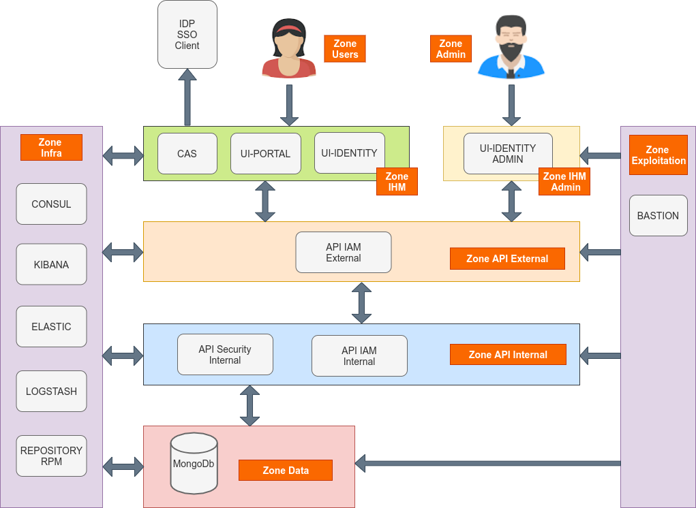

# Implémentation

## Technologies

### Briques techniques

La solution est développée principalement avec les briques technologies suivantes :

* Java 1.8+ (Java 11)
* Angular 8 : framework front
* Spring Boot 2 : framework applicatif
* MongoDB : base de données NoSQL
* Swagger : documentation API

### COTS

Les composants suivant sont utilisés dans la solution :

* CAS : gestionnaire d'authentification centralisé (IAM)
* VITAM : socle d'archivage développé par le programme VITAM
* MongoDB : base de données orientée documents
* Curator : maintenance des index d’elasticsearch
* ELK : agrégation et traitement des logs et dashboards et recherche des logs techniques
* Consul : annuaire de services

Les solutions CAS et VITAM sont également développées en Java dans des technologies proches ou similaires.

En fonction du choix de l'implémentation de la solution, il est possible de partager des dépendances logicielles avec la solution VITAM.

---

## Services

La solution est bâtie selon une architecture de type micro-services. Ces services communiquent entre eux en HTTPS via des API REST.

* Les services externes exposés publiquement sont sécurisés par la mise en oeuvre d'un protocole M2M nécessitant l'utilisation de certificats X509 client et serveur reconnus mutuellement lors de la connexion.

* Les services internes, ne sont jamais exposés publiquement. Ils sont accessibles uniquement en HTTPS par les services externes ou par d'autres services internes.

* Les accès aux bases de données MongoDb ou aux socles techniques externes (ie. VITAM) se font uniquement via les services internes.

* Les utilisateurs sont authentifiés via CAS et disposent d'un token, validé à chaque appel, qui les identifient durant toute la chaîne de traitement des requêtes.

### Identification des services

Il est primordial que chaque service de la solution puisse être identifié de manière unique sur le système. À cet effet, les services disposent des différents identifiants suivant :

* ID de service (ou service_id) : c’est une chaîne de caractères qui nomme de manière unique un service. Cette chaîne de caractère doit respecter l’expression régulière suivante : `[a-z][a-z-]*`. Chaque cluster de service possède un ID unique de service.

* ID d’instance (ou instance_id) : c’est l’ID d’un service instancié dans un environnement ; ainsi, pour un même service, il peut exister plusieurs instances de manière concurrente dans un environnement donné. Cet ID a la forme suivante : `<service_id>-<instance_number>`, avec `<instance_number>` respectant l’expression régulière suivante : `[0-9]{2}`. Chaque instance dans ce cluster possède un id d’instance (instance_id).

* ID de package (ou package_id) : il est de la forme `vitamui-<service_id>`. C’est le nom du package à déployer.

### Communications inter-services

Les services VITAMUI suivent les principes suivants lors d’un appel entre deux composants :

1. Le composant amont effectue un appel (de type DNS) à l’annuaire de service en indiquant le service_id du service qu’il souhaite appeler

2. L’annuaire de service lui retourne une liste ordonnée d’instance_id. C’est de la responsabilité de l’annuaire de service de trier cette liste dans l’ordre préférentiel d’appel (en fonction de l’état des différents services, et avec un algorithme d’équilibrage dont il a la charge)

3. Le composant amont appelle la première instance présente dans la liste. En cas d’échec de cet appel, il recommence depuis le point 1. La communication vers une instance cible de type Service API utilise nécessairement le protocole sécurisé HTTPS.

Ces principes ont pour but de garantir les trois points suivants :

* Les clients des services doivent être agnostiques de la topologie de déploiement, et notamment du nombre d’instances de chaque service dans chaque cluster. La connaissance de cette topologie est déléguée à l’annuaire de service.

* Le choix de l’instance cible d’un appel doit être décorrélé de l’appel effectif afin d’optimiser les performances et la résilience.

* La garantie de la confidentialité des informations transmises entre les services (hors COTS)

Dans le cas des COTS, la gestion de l’équilibrage de charge et de la haute disponibilité doit être intégrée de manière native dans le COTS utilisé. D'autre part, la sécurisation de la transmission dépend du COTS. Dans le cas où le chiffrement des données transmises n'est pas assuré, il est alors recommandé d'isoler le COTS dans une zone réseau spécifique.

### Cloisonnement des services

Le cloisonnement applicatif permet de séparer les services de manière physique (subnet/port) et ainsi limiter la portée d’une attaque en cas d’intrusion dans une des zones. Ce cloisonnement applique le principe de défense en profondeur préconisé par l’ANSI.

Chaque zone héberge des clusters de services. Un cluster doit être présent en entier dans une zone, et ne peut par conséquent pas être réparti dans deux zones différentes. Chaque noeud d’un cluster applicatif doit être installé sur un hôte (OS) distinct (la colocalisation de deux instances d’un même service n’étant pas supporté). La mise en oeuvre d’une infrastructure virtualisée impose de placer deux noeuds d’un même cluster applicatif sur deux serveurs physiques différents.

Un exemple de découpage en zones applicative est fourni ci-dessous. Ce découpage repose sur une logique assez classique adapté à une infrastructure de type VmWare ESX. Pour une architecture reposant sur une technologie de type Docker, il serait envisageable de découper plus finement les zones jusqu'à envisager une zone pour chaque cluster de service.

Dans cet exemple, il est prévu pour respecter les contraintes de flux inter-zones suivants :

* les utilisateurs de la zone USERS communiquent avec les services de la zone IHM
* les administrateurs de la zone ADMIN communiquent avec les services de la zone IHM ADMIN
* les services de la zone IHM et IHM-ADMIN communiquent avec les services de la zone API-EXTERNAL
* les services de la zone API-EXTERNAL communiquent avec les services de la zone API-INTERNAL
* les services de la zone API-INTERNAL communiquent avec les services de la zone DATA
* les services de toutes les zones communiquent avec les services déployés dans la zone INFRA
* les exploitants techniques accédent aux services de la zone EXPLOITATION puis intervenir dans toutes les zones

#### Les différentes zones

##### zone IHM

La zone IHM se compose de plusieurs services:

* UI Identity
* UI Portal
* UI Referential
* UI Ingest
* UI Archive Search
* UI Collect
* UI Pastis

##### zone API-EXTERNAL

La zone API-EXTERNAL se compose de plusieurs services:

* IAM EXTERNAL
* REFERENTIAL EXTERNAL
* INGEST EXTERNAL
* ARCHIVE SEARCH EXTERNAL
* COLLECT EXTERNAL
* PASTIS EXTERNAL

##### zone API-INTERNAL

La zone API-INTERNAL se compose de plusieurs services:

* IAM INTERNAL
* REFERENTIAL INTERNAL
* INGEST INTERNAL
* ARCHIVE SEARCH INTERNAL
* COLLECT INTERNAL

##### zone DATA

La zone stockage: MongoDB

##### zone INFRA

Les services consul, kibana, elk etc..

Tous les serveurs cibles doivent avoir accès aux dépôts de binaires contenant les paquets des logiciels VITAMUI et des composants externes requis pour l’installation. Les autres éléments d’installation (playbook ansible, ...) doivent être disponibles sur la machine ansible orchestrant le déploiement de la solution dans la zone INFRA.

Schéma de zoning :



---

## Intégration système

### Utilisateurs et groupes d’exécution

La segmentation des droits utilisateurs permet de respecter les contraintes suivantes :

* Assurer une séparation des utilisateurs humains du système et des utilisateurs système sous lesquels tournent les processus
* Séparer les droits des rôles d’exploitation différents suivants :
    * Les administrateurs système (OS) ;
    * Les administrateurs techniques des logiciels VITAMUI;
    * Les administrateurs des bases de données VITAMUI

Les utilisateurs et groupes décrits dans les paragraphes suivants doivent être ajoutés par les scripts d’installation de la solution VITAMUI. En outre, les règles de sudoer associées aux groupes vitamui*-admin doivent également être mis en place par les scripts d’installation.

Les sudoers sont paramétrés en mode NOPASSWD, c’est à dire qu’aucun mot de passe n’est demandé à l’utilisateur faisant partie du groupe vitamui*-admin pour lancer les commandes d’arrêt relance des applicatifs vitamui.

Les fichiers de règles sudoers des groupes vitamui-admin et vitamuidb-admin sont systématiquement écrasés à chaque installation des paquets (rpm) déclarant les utilisateurs VITAMUI. (Un backup de l’ancien fichier est cependant effectué).

#### Utilisateurs

Les utilisateurs suivant sont définis :

* vitamui(UID : 4000) : user pour les services ne stockant pas les données
* vitamuidb (UID : 4001) : user pour les services stockant des données (Ex : MongoDB)

Les processus VITAMUI tournent sous ces utilisateurs. Leurs logins sont désactivés.

#### Groupes

Les groupes suivant sont définis :

* vitamui(GID : 4000) : groupe primaire des utilisateurs de service
* vitamui-admin (GID : 5000) : groupe d’utilisateurs ayant les droits “sudo” permettant le lancement des services VITAMUI
* vitamuidb-admin (GID : 5001) : groupe d’utilisateurs ayant les droits “sudo” permettant le lancement des services VITAMUI stockant de la donnée.

### Arborescence de fichiers

L’arborescence /vitamui héberge les fichiers propres aux différents services. Elle est normalisée selon le pattern suivant : /vitamui/<folder_type>/<service_id> où :

Pour un service d’id service_id, les fichiers et dossiers impactés par VITAMUI sont les suivants.

* service_id est l’id du service auquel appartient les fichiers
* folder-type est le type de fichiers contenu par le dossier :
    * app : fichiers de ressources (non-jar) requis pour l’application (ex: .war)
    * bin : binaires (le cas échéant)
    * script : Répertoire des scripts d’exploitation du module (start/stop/status/backup)
    * conf : Fichiers de configuration
    * lib : Fichiers binaires (ex: jar)
    * log : Logs du composant
    * data : Données sauvegardes du composant
    * tmp : Données temporaires produites par l’application

Les dossiers /vitamui et /vitamui/<folder_type> ont les droits suivants :

* Owner : root
* Group owner : root
* Droits : 0555

À l’intérieur de ces dossiers, les droits par défaut sont les suivants :

* Fichiers standards :
    * Owner : vitamui (ou vitamuidb)
    * Group owner : vitamui
    * Droits : 0440

* Fichiers exécutables et répertoires :
    * Owner : vitamui (ou vitamuidb)
    * Group owner : vitamui
    * Droits : 0750

Cette arborescence ne doit pas contenir de caractère spécial. Les éléments du chemin (notamment le service_id) doivent respecter l’expression régulière suivante : `[0-9A-Za-z-_]+`

Le système de déploiement et de gestion de configuration de la solution est responsable de la bonne définition de cette arborescence (tant dans sa structure que dans les droits utilisateurs associés).

### Intégration au service d'initialisation Systemd

L’intégration est réalisée par l’utilisation du système d’initialisation systemd. La configuration se fait de la manière suivante :

* /usr/lib/systemd/system/ : répertoire racine des définitions de units systemd de type “service”
* <service_id>.service : fichier de définition du service systemd associé au service VITAMUI

Les COTS utilisent la même nomenclature de répertoires et utilisateurs que les services VITAMUI, à l’exception des fichiers binaires et bibliothèques qui utilisent les dossiers de l’installation du paquet natif.

---

## Sécurisation

### Sécurisation des accès aux services externes

Les services exposants publiquement des API REST implémentent les mesures de sécurité suivantes :

* mise en place de filtres dans les applications IHM pour contrer les attaques de type CSRF et XSS

* utilisation du protocole HTTPS. Par défaut, la configuration suivante est appliquée (Protocoles exclus : TLS 1.0, TLS 1.1, SSLv2, SSLv3 & Ciphers exclus : .*NULL.*, .*RC4.*, .*MD5.*, .*DES.*, .*DSS.*)

* authentification par certificat X509 requise des applications externes (authentification M2M) basée sur une liste blanche de certificats valides

* mise à jour des droits utilisateurs grâce aux contextes applicatifs, associés certificats clients, stockés dans la collections XXX de base MongoDB gérée par le service SECURITY INTERNAL.

* un service batch contrôle régulièrement l'expiration des certificats stockés dans le truststore des services et dans le référentiel de certificats clients (MongoDB) géré par le service SECURITY INTERNAL.

### Sécurisation des communications internes

Les communications internes sont sécurisées par le protocole HTTPS. D’autre part, dans chaque requête, le header X-Auth-Token est positionné. Il contient le token initialisé par CAS à la connexion de l’utilisateur.

A chaque requête le service VITAMUI internal procède aux contrôles suivants :

* vérification de l'existence du header X-Auth-Token
* vérification de la validité (non expiré) du token extrait du header

En cas d’échec, la requête est refusée et la connexion est fermée.

### Sécurisation des accès aux bases de données

Les bases de données de MongoDB sont sécurisées via un cloisonnement physique (réseau) et/ou logique (compte utilisateur) des différentes bases de données qui les constituent.

### Sécurisation des secrets de déploiement

Les secrets de l’intégralité de la solution VITAM déployée sont tous présents sur le serveur de déploiement ; par conséquent, ils doivent y être stockés de manière sécurisée, avec les principes suivants :

* Les mot de passe et token utilisés par ansible doivent être stockés dans des fichiers d’inventaire chiffrés par ansible-vault ;
* Les clés privées des certificats doivent être protégées par des mot de passe complexes et doivent suivre la règle précédente.

### Liste des secrets

Les secrets nécessaires au bon déploiement de VITAMUI sont les suivants :

* Certificat ou mot de passe de connexion SSH à un compte sudoers sur les serveurs cibles (pour le déploiement)

* Certificats x509 serveur (comprenant la clé privée) pour les modules de la zone d’accès (services *-external), ainsi que les CA (finales et intermédiaires) et CRL associées. Ces certificats seront déployés dans des keystores java en tant qu’élément de  configuration de ces services

* Certificats x509 client pour les clients du SAE (ex: les applications métier, le service ihm-admin), ainsi que les CA (finales et intermédiaires) et CRL associées. Ces certificats seront déployés dans des keystores java en tant qu’élément de configuration de ces services

Les secrets définis lors de l’installation de VITAM sont les suivants :

* Mots de passe des keystores ;
* Mots de passe des administrateurs fonctionnels de l’application VITAMUI
* Mots de passe d’administration de base de données MongoDB ;
* Mots de passe des comptes d’accès aux bases de données MongoDB.

Note. Les secrets de VITAMUI sont différents de ceux VITAM

### Authentification du compte SSH

Il existe plusieurs méthodes envisageables pour authentifier le compte utilisateur utilisé pour la connexion SSH :

* par clé SSH avec passphrase
* par login/mot de passe
* par clé SSH sans passphrase

La méthode d’authentification retenue dépend de plusieurs paramètres :

* criticité des serveurs (services)
* zone de confiance
* technologie de déploiement

Dans un contexte sensible, il est fortement recommandé d'utiliser un bastion logiciel (par ex. <https://www.wallix.com/bastion-privileged-access-management/>) pour authentifier et tracer les actions des administrateurs du système.

### Authentification des hôtes

Pour éviter les attaques de type MitM, le client SSH cherche à authentifier le serveur sur lequel il se connecte. Ceci se base généralement sur le stockage des clés publiques des serveurs auxquels il faut faire confiance (~/.ssh/known_hosts).

Il existe différentes méthodes pour remplir ce fichier (vérification humaine à la première connexion, gestion centralisée, DNSSEC). La gestion du fichier known_hosts est un pré-requis pour le lancement d’ansible.

### Élévation de privilèges

Plusieurs solutions sont envisageables :

* par sudo avec mot de passe
    * Au lancement de la commande ansible, le mot de passe sera demandé par sudo
    * par su
    * Au lancement de la commande ansible, le mot de passe root sera demandé
    * par sudo sans mot de passe

---

## Certificats et PKI

La PKI permet de gérer de manière robuste les certificats de la solution VITAMUI. Une PKI est une architecture de confiance constituée d’un ensemble de systèmes fournissant des services permettant la gestion des cycles de vie des certificats numériques :

* émission de certificats à des entités préalablement authentifiées
* déploiement des certificats
* révocation des certificats
* établir, publier et respecter des pratiques de certification de confiance pour établir un espace de confiance

### Principes de fonctionnement PKI de VITAMUI

La PKI VITAMUI gère les certificats nécessaires à l'authentification des services VITAMUI et des entités extérieurs. La logique de fonctionnement de la PKI VITAMUI est similaire à celle utilisée par la solution VITAM.

Les principes de fonctionnement de la PKI sont les suivants :

* Émission des certificats VITAMUI (les dates de création et de fin de validité des CA sont générées dans cette phase).
* Gestion du cycle de vie (révocation) des certificats
* Publication des certificats et des clés (.crt et .key)
* Déploiement :
    * Génération des magasins de certificats VITAMUI (les certificats .crt et .key sont utilisés pour construire un magasin de certificats qui contient des certificats .p12 et .jks)
    * Déploiement dans VITAMUI des certificats .p12 et .jks par Ansible

      Schéma de la PKI :


### Explication avancée du fonctionnement

Le fonctionnement de la PKI de la solution VITAMUI est basé sur la même logique d'architecture que celle de Vitam.

Lien des documentations existantes :

* PKI VITAM : <http://www.programmevitam.fr/ressources/DocCourante/html/installation/annexes/10-overview_certificats.html>
  & <https://www.programmevitam.fr/ressources/DocCourante/html/installation/annexes/15-certificates.html>

La PKI voit ses fichiers répartis à deux emplacements:

* deployment/pki

  À cet emplacement se trouve les scripts et fichiers de configuration associés à la génération des assets (certificats, clés privées ...)

  | Fichier            | Description                                                                                   |
  | ------------------ | --------------------------------------------------------------------------------------------- |
  | pki/ca             | Répertoire dans lequel sont stockés les CA de chaque zone                                     |
  | pki/config         | Répertoire dans lequel sont stockées les configurations pour la génération des CA/certificats |
  | pki/config/scripts | Répertoire dans lequel sont stockées les scripts de génération de la PKI.                     |

### Génération des certificats

Revenons en détails sur les scripts de génération des différents éléments de la PKI:

* generate_ca*.sh:
    * Paramètre(s):
        * ERASE [Facultatif]: Booléen indiquant si les CA et fichiers associés existants doivent être supprimés avant génération - Valeur par défaut: **false**
    * Description:
      Permet de générer les certificats d'autorité mentionnées dans le script de génération. Attention, toute autorité existante n'est pas regénérée, l'utilisation du paramètre **ERASE** sera recommandée lors de la première génération de la PKI.

* generate_certs*.sh
    * Paramètre(s):
        * ENVIRONNEMENT_FILE [Obligatoire]: Chemin vers le fichier d'environnement pour lequel les certificats vont être générés
        * ERASE [Facultatif]: Booléen indiquant si les certificats et fichiers associés existants doivent être supprimés avant génération - Valeur par défaut: **false**
    * Description:
      Permet de générer les certificats (serveur, client) mentionnés dans le script de génération. Attention, tout certificat existant n'est pas regénéré, l'utilisation du paramètre **ERASE** sera recommandée lors de la première génération de la PKI. Deux types de fichiers seront modifiés lors de cette exécution:
        * les fichiers de configuration des CA (serial, index.txt ...)
        * les fichiers générés (`deployment/environment/certs`)

Les scripts suffixés par **_dev** concernent le matériel SSL utilisé pour le lancement de l'application en local sur l'environnement de développement. L'ensemble des fichiers générés se trouveront dans l'arborescence **dev-deployment** du projet. Il faudra par la suite copier les fichiers générés associés à chaque module dans le répertoire /resources/dev du projet associé.

* deployment/environment/certs

À cet emplacement figure l'ensemble de la PKI de la solution. Par défaut on retrouvera trois zones (une par autorité):

* server: l'ensemble du certificats permettant la communication HTTPS entre les différentes applications de la solution
* client-vitam: certificats utilisés par l'application pour communiquer avec Vitam. Avec le script **generate_certs.sh** fournis par la PKI, un certificat sera généré pour s'interfacer avec Vitam.
* client-external: certificats des clients autorisés à solliciter les API externes

### Cas pratiques

* Instaurer la communication entre la solution VitamUI <-> Vitam

  Quelques rappels:
    * au sein de la solution VitamUI, vous avez:

        * un client Vitam Java (access-external, ingest-external) permettant de réaliser des requêtes aurpès de Vitam.
          Ce client se base sur un fichier de configuration dans lesquels sont référencés un **keystore** (concenant le certificat utilisé pour chiffrer la requête) et un **trustore** (contenant le(s) CA(s) utilisé(s) pour les échanges avec les applications à l'extérieur de VitamUI)

        * `deployment/environement/certs/client-vitam/ca`: certificat d'autorité intervenant dans la communication VitamUI <-> Vitam.
          /!\ L'ensemble des CA présents dans ce répertoire seront embarqués dans le truststore exploité par le client Vitam Java lors de l'exécution du script *generate_keystores.sh*.

        * `deployment/environement/certs/client-vitam/clients/vitamui`: certificat utilisé pour la communication VitamUI <-> Vitam.
          /!\ Le certificat sera embarqué dans le keystore utilisé par le client Vitam Java lors de l'exécution du script generate_keystores.sh*.

    * au sein de la solution Vitam, vous avez:

        * au sein du modèle de données, un certificat est associé à un contexte de sécurité (restriction d'actions par tenant à travers des contrats), lui-même associé à un profile de sécurité (permission sur les API externes).
        Cette association s'effectue dans le fichier `environment/group_vars/all/postinstall_param.yml`

        * la structure de la PKI VitamUI étant identique à celle de Vitam, le comportement est le suivant:

            * tout CA utilisé par un client pour solliciter les API externes et nécessaire à la chaîne de vérification de son certificat doit se trouver dans le répertoire `envionment/certs/client-external/ca`
              /!\ L'ensemble des CA présents dans ce répertoire seront embarqués dans le truststore exploités par les API externes lors de l'exécution du script *generate_keystores.sh*.

            * le certificat d'un client accédant aux API externes doit figurer à l'emplacement `envionment/certs/client-external/clients/external`

  De ce fait, vous devez synchroniser vos PKI et vos solutions pour assurer une bonne communication:
    * VitamUI -> Vitam
        * Copier le CA du certificat VitamUI `{vitamui_inventory_dir}/certs/client-vitam/ca/ca-*.crt`
          dans `{vitam_inventory_dir}/certs/client-external/ca`
        * Copier le certificat VitamUI `{vitamui_inventory_dir}/certs/client-vitam/clients/vitamui/vitamui.crt`
          dans `{vitam_inventory_dir}/certs/client-external/clients/external`
        * Mise à jour de la PKI Vitam:
            * `./generate_stores.sh`
            * `ansible-playbook ansible-vitam/vitam.yml ${ANSIBLE_OPTS} --tags update_vitam_certificates`
        * Création du contexte VitamUI:
            * Population du fichier postinstall_param.yml:

              ```yaml
                vitam_additional_securityprofiles:
                - name: vitamui-security-profile
                  identifier: vitamui-security-profile
                  hasFullAccess: true
                  permissions: "null"
                  contexts:
                    - name: vitamui-context
                      identifier: vitamui-context
                      status: ACTIVE
                      enable_control: false
                      # No control, idc about permissions, VitamUI will do it :)
                      permissions: "[ { \"tenant\": 0, \"AccessContracts\": [], \"IngestContracts\": [] }, { \"tenant\": 1, \"AccessContracts\": [], \"IngestContracts\": [] }]"
                      certificates: ['external/vitamui.crt']
              ```

            * Exécution du playbook de mise à jour : `ansible-playbook ansible-vitam-exploitation/add_contexts.yml`

    * Vitam -> VitamUI
        * Copier le(s) CA(s) de Vitam `{vitam_inventory_dir}/certs/client-vitam/ca`
          dans `{vitamui_inventory_dir}/certs/client-vitam/ca/`
        * Mise à jour de la PKI VitamUI :
            * `./generate_stores.sh`
            * `ansible-playbook vitamui_apps.yml --tags update_vitamui_certificates`

* Instaurer la communication entre la solution VitamUI <-> *Le monde extérieur*
  TODO (le process n'est pas encore industrialisé)

### PKI de test

VITAMUI propose de générer à partir d’une PKI de tests les autorités de certification root et intermédiaires pour les clients et les serveurs. Cette PKI de test permet de connaître facilement l’ensemble des certificats nécessaires au bon fonctionnement de la solution. Attention, la PKI de test ne doit être utilisée que pour faire des tests, et ne doit surtout pas être utilisée en environnement de production.

### Liste des certificats utilisés

Le tableau ci-dessous détail l’ensemble du contenu des keystores et truststores par service.

| Composants                  |  Keystores                                         | Truststores                      |
| --------------------------- | -------------------------------------------------- | -------------------------------- |
| **ui-portal**               | ui-portal.crt, ui-portal.key                       | ca-root.crt, ca-intermediate.crt |
| **ui-identity**             | ui-identity.crt, ui-identity.key                   | ca-root.crt, ca-intermediate.crt |
| **ui-identity-admin**       | ui-identity-admin.crt, ui-identity-admin.key       | ca-root.crt, ca-intermediate.crt |
| **ui-referential**          | ui-referential.crt, ui-referential.key             | ca-root.crt, ca-intermediate.crt |
| **ui-ingest**               | ui-ingest.crt, ui-ingest.key                       | ca-root.crt, ca-intermediate.crt |
| **ui-archive-search**       | ui-archive-search.crt, ui-archive-search.key       | ca-root.crt, ca-intermediate.crt |
| **cas-server**              | cas-server.crt, cas-server.key                     | ca-root.crt, ca-intermediate.crt |
| **iam-external**            | iam-external.crt, iam-external.key                 | ca-root.crt                      |
| **iam-internal**            | iam-internal.crt, iam-internal.key                 | ca-root.crt                      |
| **referential-external**    | referential-external.crt, referential-external.key | ca-root.crt                      |
| **referential-internal**    | referential-internal.crt, referential-internal.key | ca-root.crt                      |
| **ingest-external**         | ingest-external.crt, ingest-external.key           | ca-root.crt                      |
| **ingest-internal**         | ingest-internal.crt, ingest-internal.key           | ca-root.crt                      |
| **archive-search-external** | archive-search-external.crt, archive-external.key  | ca-root.crt                      |
| **archive-search-internal** | archive-search-internal.crt, archive-internal.key  | ca-root.crt                      |
| **collect-external**        | collect-external.crt, collect.key                  | ca-root.crt                      |
| **collect-internal**        | collect-internal.crt, collect.key                  | ca-root.crt                      |
| **pastis-external**         | pastis-external.crt, pastis.key                    | ca-root.crt                      |
| **security-server**         | security-server.crt, security-server               | ca-root.crt                      |

La liste des certificats utilisées par VITAM est décrite à cette adresse : <http://www.programmevitam.fr/ressources/DocCourante/html/archi/securite/20-certificates.html>

### Procédure d’ajout d’un certificat client externe

Le certificat ou l’autorité de certification doit présent dans les truststores des APIs external VITAMUI. La procédure d'ajout d’un certificat client externe aux truststores des services de VITAMUI est la suivante :

* Déposer le(s) CA(s) du client dans le répertoire deployment/environment/certs/client-external/ca

* Déposer le certificat du client dans le répertoire deployment/environment/certs/client-external/clients/external/

* Régénérer les keystores à l’aide du script deployment/generate_stores.sh

* Exécuter le playbook pour redéployer les keystores sur la solution VITAMUI :

```sh
ansible-playbook vitamui_apps.yml -i environments/hosts --vault-password-file vault_pass.txt --tags update_vitamui_certificates
```

L’utilisation d’un certificat client sur les environnements VITAMUI nécessite également de vérifier que le certificat soit présent dans la base de données VITAMUI et rattaché à un contexte de sécurité du client.

---

## Clusterisation

### Multi-instanciation du service iam-internal

Si le service `iam-internal` est déployé sur plusieurs machines, les timers permettant la journalisation des évènements métiers de Vitam-UI seront lancés sur la première instance du groupe `[hosts_vitamui_iam_internal]`. Seul une machine doit être déclarée primaire afin d'éviter la duplication des actions de journalisation.

Pour plus d'informations, se référer au DEX.

---

## Détail des services

### Service 1

* Description
* Contraintes

### Service 2

* Description
* Contraintes

---

## Détail des COTS

### Guidelines

Les COTS, software utlises par les solutions VITAMUI et VITAM, sont tous open-source. Pour des besoins de maintenabilite et de securites, ils sont entierement repackages au format RPM puis publies sur les repository yum VITAMUI.

VITAMUI s'appuie sur deux types de COTS dans son architecture:

* les COTS fournit par vitam auxquels VITAMUI se branche.

* les COTS utilises uniquement par VITAMUI

Le packaging des COTS suivront les principes suivants:

* Les noms de package cots seront de la forme vitamui|vitam-COTS_NAME. Les services systemd installes sur les systemes suivront la meme convention de nommage

* Les fichiers repackages permettront d'appliquer la protection de droits users system vitamui,vitam,vitamuidb,vitamdb

* Dans la mesure du possible les packages COTS rpm pourront contenir l'ensemble des fichiers du software

* Dans le cas contraire, le packages COTS VITAMUI|VITAM contiendrons des dependances vers les packages RPM officiels. Ils fourniront comme fichiers l'unit systemd du service COTS et des fichiers de configurations stockes dans le systeme de fichiers VITAMUI/VITAM permettant de proteger le lancement du service par les droits users systeme linux.

Le packaging specifique des cots VITAMUI contiendra un Makefile dedie pour chaque afin d'adapter la generation du contenu des packages. Ils pourront egalement contenir des templates de packaging dedies pouvant redefinir les fichiers unit systemd, les fichiers de configurations, les scripts d'installation RPM executes.

Le repackaging entier des COTS est la technique a priviligier pour les raisons suivantes:

* l'installation / desinstallation des fichiers pourra se faire entierement dans les scripts RPM

* aucune dependance RPM donc pas d'etapes d'installation / desinstallation supplementaire et pas de gestion de repository supplementaire si la dependance n'est pas dans les repository officiels RedHat ou epel-release.

* Eventuellement, les sources/binaires des cots pourront etre conserves dans le repository vitamui.

### Liste des cots Vitam

* consul
* mongo*
* mongo-express
* syslog
* elasticsearch
* curator
* siegfried
* cerebro
* logstash
* kibana
* apache

### Liste des cots VITAMUI

* consul
* logstash
* syslog
* mongo*
* nginx

## Packaging des cots VITAMUI

### vitamui-logstash

Le soft **logstash** sera entierement repackage dans vitamui-logstash a partir de **l'archive des sources Logstash**. Le package RPM contiendra:

* les librairies Java et fichiers de logstash
* les fichiers de configuration de logstash adapte au file system vitamui dans /vitamui/conf/logstash
* l'unit systemd vitamui-logstash

Les scripts d'installation RPM appliquerons les droits vitamuidb au package logstash (a corriger).

**Mise a jour de la version de logstash:**

La version de logstash embarquee dans le package sera parametrable au niveau du fichier pom.xml du cots vitamui-logstash (fichier **vitamui/cots/vitamui-logstash/pom.xml**). Ce nom de version sera transmis en parametre du Makefile qui telechargera l'archive de source logstash correspondant a la version choisie.

```xml
    ...
<argument>LOGSTASH_VERSION=7.6.0</argument>
    ...
```

### vitamui-mongo-express

Le package rpm vitamui-mongo-express est entierement repackage a partir de de l'installation via **npm**. Le package contient toutes les sources de mongo-express installee dans /vitamui/app/mongo-express et le ficher unit systemd de vitamui-mongo-express.

**Mise a jour de la version de mongo-express**

Pour modifier la version de mongo express, editez la dans le fichier
**cots/vitamui-mongo-express/package.json**.

### Annuaire de services Consul

La découverte des services est réalisée avec Consul via l’utilisation du protocole DNS. Le service DNS configuré lors du déploiement doit pouvoir résoudre les noms DNS associés à la fois aux service_id et aux instance_id. Tout hôte portant un service VITAMUI doit utiliser ce service DNS par défaut. L’installation et la configuration du service DNS applicatif sont intégrées à VITAMUI.

La résilience est assurée par l’annuaire de service Consul. Il est partagé avec VITAM.

* Les services sont enregistrés au démarrage dans Consul
* Les clients utilisent Consul (mode DNS) pour localiser les services
* Consul effectue régulièrement des health checks sur les services enregistrés. Ces informations sont utilisées pour router les demandes des clients sur les services actifs

La solution de DNS applicatif intégrée à VITAMUI et VITAM est présentée plus en détails dans la section dédiée à Consul dans la documentation VITAM.

---

## Multi instanciation des micro services

### Multi instanciation

Les services vitamui multi instanciable à ce jour sont :

* Service IAM Internal
* Service IAM External
* Service UI Identity
* Service Portal
* Service Referential Internal
* Service Referential External
* Service UI Referential
* Service Ingest Internal
* Service Ingest External
* Service UI Ingest
* Service Archive Search Internal
* Service Archive Search External
* Service UI Archive Search
* Service Collect Internal
* Service Collect External
* Service UI Collect
* Service Pastis External
* Service UI Pastis
* Service Mongod

Un load balancer/reverse proxy (à défaut Consul) est installé et configuré pour la répartition de charge entre différentes instances (cette configurtion est en cours de réalisation).

La configuration de la mémoire des services est par défaut:

```conf
Xms=512m et Xmx=512m
```

Cette configuration est modifiable dans les jvm_opts de l'ansiblerie, pour plus d'informations (cf: DEX).

### Mono instanciation

Le service CAS est actuellement mono-instanciable.
