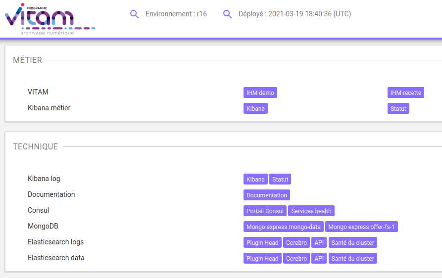
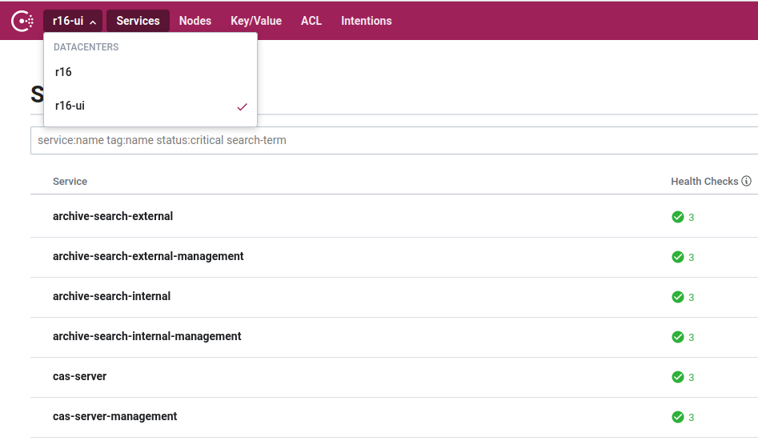
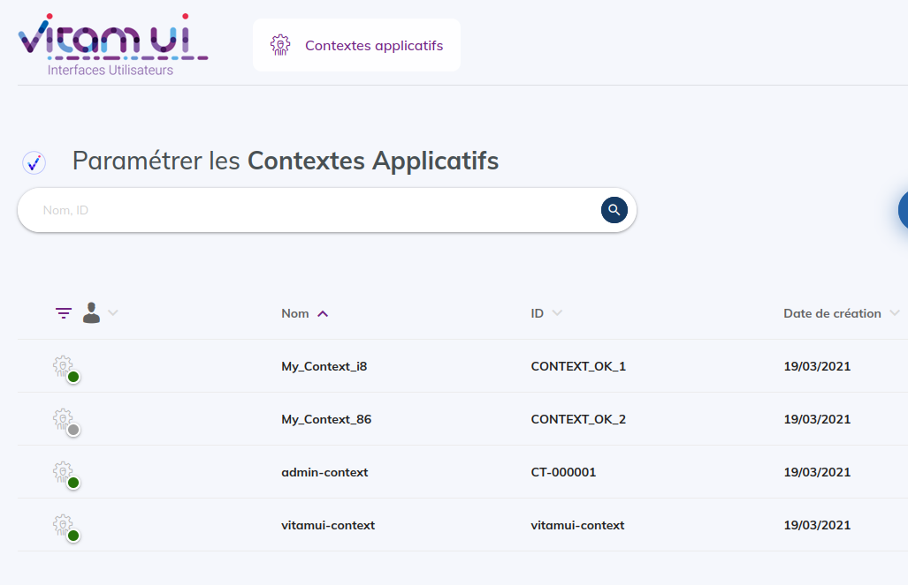
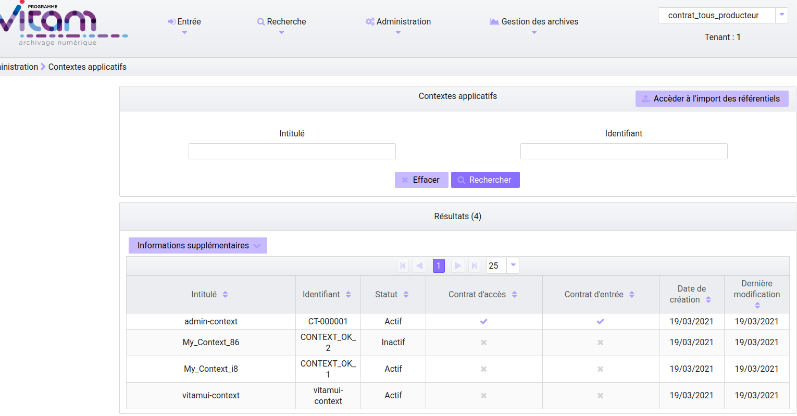
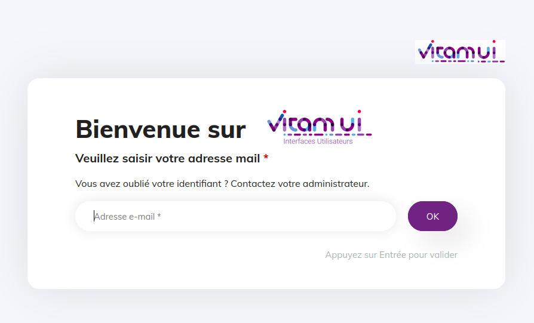

# Annexes

## Consul

L'accès au consul de VitamUI se fait par la page des outils Vitam. Les consuls sont reliés.

## Contexte vitamui

Se connecter à Vitam-UI en tant qu'utilisateur "admin", cliquez sur l'onglet "Référentiels" puis sur la tuile "Contextes Applicatifs".

Si la liste des contextes n’est pas vide alors la communication VitamUI/Vitam est bien validée.

Si ce n'est pas le cas, ouvrir la console de debug de votre navigateur internet et relever le message d'erreur.

Dans le cas d'une erreur 503/401 cela signifie que la PKI est incorrecte de part et d'autres (VitamUI/Vitam) ou que le contexte n'a pas été bien inséré dans Vitam.

Pour vérifier que le contexte est bien inséré côté Vitam, connectez vous à votre installation Vitam et regarder l'affichage des contextes dans l'ihm-demo (>administration>réferentiels>contextes applicatifs). Le contexte vitamui doit être présent.

Si le contexte est bien là, cela signifie que c'est l'échange de PKI qui n'a pas été faite. Refaire l'étape en question.

Exemple d'erreur en cas d'absence de context vitamui_context côté Vitam:

~~~console
timestamp  "1620058767"
status     403
error      "apierror.unauthorized"
exception  "fr.gouv.vitamui.commons.api.exception.ForbiddenException"
message    "Vitam unauthorized error: status: 401, message: \"Error with the response, get status: '401' and reason 'Unauthorized'.\""
args       []
~~~

## Problème Mongodb

Les machines Vitam et Vitam-UI doivent être à la même heure. Pour cela on utilise généralement un agent "ntp" avec un serveur "ntp" associé pour la synchronisation.

Si les machines ne sont pas correctement synchronisées au niveau de la date système il est possible de rencontrer l'erreur suivante lors du démarrage nécessitant une connection à la base de données mongodb.

Erreur "localdatetime"

<!-- TODO: ex erreur .. -->

## Problème de démarrage "cas-server"

Lors du démarrage du service cas-server, on peut rencontrer le message d'erreur suivant:

TODO: ex erreur "certficate not found" ...

Dans ce cas précis il y a une incohérence/mismatch sur les certificats des services "ui" de l'application. Les certificats "ui" en base de données ne sont pas identiques à ceux présent dans les stores.

## 1ère connexion à VitamUI

À la 1ère installation de Vitam-UI, 2 utilisateurs sont disponibles à l'usage: admin et superadmin.

Les identifiants sont les suivants:

~~~yaml
user admin:
login: admin@change-it.fr
mdp : Change-it0!

user superadmin:
login: superadmin@change-it.fr
mdp : Change-it0!
~~~

## Installation d'un repository dédié aux packages de Vitam-UI

Se rendre sur une machine (vm) accessible par les machines sur lesquelles nous allons installer VitamUI via le réseau.

Rapatriez les packages de Vitam-UI (<https://download.programmevitam.fr/vitamui/>) et déposez les dans le répertoire voulu (exemple : `/home/depot/VitamUI/`).

Installer un serveur http afin de servir ce dossier aux autres machines du même réseau (ex: apache avec un root director `/home/depot/VitamUI/`).

* Yum (Centos/Redhat)

  Effacer le répertoire repodata/ si présent via: `rm -Rf repodata/`

  Puis le recréer via la commande: `createrepo .`

  Le dossier repodata/ contient les métadonnées nécessaire à l'utilisation de yum sur ces packages.

* Apt (Debian)

  Effacer le fichier Packages.gz si présent via `rm -f Packages.gz`

  Puis le recréer via la commande : `dpkg-scanpackages . /dev/null | gzip -9c > Packages.gz`
