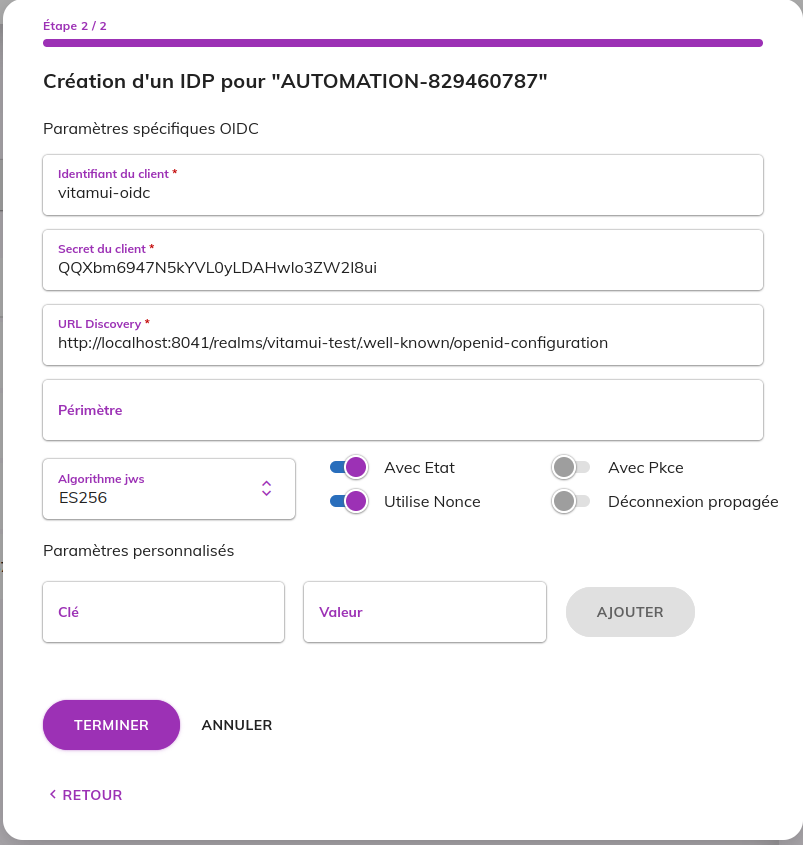

# Readme

To test the authentication delegation based on OIDC protocol, bellow an example of ready-made configuration:

- Launch the `run-dev.sh` script on your computer or on vm, this script create:
    - Keycloak Docker container exposed on the url :  `http://localhost:8041`
    - OIDC client on the realm `vitamui-test`
    - Test user `demo@change-me.fr`
- The keycloak credentials for GUI administration are:
    - user: `admin`,
    - password: `changeme`
- The OIDC client created has the following information:
    - identifier: `vitamui-oidc`
    - secret: `QQXbm6947N5kYVL0yLDAHwlo3ZW2I8ui`
    - OpenID Endpoint Configuration: `http://localhost:8041/realms/vitamui-test/.well-known/openid-configuration`

- The user created has the following information:
    - Username: `demo@change-me.fr`
    - Email: `demo@change-me.fr`
    - Name: `demo oidc vitamui`
    - Password: `ChangeIt.2024`

- The client is configured for local tests. To test on another environment, you need to change the settings on the
  oidc-client `vitamui-oidc` on keycloak by replacing http://localhost:8080 with the main vitamui url of the
  environment.

**Full example**

1. Créate or update a customer by adding a new email domain **change-me.fr**
2. Create a new provider in the SSO tab with the following settings :

- ### Step 1:
  
- ### Step 2:
  

We can check that a new provider is created in the **iam/providers** collection on vitamui:

```mongodb-json

{
    _id: '<some-guid>',
    identifier: '<some-identifier>',
    name: 'keycloak-oidc',
    technicalName: '<some technical name with fomat idp295983> ',
    internal: false,
    enabled: true,
    patterns: [
        '.*@change-me.fr'
    ],
    readonly: false,
    mailAttribute: 'email',
    autoProvisioningEnabled: false,
    propagateLogout: false,
    authnRequestBinding: 'POST',
    wantsAssertionsSigned: false,
    authnRequestSigned: false,
    clientId: 'vitamui-oidc',
    clientSecret: 'QQXbm6947N5kYVL0yLDAHwlo3ZW2I8ui',
    discoveryUrl: 'http://localhost:8041/realms/vitamui-test/.well-known/openid-configuration',
    scope: 'openid email',
    preferredJwsAlgorithm: 'ES256',
    useState: true,
    useNonce: true,
    usePkce: false,
    protocoleType: 'OIDC',
    customerId: '<the customer id >',
    _class: 'providers'
}

```

## Case 1: testing without auto-provisioning feature:

In this case we need to create an internal user having the email **demo@change-me.fr**
