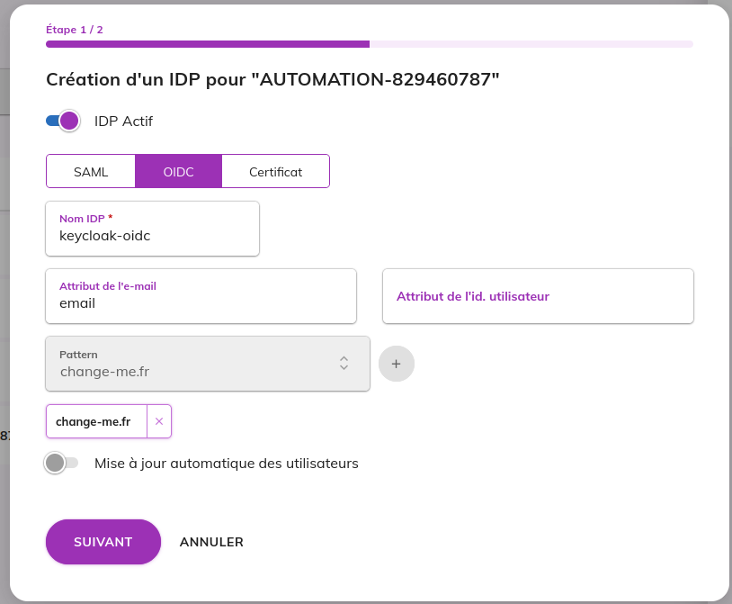

# Keycloak test IdP — OIDC and SAML

A disposable Keycloak instance exposing the same identity twice, once through
OpenID Connect and once through SAML 2, plus the provisioning needed to attach
both to a VitamUI organization.

It supersedes `tools/docker/external-idp-cas`, which covered OIDC only, needed a
MySQL container of its own and left the VitamUI side to be configured by hand.

Validating the tooling itself rather than using it? Go straight to
[QA recipe](#qa-recipe).

## Quick start

```sh
cd tools/docker/keycloak
./setup.sh
```

The script starts the container, imports the `vitamui` realm, aligns both
clients and both test users on `.env`, generates the SAML service provider
keystore, downloads the IdP metadata, and writes the two providers and their
test users into the `iam` database.

Then log in on <https://dev.vitamui.com/cas/login> with:

| Protocol | Login                       | Password       |
| -------- | --------------------------- | -------------- |
| OIDC     | `demo.oidc@keycloak-oidc.fr` | `ChangeIt.2024` |
| SAML     | `demo.saml@keycloak-saml.fr` | `ChangeIt.2024` |

CAS reloads the provider list every minute (`ProvidersService.reloadData`), so
no restart is needed — but a provider whose pac4j client fails to build is
silently dropped, so watch `cas-server` logs on the first attempt.

Keycloak admin console: <http://localhost:8042> — `admin` / `changeme`.

`./setup.sh` is idempotent; re-run it after any change to `.env`. Options:

- `--check` — verify only, change nothing. Use it first whenever a delegation
  stops working.
- `--no-mongo` — stop after rendering `generated/vitamui-providers.js` and print
  the `mongosh` command instead of running it.
- `--recreate` — drop the container and its embedded database first. The realm
  gets a new SAML signing key, so the providers must be re-provisioned (which
  the same run does).

## The one failure mode to know about

The two protocols do not age the same way. The OIDC provider only stores a URL:
CAS refetches the discovery document and the JWKS at every authentication, so it
survives anything happening to Keycloak. The SAML provider stores a **copy** of
the IdP metadata, signing certificate included. Regenerate the realm keys and
that copy is stale: every assertion is then rejected, CAS logs

```
WARN org.apereo.cas.util.function.FunctionUtils - Signature is not trusted
    AbstractSAML2ResponseValidator.validateSignature
```

and the browser gets an opaque "Accès non autorisé". OIDC keeps working, which
makes the diagnosis misleading.

Two defences are in place:

- the container keeps its database in a named volume, so recreating it no longer
  regenerates the realm keys — only `down -v` does, and that is what
  `./teardown.sh` and `./setup.sh --recreate` deliberately use;
- `./setup.sh` compares, after writing, the certificate stored in mongo with the
  one Keycloak currently signs with, and fails if they differ. `--check` runs
  that comparison alone.

The cure is always the same: **re-run `./setup.sh`**, then wait up to a minute —
CAS rebuilds its pac4j clients on a 60 second cycle, so the previous metadata
stays in effect until the next reload.

`./teardown.sh` removes the providers, the test users, the two email domains,
the container and the `generated/` directory.

## What gets created

**In Keycloak** (`realms/vitamui-realm.json`, realm `vitamui`):

- `vitamui-oidc`, a confidential OIDC client, standard flow, RS256 id tokens.
- a SAML client whose clientId is the service provider entityId, with NameID
  format `email` forced, signed responses and assertions, client signature not
  required, and `email` / `firstName` / `lastName` attribute mappers.
- the two test users above.

**In `iam`** — two documents in `providers` plus their two users, attached to
the organization of `VITAMUI_REFERENCE_USER_EMAIL` (`admin@change-it.fr`, i.e.
`system_customer`, in the dataset seeded by `tools/docker/mongo`). Set
`VITAMUI_CUSTOMER_ID` and `VITAMUI_GROUP_ID` to pin another one.

Delegated authentication provisions nothing, and an address missing on the
VitamUI side fails late. CAS deliberately redirects an unknown email to the IdP
as soon as its domain matches a provider — `ListCustomersAction` does so to
avoid disclosing whether the account exists. The rejection only happens on the
way back, in `UserPrincipalResolver`, which finds no `iam.users` record and
returns a null principal: the browser gets an authentication failure *after* a
successful Keycloak login. Both sides therefore need the same email, which is
why `setup.sh` writes to both.

## How the two sides are bound together

Everything hinges on `technicalName`, the name pac4j gives the client:

| | value |
| --- | --- |
| SP entityId (SAML) | `<VITAMUI_CAS_URL>/login/<technicalName>` |
| Callback / ACS | `<VITAMUI_CAS_URL>/login?client_name=<technicalName>` |

Both are computed by `Pac4jClientBuilder`: the entityId explicitly, the callback
through pac4j's default `QueryParameterCallbackUrlResolver`. Keycloak must be
declared with exactly these values, which is what the admin-API step of
`setup.sh` guarantees — change `SAML_TECHNICAL_NAME` or `VITAMUI_CAS_URL` in
`.env` and re-run.

Two provider fields are worth understanding rather than copying:

- **OIDC `mailAttribute: "email"`** is mandatory. Keycloak's `sub` is an opaque
  uuid; without this, `UserPrincipalResolver` would look for a VitamUI account
  named after that uuid.
- **SAML `mailAttribute: ""`** relies on the NameID, which the client forces to
  the email address. The realm also exports an `email` attribute, so setting
  `mailAttribute` to `email` exercises the attribute path instead.

## Manual setup

`setup.sh` is the reference, but the same wiring can be done by hand — to
attach the IdP to an organization through the VitamUI interface, to reproduce
the setup on an environment where the mongo database is not reachable, or
simply to see what the script automates. The order matters: VitamUI computes
the `technicalName` of a provider at creation (`"idp"` + the first six digits of
the hash of its name, `IdentityProviderConverter.buildTechnicalName`), and
Keycloak has to be declared with that value. So the VitamUI side comes first,
and the Keycloak client is aligned on it afterwards.

Everything below assumes the container is up (`docker compose up -d` from this
directory) and uses the values of `.env`.

### 1. Email domains on the organization

In the Identity application, open the organization the users will belong to
and add one email domain per protocol (`keycloak-oidc.fr`, `keycloak-saml.fr`
by default). A provider's patterns can only be picked among the domains of its
organization, and the guard described in [Constraints](#constraints) applies:
no other provider of that organization may already match one of them.

### 2. The providers, in the SSO tab

Still on the organization, open the **SSO** tab and create an IdP. The first
step is common to both protocols:

| Field | OIDC | SAML |
| --- | --- | --- |
| IDP active | on | on |
| Protocol | OIDC | SAML |
| Name | `Keycloak (OIDC)` | `Keycloak (SAML)` |
| Email attribute | `email` — mandatory, see [above](#how-the-two-sides-are-bound-together) | empty (the NameID carries the email) |
| Pattern | `keycloak-oidc.fr` | `keycloak-saml.fr` |
| Automatic user update | off | off |



The second step is protocol specific.

**OIDC:**

| Field | Value |
| --- | --- |
| Client identifier | `OIDC_CLIENT_ID` (`vitamui-oidc`) |
| Client secret | `OIDC_CLIENT_SECRET` |
| Discovery URL | `<KEYCLOAK_BASE_URL>/realms/<KEYCLOAK_REALM>/.well-known/openid-configuration` |
| Scope | `openid email profile` |
| JWS algorithm | `RS256` — the realm signs id tokens with RS256 |
| With state / with nonce | on |
| With PKCE | off |
| Propagate logout | on — otherwise the Keycloak session survives the VitamUI logout |


The two screenshots come from the previous tooling: the form is the same, the
values to type are the ones of the tables.

**SAML:** the form asks for two files, both to prepare beforehand.

- the service provider keystore, a PKCS12 holding one RSA key pair, exactly what
  `setup.sh` generates:

  ```sh
  keytool -genkeypair -alias vitamui-sp -keyalg RSA -keysize 2048 -validity 3650 \
    -dname "CN=VitamUI CAS SP, OU=VitamUI, O=VitamUI, C=FR" \
    -keystore sp-keystore.p12 -storetype PKCS12 -storepass changeit -keypass changeit
  ```

- the IdP metadata, downloaded from the realm:

  ```sh
  curl -sf http://localhost:8042/realms/vitamui/protocol/saml/descriptor -o idp-metadata.xml
  ```

| Field | Value |
| --- | --- |
| Keystore / keystore password | `sp-keystore.p12` / `changeit` |
| IdP metadata | `idp-metadata.xml` |
| AuthnRequest binding | `POST` |
| AuthnRequest signed | off — the Keycloak client does not require the client signature |
| Wants assertions signed | on |
| Maximum authentication lifetime | `3600` |
| Propagate logout | on |

Once created, open the provider: its **technical name** is displayed in the
detail panel. Note it for each provider, it is needed in step 4. If the name is
the one given above, this is `idp` followed by six digits, not the
`keycloak-oidc` / `keycloak-saml` values `setup.sh` pins.

The equivalent mongo documents, field by field, are in
`provision/vitamui-providers.js.tpl`.

### 3. The users, in the organization

Delegated authentication provisions nothing (see [What gets created](#what-gets-created)),
so create one nominative user per protocol in the same organization, with the
email that will be typed on the CAS login page: `demo.oidc@keycloak-oidc.fr`
and `demo.saml@keycloak-saml.fr` by default. The password set on the VitamUI
side is irrelevant, CAS never checks it for a delegated email.

### 4. Align the Keycloak clients on the technical names

In the Keycloak admin console (<http://localhost:8042>, `admin` / `changeme`),
realm `vitamui`, **Clients**. With `<cas>` standing for `VITAMUI_CAS_URL`
(`https://dev.vitamui.com/cas`):

**`vitamui-oidc`:**

| Setting | Value |
| --- | --- |
| Client authentication | on, credentials tab: the secret typed in step 2 |
| Valid redirect URIs | `<cas>/login*` |
| Valid post logout redirect URIs | `+` and one entry per application tested (`https://dev.vitamui.com/*`), see [Constraints](#constraints) |

The OIDC callback is `<cas>/login?client_name=<technicalName>`, which the
wildcard above covers whatever the technical name is.

**SAML client** — the client ID *is* the service provider entityId, so it has
to be renamed:

| Setting | Value |
| --- | --- |
| Client ID | `<cas>/login/<technicalName>` |
| Valid redirect URIs | `<cas>/login*` |
| Assertion Consumer Service POST and Redirect binding URL | `<cas>/login?client_name=<technicalName>` |
| Logout Service POST and Redirect binding URL | `<cas>/login?client_name=<technicalName>` |
| Name ID format | `email`, forced |
| Sign documents / sign assertions | on |
| Client signature required | off |
| Mappers | `email`, `firstName`, `lastName` (present in the imported realm) |

Then **Users**: make sure the two test users exist with the emails of step 3,
email verified, and a password (`ChangeIt.2024` by default).

### 5. Check

Wait up to a minute for CAS to rebuild its pac4j clients, then run the cases 3
and 4 of the [QA recipe](#qa-recipe). A provider that is silently missing from
the CAS login flow means its pac4j client could not be built — usually a
missing field on the VitamUI side — and only shows up in the `cas-server` logs.

Keep in mind that the realm keys, hence the metadata uploaded in step 2, are
tied to the container's database volume: after a `down -v`, the SAML provider
has to be updated with the new `idp-metadata.xml`, which is the
[failure mode](#the-one-failure-mode-to-know-about) described above.

`./setup.sh --check` does not know about providers created by hand (it looks
for the `_id`s it writes itself), so it cannot validate this setup.

## Constraints

**Keycloak must stay on `http://localhost`.** It issues its session cookies with
`Secure; SameSite=None` regardless of `sslRequired`, and a browser only accepts
those over plain HTTP for `localhost`. Moving `KEYCLOAK_BASE_URL` to another
hostname means serving Keycloak over HTTPS *and* adding its certificate to the
CAS truststore, since CAS fetches the discovery document and the metadata
server-side.

**One email domain per provider.** Within an organization,
`IdentityProviderHelper.findByUserIdentifierAndCustomerId` returns the *first*
provider whose pattern matches — overlapping domains would silently shadow one
of the two. `setup.sh` refuses to run when an existing provider of the target
organization already matches one of the two domains.

**A logout redirect Keycloak refuses means no logout at all.** Keycloak validates
`post_logout_redirect_uri` *before* ending the session, so an address missing from the
client's `post.logout.redirect.uris` produces "L'URI de redirection est invalide" and
leaves the session open — it is not merely a failed final redirect. CAS ends the logout on
the application the user came from, which is not under the CAS url the client redirect uris
cover, hence the dedicated `VITAMUI_POST_LOGOUT_REDIRECT_URIS` in `.env`; add an entry there
for every application tested. To check an address without going through a browser:

```bash
curl -s -o /dev/null -w '%{http_code}\n' \
  "http://localhost:8042/realms/vitamui/protocol/openid-connect/logout\
?client_id=vitamui-oidc&post_logout_redirect_uri=<url encoded address>"
```

302 means accepted, 400 means refused.

Should a logout still leave the session open, the next login is answered by Keycloak's SSO
session and never asks for credentials again, which silently invalidates any test of the
login screen. Clear it from the Keycloak console (Sessions -> Sign out) or with:

```bash
TOKEN=$(curl -s -d client_id=admin-cli -d username=admin -d password=changeme \
  -d grant_type=password \
  http://localhost:8042/realms/master/protocol/openid-connect/token | jq -r .access_token)
# 3333... is the OIDC test user, 4444... the SAML one (ids pinned by setup.sh)
curl -s -X POST -H "Authorization: Bearer $TOKEN" \
  http://localhost:8042/admin/realms/vitamui/users/33333333-3333-3333-3333-333333333333/logout
```

**Editing `realms/vitamui-realm.json` needs `--recreate`.** The import strategy
is `IGNORE_EXISTING`: as long as the database survives, an existing realm is left
alone. That is the same persistence that keeps the SAML signing key stable, so
the trade-off is deliberate — and `--recreate` re-provisions VitamUI in the same
run.

What comes from `.env` is exempt: at every run `setup.sh` re-applies the client
URLs, the client secret and the two identities (address, name, password) through
the admin API, on both sides. Only a structural edit — a new mapper, a new
client — calls for `--recreate`.

## QA recipe

Self-contained validation procedure for this tooling. It exercises the two
delegation paths and the two guards the scripts implement.

### Prerequisites

| | |
| --- | --- |
| Host entry | `127.0.0.1 dev.vitamui.com` in `/etc/hosts` |
| MongoDB | `tools/docker/mongo/restart_dev.sh`, loaded with the standard dev dataset |
| CAS | `cas/cas-server/run.sh`, reachable on <https://dev.vitamui.com/cas/login> |
| Browser | the dev certificates of `dev-deployment/environments/certs/` trusted |
| Host tools | `docker`, `curl`, `jq`, `keytool`, `base64`, `envsubst`, `mongosh` |

The IAM and portal services are not needed: every case below stops at the CAS
login page, which is where delegation happens.

Nothing has to be edited in `.env` for a nominal run.

### Test cases

Between each case, remember that CAS rebuilds its pac4j clients on a 60 second
cycle: after anything that touches `iam.providers`, wait up to a minute before
concluding.

| # | Case | Steps | Expected result |
| --- | --- | --- | --- |
| 1 | Installation | `cd tools/docker/keycloak && ./setup.sh` | Ends on the summary listing the two accounts. The organization and the two providers are printed. No `[KO]` line. |
| 2 | Self-check | `./setup.sh --check` | Three `[OK]` lines, exit code 0. |
| 3 | OIDC delegation | On the CAS login page, enter `demo.oidc@keycloak-oidc.fr` and submit | Redirection to `http://localhost:8042/realms/vitamui/protocol/openid-connect/auth`. After the Keycloak login, back on VitamUI, authenticated. CAS never asks for a password itself. |
| 4 | SAML delegation | Same with `demo.saml@keycloak-saml.fr` | Redirection to `http://localhost:8042/realms/vitamui/protocol/saml`, then the same authenticated return. The protocol in the URL is what tells the two providers apart. |
| 5 | `.env` is authoritative | Set `SAML_USER_EMAIL=qa.saml@keycloak-saml.fr` in `.env`, re-run `./setup.sh`, log in with that address | The account works on both sides without touching the realm file or the VitamUI interface. Restore `.env` and re-run afterwards. |
| 6 | Stale SAML metadata | `./setup.sh --recreate --no-mongo`, then `./setup.sh --check` | `--check` reports `STALE SAML metadata`, exit code 1. Case 4 now fails while case 3 still works. `./setup.sh` restores both; allow the 60 second reload. |
| 7 | Unknown address | Log in with `ghost@keycloak-oidc.fr` | CAS redirects to Keycloak anyway — it does not disclose that the account is unknown — and Keycloak refuses the credentials. |
| 8 | Removal | `./teardown.sh`, then `./setup.sh --check` | The counts of removed documents are printed, the container is gone, `generated/` is gone, and `--check` answers `no SAML descriptor at … — is the container up?`. |

Case 6 is the one that matters: it is the only failure mode of this setup seen
in practice, and it is the reason the container keeps its database in a named
volume.

### On failure

Collect, in this order:

- `./setup.sh --check`, which tells a stale certificate, an unreachable
  Keycloak and an unreachable mongo apart;
- the CAS logs — a provider whose pac4j client cannot be built is dropped
  silently, and a rejected SAML assertion only shows up there, as
  `Signature is not trusted`;
- `docker compose logs keycloak` from this directory.
