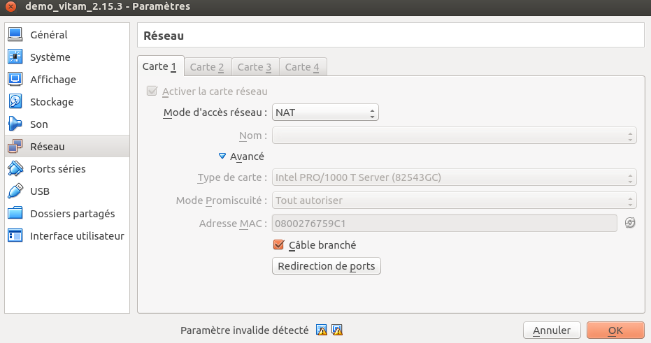
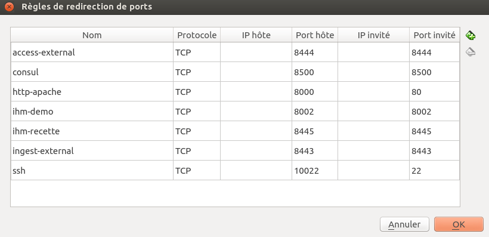
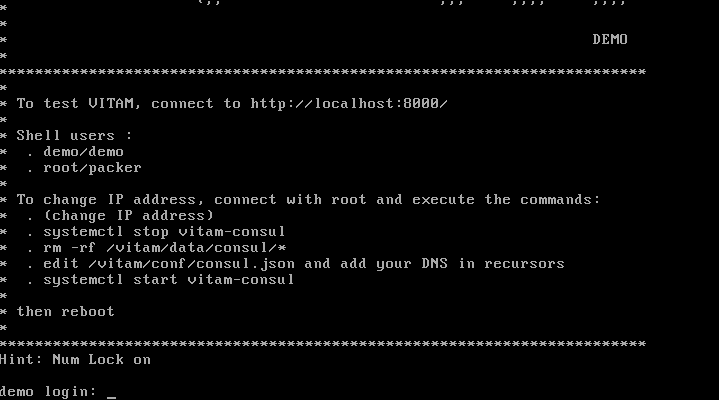
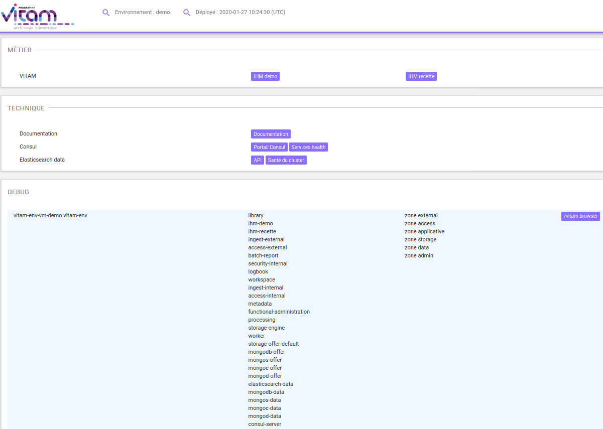
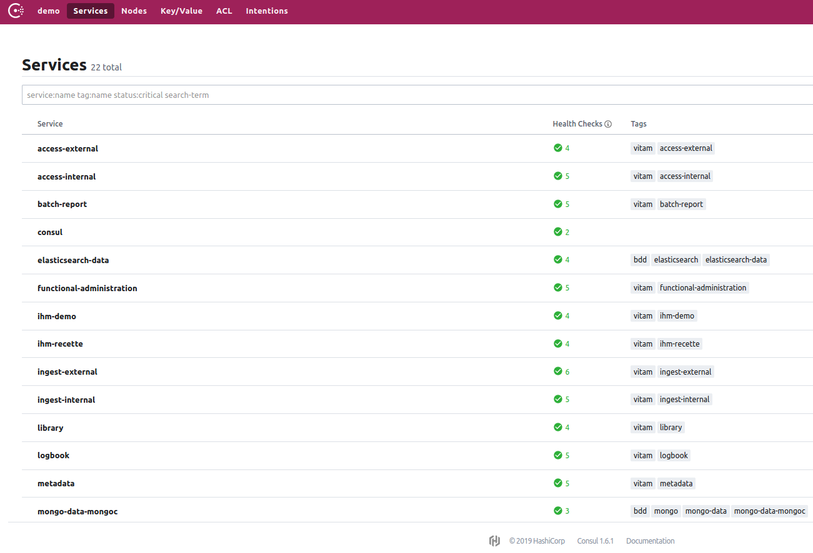
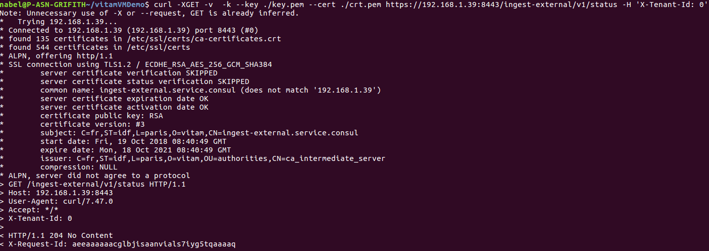
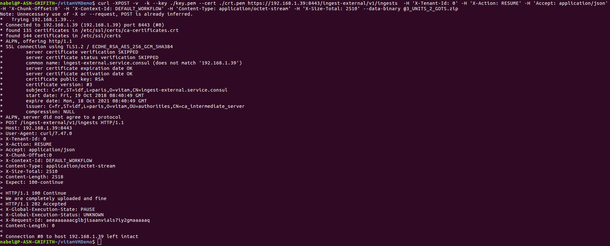

# VitamUI
## Install Vitam locally

There is two ways (for now) for starting [VITAM](https://github.com/ProgrammeVitam/vitam) in an development mode in order to make 
requests to external APIs from VitamUI:
### Launch Vitam services using your IDE and docker for COTS
the first way is launching Vitam locally with IDEs and docker images etc... refer to the directory named `vitam-conf-dev`
 at [Vitam configuration for devs](https://github.com/ProgrammeVitam/vitam), don,t forget to choose the compatible 
 version of vitam you want to use to follow compatible configurations.
 

### Launch Vitam services using Vitam Virtual Machine

This is the recommanded way for starting development with VITAMUI with a virtualized VITAM.
each relese of VITAM, a virtual machine is created and published.
to download a specific version (example 2.15.3) of VITAM virtual machine, [see](https://download.programmevitam.fr/vitam_repository/2.15.3/VM/)

> :warning: **Vitam uses Java 11, since 3.0.x **: Be careful when choosing the VM to download.

### 1 - Steps after downloading the VITAM VM

After downloading the VITAM Virtual Machine, launch it using either [VirtualBox](https://www.virtualbox.org/) or [VM Ware](https://www.vmware.com)
dans ce qui suit, le lancement est fait avec VirtualBox.

### 1a - Starting checks
 
#### Import the VM to VirtualBox

dans virtualBox , Fichier > Importer un appareil virtuel

#### Configure network to NAT

#### Vitam port redirections
The redirection of vitam external endpoints ports

#### access the VM
the default shel users: 
- demo/demo
- root/packer

#### Vitam main interface
the main interface for all vitam services are accessible with : [localhost:8000](localhost:8000)

#### consul

The consul interface for service discovery is accessible at [http://localhost:8000/ui/demo/services](http://localhost:8000/ui/demo/services)

### 1b - Get SSL certificate from the store
to make HTTPS request to VITAM Endpoints, you should get the `.crt` and `.key` certificates.
To do so, download the keystore from this link [localhost:8000/nodes/vitam-env-vm-demo.vitam-env/browse/conf/ihm-demo/](http://localhost:8000/nodes/vitam-env-vm-demo.vitam-env/browse/conf/ihm-demo/)

or execute the command below: 
>`bash$ wget localhost:8000/nodes/vitam-env-vm-demo.vitam-env/browse/conf/ihm-demo/keystore_ihm-demo.p12` 

store it in a working directory, after that, we should extract private kay and certificate from that keystore.

To do so execute the two commands:

- extract the private key:
>`bash$ openssl pkcs12 -in keystore_ihm-demo.p12 -out key.pem -nocerts -nodes`

- extract the public key:
>`bash$ openssl pkcs12 -in keystore_ihm-demo.p12 -out crt.pem -clcerts -nokeys`

### 1b - Try to access the Vitam from local
get your IP adress with `ifconfig` command or with the command `hostname -i`.

- sending HTTPS curl request:

we are going to send an example request to VITAM external endpoint, for example we'll choose VITAM `Ingest External` API.

Vitam is responding with an `X-Request-Id` as we see in the screen above.

use this request to reproduce it in your local: 
>`bash$ curl -XGET -v  -k --key ./key.pem --cert ./crt.pem https://@yourIP:8443/ingest-external/v1/status -H 'X-Tenant-Id: 0'`

`--key ./key.pem` and `--cert ./crt.pem`  are the private and the public key extracted at the previous step.

- example of sending an SIP to VITAM
In this step we are going to send a real SIP to VITAM, see the screen example

use this request to reproduce it in your local: 

>`bash$ curl -XPOST -v  -k --key ./key.pem --cert ./crt.pem https://@yourIP:8443/ingest-external/v1/ingests  -H 'X-Tenant-Id: 0' -H 'X-Action: RESUME' -H 'Accept: application/json' -H 'X-Chunk-Offset:0' -H 'X-Context-Id: DEFAULT_WORKFLOW' -H 'Content-Type: application/octet-stream' -H 'X-Size-Total: Size-2510 (verify size of sip.zip)' --data-binary @path/to/some/valid/sip.zip`

> :warning: change `@yourIP`, `Size-2510` and the `path/to/some/valid/sip.zip` before launching the command

### 1c - Configure VITAMUI to access Vitam APIs
The final Step is to configure VITAMUI modules that interacts with VITAM.
Untill now there is two modules that interacts with VITAM endpoints,
the `IAM` module and the `Ingest` module. specifically the `IAM-Internal` and `Ingest-Internal` modules.

#### Copie VITAM configuration files and necessary certificates to VITAMUI modules
Under the `conf` directory of this two modules, a directory called `vitam-dev` directory for dev purposes as it's name indicate.
at this level you should copy 4 necessary files:
- `access-external-client.conf` [download](localhost:8000/nodes/vitam-env-vm-demo.vitam-env/browse/conf/ihm-demo/access-external-client.conf)
- `ingest-external-client.conf` [download](localhost:8000/nodes/vitam-env-vm-demo.vitam-env/browse/conf/ihm-demo/ingest-external-client.conf)
- `keystore_ihm-demo.p12` [download](localhost:8000/nodes/vitam-env-vm-demo.vitam-env/browse/conf/ihm-demo/keystore_ihm-demo.p12)
- `truststore_ihm-demo.jks` [download](localhost:8000/nodes/vitam-env-vm-demo.vitam-env/browse/conf/ihm-demo/truststore_ihm-demo.jks)

copy them to the `vitam-dev` directory of the two modules.

these files are accessible here : [4 files](localhost:8000/nodes/vitam-env-vm-demo.vitam-env/browse/conf/ihm-demo)

