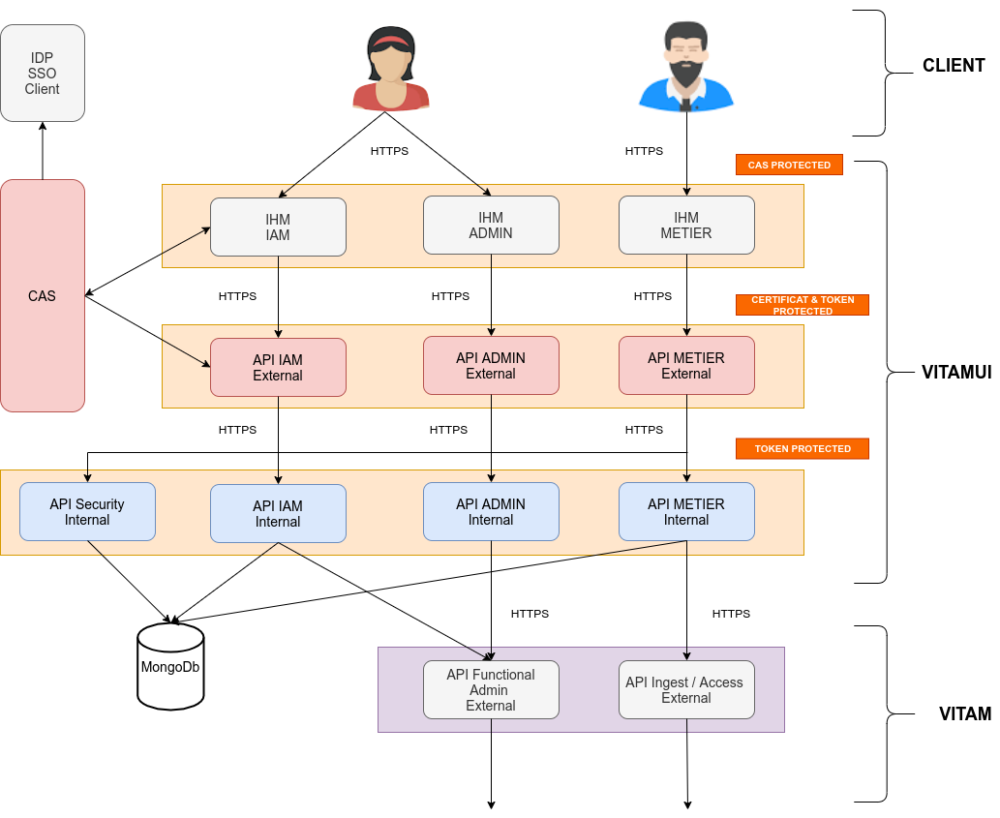
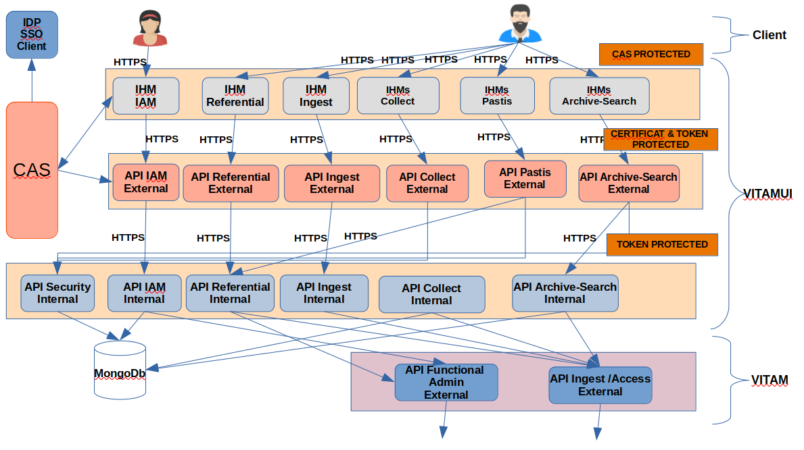

# VitamUI

# Prerequisites

- Un PC avec 32 Go en RAM.
- Système d'exploitation Linux (Ubuntu).
- Un compte sur Github.
- Un compte LDAP (l'équipe Vitam qui gère la création).
- Accès à jenkins, gitlab (projets : vitam et vitam-deploy) et les environnements de développements de Vitam
- Slack pour les discussions et les échanges avec l'équipe Vitam.

## Tools

- Installer JDK version 11
- Installer Maven.
    - Run [this script](https://github.com/ProgrammeVitam/vitam/blob/b1b7bb6e8ee83e9e747a9849b457824af650cd16/vitam-conf-dev/scripts/maven-setup-chapelle-edition.sh) to set it up.
- Installer Git.
- Installer Node.js (version 14.x) and npm (6.x) (with nvm).
    - Configure default registry: `npm config set registry https://registry.npmjs.org/`
- Installer Angular CLI (version 10.x).
- Python version 2.7 + pip for Python 2.
- Installer Ansible (see [Ansible](#Ansible)).
- Installer Docker.
- Installer Intellij pour le code Java.
- Installer VSCode pour le code Angular.

### Ansible

La version actuelle de VitamUI dépend de la version 2.7.0 d'Ansible pour exécuter les scripts d'installation.

#### With VirtualEnv

Afin de ne pas interférer avec la version plus récente d'Ansible, déployez un Python VirtualEnv dans lequel vous installez Ansible 2.7.0:
* Vérifiez que l'exécutable VirtualEnv est installé: `apt-get install python-virtualenv`
* Dans un répertoire de votre choix, créez l'environnement virtuel: `virtualenv vitamUI-ansible`
* Activer l'environnement: `vitamUI-ansible/bin/activate`

#### Without VirtualEnv

* Supprimez d’abord les anciennes versions d’Ansible avant de le réinstaller:
  `pip uninstall ansible`.
* Si une version d'Ansible a été installée via `apt-get install`, il est nécessaire de la désinstaller : `apt-get remove ansible`

#### Common steps

* Installer Ansible 2.7.0: `pip install ansible==2.7.0`
* Vérifiez la version d'Ansible: `ansible --version`

Il est possible que l'ajout du lien vers ansible dans le PATH et/ou qu'un redémarrage soit nécessaire

## Configuration
- Cloner le projet et changer le propriétaire: `sudo chown -R $USER vitam-ui/`
- Construire un projet en utilisant le "bon" profil.

### For Vitam internal developers
- Configurer les variables d'environnement : `SERVICE_NEXUS_URL` and `SERVICE_REPOSITORY_URL`
- Builder le projet avec le profil `vitam` (see [Build for Vitam developers](#Build-for-Vitam-internal-developers))
- Copier les fichiers: `collect-external-client.conf`,`access-external-client.conf`, `ingest-external-client.conf`, `keystore_ihm-demo.p12` 
and `truststore_ihm-demo.jks` into `api/api-(iam|referential)/(iam|referential)-internal/src/main/config/dev-vitam/`
- Sinon utiliser cette procedure pour brancher vitamUI avec un Vitam installé sur un environnement

### 1. Prepare TSL/SSL configurations:

Dans le cas de l'authentification mutuelle TSL/SSL, nous devons préparer le trust-store de l'environnement distant 
et le keystore de notre environnement approuvé par l'environnement distant, pour ce faire, nous suivons ces étapes :

#### 1.1. Prepare trust-store & key-store for server API access

1. Exécutez la commande suivante pour récupérer le certificat du serveur :

```shell script
    openssl s_client -servername ga.env-api.programmevitam.fr -connect ga.env-api.programmevitam.fr:443 </dev/null 2>/dev/null | openssl x509 -text > /tmp/server_cert.crt
```

2. Générez un keystore avec le certificat extrait précédent (exemple de mot de passe : customer-password-ts , trust: oui) :

```shell script
    keytool -import -file /tmp/server_cert.crt -alias server_cert -keystore our-trust-store.jks
```

3. Télécharger un certificat public externe (external_pub.pem && external_key.pem) fourni dans ce
   path: https://rec.env.programmevitam.fr/
4. Générez un keystore, pour le contexte Vitam, avec ce certificat. (exemple de mot de passe : customer-password-ks , exemple au format P12):

 ```shell script
    openssl pkcs12 -export -in external_pub.pem -inkey external_key.pem -out our-keystore-env-ga.p12
```

### 2. Modifier les fichiers de configuration:

Mettre à jour les fichiers de paramètres pour appeler les services externes Vitam: 
nous devons mettre à jour le fichier de paramètres pour appeler les services Web externes sur Vitam: access-external, ingest-external et collect-external.

Par défaut, le fichier de paramètres est nommé :
access-external-client.conf, ingest-external-client.conf, collect-external-client.conf

Ces 3 fichiers, il faut les mettre dans le dossier /vitam/conf (dossier à créer au niveau de la racine du PC).
Example ingest-external-client.conf :

```
serverHost: vgx.env-api.programmevitam.fr                ## the API url of remote Vitam environment
serverPort: 443                                         ## HTTPS default port 
secure: true
sslConfiguration :
 keystore :
  - keyPath: /vitam/conf/our-keystore-env-ga.p12        ## the path of generated keystore before
    keyPassword: customer-password-ks                   ## the password provided on keystore generation
 truststore :
  - keyPath: /vitam/conf/our-trust-store.jks            ##  the path of  generated trust store before
    keyPassword: customer-password-ts                   ## the password provided on trust store generation
hostnameVerification: true
```

- Redirect `dev.vitamui.com` URL defined in code to `localhost` : ajouter cette ligne `127.0.0.1       dev.vitamui.com` dans ton fichier `hosts` (`/etc/hosts`)

## Démarrer la base de données Mongo VitamUI dans un conteneur docker

Avant de lancer les services VitamUI, il faut obligatoirement avoir une base de données alimentée par quelques données comme les services, 
les certificats, les applications, les organisations, les utilisateurs, les groupes de profils, les profils…. Pour visualiser toutes ces informations, 

Voici le script à lancer pour alimenter la base de données : `tools/docker/mongo/restart_dev.sh`.

Vous pouvez utiliser **Robo3T**, sinon un client Mongo sur le poste de travail.
Les identifiants de connexion :

  - Adresse : 127.0.0.1
  - port : 27018

## Commande pour builder le projet (sans tests) :
      mvn clean install -Ddependency-check.skip=true -Denv.SERVICE_NEXUS_URL=https://nexus.dev.programmevitam.fr -DskipTests -DskipAllFrontend -Pvitam

Après l'installation des pré-requis de VitamUI et configurer Vitam et VitamUI en local on peut commencer à démarrer 
les services de VitamUI d'une manière simple (application spring-boot).

## Commande pour builder le projet et générer le tar.gz de ui-frontend-common (nécessaire pour une première installation) :
      mvn clean install -Ddependency-check.skip=true -Denv.SERVICE_NEXUS_URL=https://nexus.dev.programmevitam.fr -DskipTests -Pvitam

## Lancer les tests Java :
- Lancer directement les tests dans Intellij
- lancer l'ensemble des tests :

      mvn test -Ddependency-check.skip=true -DskipAllFrontendTests -Pvitam

## Lancer les tests Angular :
      npm run test:collect
Voir le fichier package.json pour plus de commande sur les autres applications Front.

### Les services à démarrer avec les commandes nécessaires:
- **IAM :**
  - **security-internal :** `clean spring-boot:run -P vitam` 
  - **iam-internal :** `clean spring-boot:run -P vitam`
  - **iam-external :** `clean spring-boot:run -P vitam`
- **Collect :**
    - **collect-internal :** `clean spring-boot:run -P vitam`
    - **collect-external :** `clean spring-boot:run -P vitam`
- **Referential :**
    - **referential-internal :** `clean spring-boot:run -P vitam`
    - **referential-external :** `clean spring-boot:run -P vitam`
- **UI :**
    - **ui-portal :** `clean spring-boot:run -DskipTests -DskipAllFrontendTests -Pvitam`
    - **ui-collect :** `clean spring-boot:run -DskipTests -DskipAllFrontendTests -Pvitam`
- **Front application :**
    - **portal :** `npm run start:portal`
    - **collect :** `npm run start:collect`
- **cas-server :**

Une fois les services sont lancés, on peut se rendre sur le lien suivant https://dev.vitamui.com:4200. 
Deux utilisateurs sont configurés pour accéder à VitamUi :

1. **admin :**
    - identifiant : admin@change-it.fr
   - mot de passe : password
2. **superadmin :** 
   - identifiant : superadmin@change-it.fr
   - mot de passe : password

## Lancer les services en mode Debug :

Pour debugger un service, il faut lancer le service en mode springBootApplication et aussi il faut pas oublier d’ajouter
en ajoutant `-Dspring.profiles.active=dev` comme jvm options.

### Des règles à respecter pour les PR :

- un seul commit pour chaque fonctionnalité développée.
- le nom de la branche doit etre sous la forme : vgx_quelque_chose_qui_indique_la_fonctionnalitée
- Ajouter des tags (comme vgx, java...).
- Ajouter un texte descriptif de ce qui a été développé au niveau de cette PR (on un template par défaut qui s'ajoute automatiquement lors de la création d'une PR, il suffit juste de la modifier).
- Toujours merger les PR dans la branche : vgx_develop
- A la fin du projet merger la branche vgx_develop dans la branche develop.

# Architecture

Les deux schémas montrent en générale l'architecture de VitamUI et aussi comment les services (external, internal et aussi ui) communiuent entre eux.





La communication entre les 3 couches est faite toujours en https avec une condition d'etre bien authetifié et bien sur avec les droits d'accès et les autorisations nécessaires pour taper sur une API.

### Identification des services
 
Il est primordial que chaque service de la solution puisse être identifié de manière unique sur le système. À cet effet, les services disposent des différents identifiants suivant :

* ID de service (ou service_id) : c’est une chaîne de caractères qui nomme de manière unique un service. Cette chaîne de caractère doit respecter l’expression régulière suivante : `[a-z][a-z-]*`. 
Chaque cluster de service possède un ID unique de service.

* ID d’instance (ou instance_id) : c’est l’ID d’un service instancié dans un environnement ; ainsi, pour un même service, il peut exister plusieurs instances de manière concurrente dans un environnement donné. 
Cet ID a la forme suivante : `<service_id>-<instance_number>`, avec `<instance_number>` respectant l’expression régulière suivante : `[0-9]{2}`. Chaque instance dans ce cluster possède un id d’instance (instance_id).

* ID de package (ou package_id) : il est de la forme `vitamui-<service_id>`. C’est le nom du package à déployer.

### Communications inter-services

Les services VITAMUI suivent les principes suivants lors d’un appel entre deux composants :

1. Le composant amont effectue un appel (de type DNS) à l’annuaire de service en indiquant le service_id du service qu’il souhaite appeler

2. L’annuaire de service lui retourne une liste ordonnée d’instance_id. C’est de la responsabilité de l’annuaire de service de trier cette liste dans l’ordre préférentiel d’appel (en fonction de l’état des différents services, et avec un algorithme d’équilibrage dont il a la charge)

3. Le composant amont appelle la première instance présente dans la liste. En cas d’échec de cet appel, il recommence depuis le point 1. La communication vers une instance cible de type Service API utilise nécessairement le protocole sécurisé HTTPS.

Ces principes ont pour but de garantir les trois points suivants :

* Les clients des services doivent être agnostiques de la topologie de déploiement, et notamment du nombre d’instances de chaque service dans chaque cluster. La connaissance de cette topologie est déléguée à l’annuaire de service.

* Le choix de l’instance cible d’un appel doit être décorrélé de l’appel effectif afin d’optimiser les performances et la résilience.

* La garantie de la confidentialité des informations transmises entre les services (hors COTS)


#### Les différentes zones

##### zone IHM

La zone IHM se compose de plusieurs services:

* UI Identity
* UI Portal
* UI Referential
* UI Ingest
* UI Archive Search
* UI Collect
* UI Pastis

##### zone API-EXTERNAL

La zone API-EXTERNAL se compose de plusieurs services:

* IAM EXTERNAL
* REFERENTIAL EXTERNAL
* INGEST EXTERNAL
* ARCHIVE SEARCH EXTERNAL
* COLLECT EXTERNAL
* PASTIS EXTERNAL

##### zone API-INTERNAL

La zone API-INTERNAL se compose de plusieurs services:

* IAM INTERNAL
* REFERENTIAL INTERNAL
* INGEST INTERNAL
* ARCHIVE SEARCH INTERNAL
* COLLECT INTERNAL

##### zone DATA

La zone stockage: MongoDB


## Applications Web

Les applications Web constituent les IHM de la solution. Elles sont accessibles depuis le portail de la solution.
L'authentification d'un utilisateur dans une application cliente se fait par l'intermédiaire de l'IAM CAS. Une application cliente est constituée de 2 parties.

* Interface utilisateur Front (IHM WEB) qui donne accès aux fonctionnalités via un navigateur
* Interface utilisateur Back (Service BackOffice) qui gère la communication avec CAS et les accès aux API externes

Une double authentification est nécessaire pour qu’un utilisateur puissent accéder aux API externes :

* Le service UI Back de l’application cliente doit posséder un certificat reconnu par la solution
* L’utilisateur de l’application cliente doit être authentifié dans la solution (par CAS) et posséder un token valide

Les applications de base :

* portal : application portail donnant accès aux applications
* identity : application pour gérer les organisations, utilisateurs, profils, etc.

---

## Services externes

Les services externes exposent des API REST publiques accessibles en HTTPS. Ces services constituent une porte d'accès aux services internes et assurent principalement un rôle de sécurisation des ressources internes.

La connexion d'une application cliente à un service externe nécessite le partage de certificats X509 client et serveur dans le cadre d'un processus d'authentification mutuel (Machine To Machine/M2M). 
Dans la solution VITAMUI, les certificats des clients sont associés à un contexte de sécurité stocké dans une collection MongoDb gérée par le service security_internal. D'autre part, les utilisateurs clients 
sont identifiés et authentifiés dans les services externes par le token fourni par CAS et transmis dans les headers des requêtes REST en HTTPS.

Le service externe a pour responsabilité de sécuriser les accès en effectuant les différentes étapes de vérifications des droits (générale, tenant, rôles, groupes, etc.) et de déterminer les droits résultants du client à l'origine de la requête, 
en réalisant l'intersection des droits applicatifs, définis dans le contexte de sécurité, avec les droits issus des profils de l'utilisateur. Le service externe s'assure ensuite que le client possède bien les droits pour accéder à la ressource demandée.

Les services externes s'auto-déclarent au démarrage dans l'annuaire de service Consul.

Les services disposent d'API REST pour suivre leur état et leur activité. Ces API ne sont pas accessibles publiquement.

* API Status pour connaître la disponibilité du service (utilisé par Consul)
* API Health (basée sur SpringBoot) pour suivre l'activité

Les services génèrent les logs techniques dans la solution de log centralisée basée sur ELK.

### Service de collect externe

* Description : service external pour la gestion des projets de versements.

  Le service collect external est composé de plusieurs points d'APIs:

* POST /collect-api/getorix-deposit : create an operation
* PUT /collect-api/getorix-deposit/{id} : update an operation
* GET /collect-api/getorix-deposit/{id} : Get an operation by id
* GET /collect-api/getorix-deposit/{id}/full-path : Get the full path of an archive unit
* GET /collect-api/getorix-deposit/last-three-operations : Get the last 3 created operations

* GET /collect-api/projects: get projects paginated
* POST /collect-api/projects: Create new collect project
* GET /collect-api/projects/{id}: GET project Details
* PUT /collect-api/projects/{id}: updateProject
* DELETE /collect-api/projects/{id}: DELETE project
* GET /collect-api/projects/{id}/last-transaction: GET last Transaction for project
* GET /collect-api/projects/{id}/transactions:    GET transactions by project paginated
* POST /collect-api/projects/{id}/transactions:    Create Transaction For Project
* GET /collect-api/projects/archive-units/searchcriteriahistory:  GET the search criteria history
* POST /collect-api/projects/archive-units/searchcriteriahistory:  Create search criteria history for collect
* PUT /collect-api/projects/archive-units/searchcriteriahistory/{id}: Update Search criteria history
* DELETE /collect-api/projects/archive-units/searchcriteriahistory/{id}: DELETE Search criteria history
* GET /collect-api/projects/object-groups/downloadobjectfromunit/{id}: Download Archive Unit Object
* POST /collect-api/projects/upload: Upload collect zip file
* GET /collect-api/transactions/{id}: GET transaction by project
* PUT/collect-api/transactions/{id}: updateTransaction
* PUT /collect-api/transactions/{id}/abort: Abort transaction operation
* PUT /collect-api/transactions/{id}/reopen: Reopen transaction operation
* PUT /collect-api/transactions/{id}/send: Send transaction operation
* PUT /collect-api/transactions/{id}/validate:Validate transaction operation
* PUT /collect-api/transactions/{transactionId}/update-units-metadata: Upload on streaming metadata file and update archive units
* POST/collect-api/transactions/archive-units/{transactionId}/export-csv-search: export into csv format archive units by criteria
* POST/collect-api/transactions/archive-units/{transactionId}/search: GET AU collect paginated
* GET /collect-api/transactions/archive-units/archiveunit/{id}: Find the Archive Unit Details


## Services internes

Les services internes offrent des API REST accessibles en HTTPS uniquement depuis les services externes ou internes. Les API de ces services ne sont donc pas exposées publiquement. 
Les services internes implémentent les fonctionnalités de base de la solution ainsi que les fonctionnalités métiers. En fonction des besoins, les services internes peuvent être amenés à journaliser des évènements dans le logbook des opérations du socle VITAM.

Les utilisateurs sont identifiés dans les services internes grâce au token transmis dans les headers des requêtes HTTPS.
L'utilisation du protocole HTTPS permet de chiffrer les tokens et les informations sensibles qui sont transportées dans les requêtes. Les services internes peuvent éventuellement vérifier les droits d'accès de l'utilisateur avant d'accéder aux ressources.

Les services internes s'auto-déclarent au démarrage dans l'annuaire de service Consul.

Les services disposent d'API REST pour suivre leur état et leur activité.

* API Status pour connaître la disponibilité du service (utilisé par Consul)
* API Health (basée sur SpringBoot) pour suivre l'activité du service

Les services génèrent les logs techniques dans la solution de log centralisée basée sur ELK.

### Service de collect interne

Le service collect internal est composé de plusieurs points d'APIs:

* GET /collect-api/projects: get projects paginated
* POST /collect-api/projects: Create new collect project
* GET /collect-api/projects/{id}: GET project Details
* PUT /collect-api/projects/{id}: updateProject
* DELETE /collect-api/projects/{id}: DELETE project
* GET /collect-api/projects/{id}/last-transaction: GET last Transaction for project
* GET /collect-api/projects/{id}/transactions:    GET transactions by project paginated
* POST /collect-api/projects/{id}/transactions:    Create Transaction For Project
* GET /collect-api/projects/archive-units/searchcriteriahistory:  GET the search criteria history
* POST /collect-api/projects/archive-units/searchcriteriahistory:  Create search criteria history for collect
* PUT /collect-api/projects/archive-units/searchcriteriahistory/{id}: Update Search criteria history
* DELETE /collect-api/projects/archive-units/searchcriteriahistory/{id}: DELETE Search criteria history
* GET /collect-api/projects/object-groups/downloadobjectfromunit/{id}: Download Archive Unit Object
* POST /collect-api/projects/upload: Upload collect zip file
* GET /collect-api/transactions/{id}: GET transaction by project
* PUT/collect-api/transactions/{id}: updateTransaction
* PUT /collect-api/transactions/{id}/abort: Abort transaction operation
* PUT /collect-api/transactions/{id}/reopen: Reopen transaction operation
* PUT /collect-api/transactions/{id}/send: Send transaction operation
* PUT /collect-api/transactions/{id}/validate:Validate transaction operation
* PUT /collect-api/transactions/{transactionId}/update-units-metadata: Upload on streaming metadata file and update archive units
* POST/collect-api/transactions/archive-units/{transactionId}/export-csv-search: export into csv format archive units by criteria
* POST/collect-api/transactions/archive-units/{transactionId}/search: GET AU collect paginated
* GET /collect-api/transactions/archive-units/archiveunit/{id}: Find the Archive Unit Details

* POST /collect-api/getorix-deposit : create an operation
* PUT /collect-api/getorix-deposit/{id} : update an operation
* GET /collect-api/getorix-deposit/{id} : Get an operation by id
* GET /collect-api/getorix-deposit/{id}/full-path : Get the full path of an archive unit
* GET /collect-api/getorix-deposit/last-three-operations : Get the last 3 created operations

### Service d'authentification centralisé CAS

Dans VITAMUI, l'authentification des utilisateurs est réalisée au moyen du service CAS. CAS est un service d'authentification centralisé (SSO et fédération d’identité), développé depuis 2004 par une communauté open source, et destiné aux applications Web .

CAS propose les fonctionnalités suivantes :

* un protocole (CAS protocol) ouvert et documenté
* la prise en charge de moteur de stockage variés (LDAP, base de données, X.509, 2-facteur)
* la prise en charge de plusieurs protocoles (CAS, SAML, OAuth, OpenID)
* des bibliothèques de clients pour Java, .Net, PHP, Perl, Apache, uPortal, etc.
* l’intégration native avec uPortal, BlueSocket, TikiWiki, Mule, Liferay, Moodle, etc.


Dans la solution VITAMUI, CAS porte uniquement le processus d'authentification (délégué ou non) avec les informations (tickets, cookies, etc.) nécessaires au bon fonctionnement de l'authentification. En revanche, toutes les données des utilisateurs (compte, profils, rôles, etc.) sont stockés dans une base MongoDB gérée par les services VITAMUI. Lors du processus d'authentification, CAS récupère les données des utilisateurs via des services REST dédiés et sécurisés dans VITAMUI. Il est important de noter que les crédentials d'accès à la solution, les données des utilisateurs ou des applications ne sont donc jamais stockés dans CAS.

Ce choix simplifie l'exploitation de la solution car il n'est pas nécessaire de migrer les données lors de la mise à jour de CAS.


## Service d'archivage VITAM

Le service d'archivage se base sur le socle logiciel VITAM a pour fonction de gérer l'archivage des documents. Il apporte une forte garantie de sécurité et de disponibilité pour les archives.

Ses principales caractéristiques sont :

* Fonctions d’archivage : versement, recherches, consultation, administration , structurations arborescentes, référentiels…
* Accès aux unités d’archives via un service de requêtage performant
* Garantie de la valeur probante par le respect des normes en vigueur, par la traçabilité des opérations et du cycle de vie des objets et leur journalisation sécurisée
* Sécurité et la robustesse : la gestion applicative du stockage permet une réplication des données, métadonnées, index et journaux sur plusieurs sites et plusieurs offres contrôlées.
  L’architecture interne du stockage assure la capacité de reconstruire le système à partir d’une seule offre, en une fois ou au fil de l’eau
* La possibilité d’une utilisation mutualisée grâce à la gestion multi-tenant des archives
* Offres de stockage multiple
* Capacité à absorber de fortes volumétries de données

La documentation de la solution VITAM est disponible sur le site [programmevitam.fr](http://www.programmevitam.fr/pages/documentation/).

### Service de collect Vitam (Back-office)

Le service collect de Vitam est composé de plusieurs points d'APIs:

Pour trouver toutes ces APIs exposées par le Back-Office Vitam, il suffit juste de consulter le lien suivant :

- [COLLECT_VITAM_API](https://vgx.env.programmevitam.fr/doc/raml/externe/collect.html)
- [VITAM_API](https://vgx.env.programmevitam.fr/doc/raml/externe/)

Si les deux liens ne fonctionnent pas, il suffit juste de modifier vgx dans l'url par int ou itrec (des environnements toujours up).

Et au cas où l'accès est interdit, il faut voir avec l'équipe Vitam pour donner accès et les autorisations necessaires pour votre compte LDAP.

## Etat d'avancement 

### Fonctionnalité développées :

Les fonctionnalités développées avec les deux parties backend et frontend, les API sont bien créées côté Backend.

- Création d'une nouvelle Application `versementGetorix` dans VitamUI.
- Création de deux profils (archiviste et archéologue) pour l'application versementGetorix.
- Ajout des roles pour chaque profil créé.
- Page d’accueil avec un bouton pour créer un dépôt et une liste dynamique qui récupère les 3 derniers dépôt (en se basant sur le service producteur auquel le user est rattaché).
- Un formulaire pour la création d’une opération (avec possibilité de sauvegarder une partie du formulaire comme brouillon au niveau de la base).
- Un formulaire et aussi la possibilité de modifier une opération déjà créée dans la BD.
- Une nouvelle BD avec une nouvelle Collection pour l’application VersementGetorix.
- Une page pour informer l’utilisateur que son opération est bien créée.
- Un panneau latéral qui contient des informations et des consignes sur comment bien créer un dépôt dans Vitam.
- Un composant pour l’upload des objets (en mode streaming) ===> deux étapes côté Front : un processus de zipping (avec la librairie JSZip) et après envoie vers le backend en mode streaming.
- Un panneau latéral à gauche pour l’affichage des unités archivistique en mode d’arborescence.
- La liste des unités archivistiques (des objets uploadés).
- Trier la liste des unités archivistique par nom (Title/Title_.Fr/Title_.En dans Vitam).
- Calcul du chemin complet de chaque unité archivistique.
- Récupération de l’object Groupe de chaque unité archivistique.
- Un panneau latéral à droite pour l’affichage des métadatas de chaque unité archivistique (soit par un click droit soit par un click l'icône qui affiche les détails de chaque unité).
- Création d’un fil d’ariane au niveau de l’ensemble des pages.
- Traduction implémentée dans l’ensemble des pages développées (français et anglais).
- Ajout des nouveaux icones propres à l'application versementGetorix.
- Des test unitaires Java et Angular pour couvrir plus de 90 % de ce qui a été développé.

### Lien utiles :

- Code source Vitam-ui : https://github.com/ProgrammeVitam/vitam-ui
- Branche master : **vgx_develop**
- Code source Vitam : https://gitlab.dev.programmevitam.fr/vitam/vitam
- Branche master : **vgx_develop**
- Code de déploiement (chaque branche a le nom d’un environnement) branche vgx pour l’environnement vgx : https://gitlab.dev.programmevitam.fr/integration/vitam-deploy
- répo des TNR Vitam : https://github.com/ProgrammeVitam/vitam-itests
- Lien Jenkins : https://jenkins.dev.programmevitam.fr/
- Lien de l’environnement de test :
  - VitamUI : https://vgx-ui.env.programmevitam.fr/
  - Vitam : https://vgx.env.programmevitam.fr/
- Builder une branche : https://jenkins.dev.programmevitam.fr/job/build/job/vitamui-build/
- Lancer un déploiement : https://jenkins.dev.programmevitam.fr/job/deploy/job/vitam-deploy/job/vgx/
- Documentation API Vitam : https://vgx.env.programmevitam.fr/doc/index.html
- Liste des API : Vitam : https://vgx.env.programmevitam.fr/doc/raml/externe/
- Documentation VitamUI : https://vgx.env.programmevitam.fr/doc/index.html
- Installation : https://github.com/ProgrammeVitam/vitam-ui/tree/develop/docs/fr/installation
- Architecture : https://github.com/ProgrammeVitam/vitam-ui/tree/develop/docs/fr/architecture
- Migration : https://github.com/ProgrammeVitam/vitam-ui/tree/develop/docs/fr/migration
- Exploitation : https://github.com/ProgrammeVitam/vitam-ui/tree/develop/docs/fr/exploitation
- Télécharger les certificats publiques externes de Vitam : https://rec.env.programmevitam.fr/
- Lien pour le branchement de Vitam et VitamUI : https://github.com/ProgrammeVitam/vitam-ui/tree/develop/docs/developeurs/vitamui-conf-dev
- Lien vers le code style Vitam : https://github.com/ProgrammeVitam/vitam-ui/tree/develop/docs/developeurs/configuration%20editeur
- Visualiser les statuts des services (Vitam et VitamUI) avec Consul : https://vgx.env.programmevitam.fr/ui/vgx/services
- Lien Figma : https://www.figma.com/file/JsceLclsjjJh1EfreDsZCg/Versementg%C3%A9torix?type=design&node-id=1-2&mode=design
- Lien Miro : https://miro.com/app/board/uXjVMCxcXAg=/
